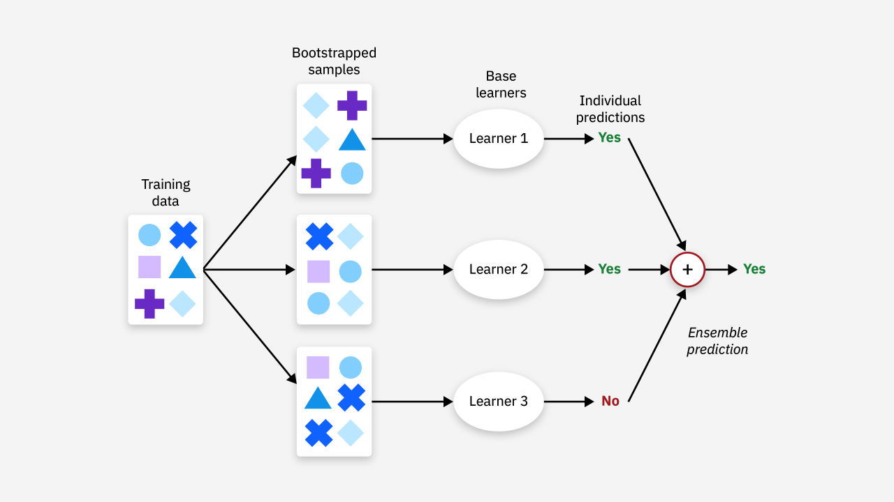
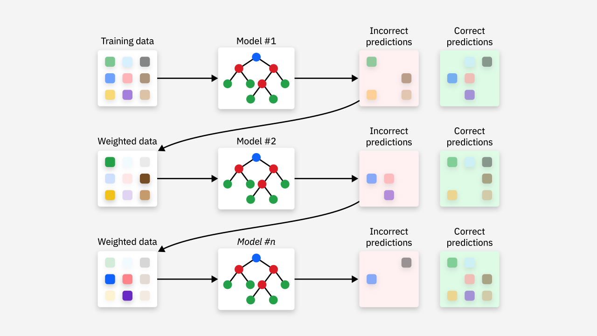
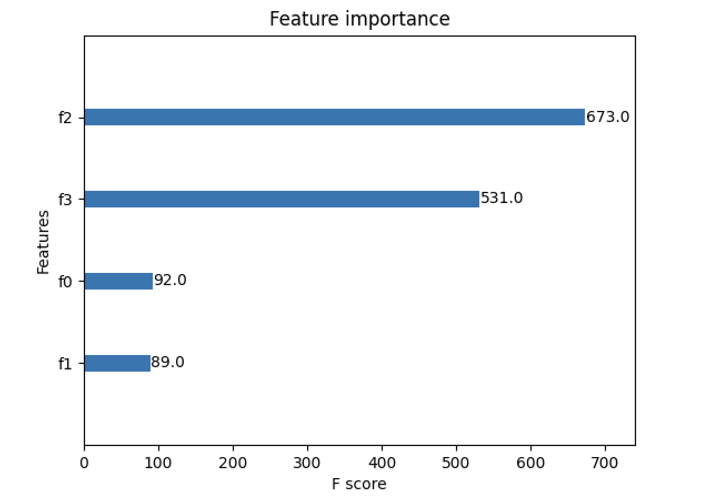

## 集成学习算法

之前的章节，我们主要为大家介绍了机器学习中的单模型。事实上，将多个单模型组合成一个综合模型的方式早已成为现代机器学习模型采用的主流方法，这种方法被称为**集成学习**（ensemble learning）。集成学习的目标是通过多个弱学习器（分类效果略优于随机猜测的模型，如果太强容易导致过拟合）的组合来构建强学习器，从而克服单一模型可能存在的局限性，获得比单一模型**更好的泛化能力**，通常用于**需要高精度预测的场景**。

### 算法分类

集成学习算法主要分为以下几类：

1. **Bagging**：通过从训练数据中随机抽样生成多个数据子集，在这些子集上训练多个模型，并将它们的结果进行结合。这种集成学习的原理如下图所示，最典型的例子就是我们之前讲过的随机森林。

    

2. **Boosting**：通过迭代训练多个模型，在每一轮训练时，重点关注前一轮预测错误的样本。每个新模型的训练目标是弥补前一轮模型的不足。这种集成学习的原理如下图所示，经典的算法有 AdaBoost、Gradient Boosting 和 XGBoost。

    

    Boosting的基本原理是：初始时对所有样本赋予相同的权重；训练第一个模型时，错误分类的样本权重会增加；训练下一个模型时，重点关注之前模型错误分类的样本；最终将所有模型的结果加权组合（表现好的模型会有更高的权重），得到最终的输出。简单的说，Boosting 就是串行的训练一系列弱分类器，使得被先前弱分类器分类错误的样本在后续得到更多关注，最后将这些分类器组合成最优强分类器的过程。

3. **Stacking**：通过训练多个模型，将它们的预测结果作为新特征输入到另一个模型（通常称为“二级模型”）中，用“二级模型”来做最终的预测，原理如下图所示。

    

### AdaBoost

AdaBoost（Adaptive Boosting）由 Yoav Freund 和 Robert Schapire 于 1996 年提出，是一种经典的集成学习算法，通常将其翻译为自适应提升算法。AdaBoost 的做法非常朴素，一是**提高前一轮被弱分类器分类错误的样本的权重**，二是对多个弱分类器进行线性组合，**提高分类效果好的弱分类器的权重**；它的自适应体现在会根据前一轮模型的错误调整样本的权重。

AdaBoost 算法的训练过程是逐步迭代的，关键步骤如下：

1. **初始化样本权重**：给每个训练样本分配一个相等的初始权重。对于 $\small{N}$ 个样本，初始权重为：
    $$
    w_{i}^{(1)} = \frac{1}{N}, \ i = 1, 2, \cdots, N
    $$
    这里，$\small{w_{i}^{(1)}}$ 表示第 $\small{i}$ 个样本的权重，初始时权重相等。

2. **训练弱学习器**：在每一轮迭代中，AdaBoost 会根据当前样本的权重训练一个弱分类器（例如决策树桩，即深度为 1 的决策树）。弱分类器的目标是最小化加权误差。对于第 $\small{t}$ 轮训练得到的分类器模型（弱学习器） $\small{h_t}$，计算其加权误差：
    $$
    \varepsilon_{t} = \sum_{i=1}^{N} w_{i}^{(t)} \cdot I(y_{i} \neq h_{t}(x_{i}))
    $$
    其中， $\small{y_{i}}$ 是第 $\small{i}$ 个样本的真实标签，$\small{h_{t}(x_{i})}$ 是第 $\small{t}$ 轮模型 $\small{h_{t}}$ 对第 $\small{i}$ 个样本 $\small{x_{i}}$ 给出的预测结果（取值为 1 或 -1），$\small{I(y_{i} \neq h_{t}(x_{i}))}$ 是指示函数，当样本 $\small{x_{i}}$ 被错误分类时函数取值为 1，否则函数取值为 0。

3. **更新分类器权重**：计算第 $\small{t}$ 轮分类器模型的权重 $\small{\alpha_{t}}$，并用它来更新每个样本的权重。分类器权重 $\small{\alpha_{t}}$ 的计算公式为：
    $$
    \alpha_{t} = \frac{1}{2} ln \left( \frac{1 - \varepsilon_{t}}{\varepsilon_{t}} \right)
    $$
    当分类器的误差较低时，$\small{\alpha_{t}}$ 的值较大，说明该分类器的权重较大。

4. **更新样本权重**：根据当前分类器的表现，更新样本的权重。误分类样本的权重会增加，正确分类样本的权重会减少。样本权重的更新公式为：
    $$
    w_{i}^{(t + 1)} = w_{i}^{(t)} \cdot e^{-\alpha_{t} y_{i} h_{t}(x_{i})}
    $$

5. **归一化权重**：对所有样本的权重进行归一化，使得所有样本的权重和为 1。

6. **最终分类器**：AdaBoost 的最终分类器是所有弱学习器的加权组合，预测时通过加权投票来决定最终类别：
    $$
    H(x) = \text{sign} \left( \sum_{t=1}^{T} \alpha_{t} h_{t}(x) \right)
    $$
    其中，$\small{\text{sign}}$ 是符号函数，其定义如下所示：
    $$
    \text{sign}(z) = \begin{cases} +1 \ (z \ge 0) \\ -1 \ (z \lt 0) \end{cases}
    $$
    例如，有 3 个弱学习器 $\small{h_{1}(x)}$、$\small{h_{2}(x)}$、$\small{h_{3}(x)}$，它们的输出分别是`+1`、`-1`和`+1`，对应的权重是 $\small{\alpha_{1} = 0.5}$、$\small{\alpha_{2} = 0.3}$、$\small{\alpha_{3} = 0.2}$，那么加权和为：
    $$
    \sum_{t=1}^{3} \alpha_{t} h_{t}(x) = 0.5 \times 1 + 0.3 \times -1 + 0.2 \times 1 = 0.4
    $$
    由于加权和`0.4`为正，符号函数会输出`+1`，表示最终预测类别为正类。

我们还是以鸢尾花数据集为例，应用 AdaBoost 集成学习算法来构建分类模型，完整的代码如下所示。

```python
from sklearn.datasets import load_iris
from sklearn.model_selection import train_test_split
from sklearn.tree import DecisionTreeClassifier
from sklearn.ensemble import AdaBoostClassifier
from sklearn.metrics import classification_report

# 数据集的加载和划分
iris = load_iris()
X, y = iris.data, iris.target
X_train, X_test, y_train, y_test = train_test_split(X, y, train_size=0.8, random_state=3)

# 初始化弱分类器（决策树桩）
base_estimator = DecisionTreeClassifier(max_depth=1)
# 初始化 AdaBoost 分类器
model = AdaBoostClassifier(base_estimator, n_estimators=50)
# 训练模型
model.fit(X_train, y_train)
# 预测结果
y_pred = model.predict(X_test)

# 输出评估报告
print(classification_report(y_test, y_pred))
```

输出：

```
              precision    recall  f1-score   support

           0       1.00      1.00      1.00        10
           1       0.90      0.90      0.90        10
           2       0.90      0.90      0.90        10

    accuracy                           0.93        30
   macro avg       0.93      0.93      0.93        30
weighted avg       0.93      0.93      0.93        30
```

这里需要注意几个超参数的设置：

1. `n_estimators`：指定要训练的基学习器（弱分类器）的数量，默认值为 50。
2. `learning_rate`：控制每个基学习器在最终模型中的贡献大小，即学习率，默认值为 1.0。
3. `algorithm`：决定 AdaBoost 的训练算法。AdaBoost 主要有两种训练模式：
    - `'SAMME'`：用于多类分类问题的算法，采用加法模型。
    - `'SAMME.R'`：基于 Real AdaBoost 的算法，用于加权的二分类和多分类问题，使用了一个加权的重新采样策略。
4. `base_estimator`：基学习器，默认值为`None`，表示使用`max_depth=1`的`DecisionTreeClassifier`作为基学习器。所以，上面代码中创建`AdaBoostClassifier`对象的两个参数都可以省略，因为它们刚好都是默认值。

增大 `n_estimators` 可以提高模型的性能，但可能会导致过拟合；增大 `learning_rate` 则可以加速训练，但可能会导致模型不稳定。通常需要通过交叉验证来找到最佳的 `n_estimators` 和 `learning_rate` 的组合。对于大多数问题，`DecisionTreeClassifier(max_depth=1)` 是常见的选择，但如果数据较为复杂，可以考虑其他基学习器，如`SVC`、`LogisticRegression`等。

### GBDT

GBDT（Gradient Boosting Decision Trees）也是一种强大的集成学习算法，相较于 AdaBoost，GBDT 系列的模型应用得更加广泛。GBDT 基于**梯度提升**（Gradient Boosting）的思想，结合了决策树的优势，通过一系列的弱分类器（决策树）逐步改进模型，每次训练时通过减少前一个模型的误差（拟合残差）来提高模型的预测性能。

GBDT 使用梯度下降的方式来最小化损失函数。对于回归任务，损失函数通常是均方误差（MSE）；对于分类任务，常用的损失函数是对数损失（Log Loss）。下面我们以二分类任务为例，为大家讲解算法的原理。

1. 损失函数。在分类任务中，通常使用对数似然损失函数，对于二分类问题，损失函数如下所示：
    $$
    L(y, F(x)) = -y\log(p(x)) - (1 - y)\log(1 - p(x))
    $$
    其中，$\small{y}$ 是实际标签（$\small{y \in \lbrace 0, 1 \rbrace}$，表示类别 0 或 1），$\small{p(x)}$ 是模型预测的样本 $\small{x}$ 属于类别 1 的概率。由于 GBDT 是基于梯度提升算法的，因此在每一轮的更新中，我们将通过梯度下降法来优化这个损失函数。

2. 梯度计算。为了使用梯度提升，我们需要计算损失函数关于当前模型预测的梯度。令当前模型的输出为 $\small{F(x)}$，即预测函数。根据对数损失函数，$\small{p(x)}$ 是通过模型输出 $\small{F(x)}$ 转换得到的概率，通常使用 Sigmoid 函数，有：
    $$
    p(x) = \frac{1}{1 + e^{-F(x)}}
    $$
    计算损失函数对 $\small{F(x)}$ 的梯度时，我们得到：
    $$
    \frac{\partial{L(y, F(x))}}{\partial{F(x)}} = p(x) - y
    $$
    即梯度为 $\small{p(x) - y}$，这个值告诉我们当前模型的预测 $\small{F(x)}$ 与真实标签 $\small{y}$ 之间的差距。

3. 模型更新。每一轮的更新都包括两步：

    - 计算残差：在每一轮迭代中，我们计算当前模型的残差，即 $\small{\delta_i = p(x_i) - y_i}$，表示每个样本的误差。
    - 拟合残差：使用新的基学习器（通常是决策树）来拟合这些残差。在分类任务中，我们训练的决策树并不是拟合真实标签，而是拟合残差，即拟合当前模型的预测误差。

    更新规则为：
    $$
    F_{m + 1}(x) = F_{m}(x) + \eta h_{m}(x)
    $$
    其中，$\small{F_{m}(x)}$ 是第 $\small{m}$ 轮模型的输出；$\small{h_{m}(x)}$ 是第 $\small{m}$ 轮训练出的弱学习器（通常是决策树），它预测当前模型的残差；$\small{\eta}$ 是学习率，控制每棵树的贡献大小。通过这样逐步拟合残差，最终生成的模型 $\small{F(x)}$ 就是一个由多棵决策树组成的强学习器。

对于多分类任务，我们需要将损失函数和梯度计算做相应的扩展。常用的多分类损失函数是多项式对数损失，对于每个类别 $\small{k}$，损失函数可以表示为：
$$
L(y, F(x)) = -\sum_{k=1}^{K} y_{k} \log(p_{k}(x))
$$
其中，$\small{K}$ 是类别总数，$\small{y_{k}}$ 是目标类别 $\small{k}$ 的指示函数，$\small{p_k(x)}$ 是样本 $\small{x}$ 属于类别 $\small{k}$ 的预测概率。

我们还是以鸢尾花数据集为例，应用 AdaBoost 集成学习算法来构建分类模型，完整的代码如下所示。

```python
from sklearn.datasets import load_iris
from sklearn.model_selection import train_test_split
from sklearn.ensemble import GradientBoostingClassifier
from sklearn.metrics import classification_report

# 数据集的加载和划分
iris = load_iris()
X, y = iris.data, iris.target
X_train, X_test, y_train, y_test = train_test_split(X, y, train_size=0.8, random_state=3)

# 初始化 GBDT 分类器
model = GradientBoostingClassifier(n_estimators=32)
# 训练模型
model.fit(X_train, y_train)
# 预测结果
y_pred = model.predict(X_test)

# 输出评估报告
print(classification_report(y_test, y_pred))
```

输出：

```
              precision    recall  f1-score   support

           0       1.00      1.00      1.00        10
           1       1.00      1.00      1.00        10
           2       1.00      1.00      1.00        10

    accuracy                           1.00        30
   macro avg       1.00      1.00      1.00        30
weighted avg       1.00      1.00      1.00        30
```

我们还是讲一讲`GradientBoostingClassifier`几个重要的超参数：

1. `loss`：指定用于分类任务的损失函数，默认值为 `deviance`，表示使用对数损失函数。也可以选择 `exponential`，表示使用指数损失函数（AdaBoost 的损失函数）。
2. `learning_rate`：控制每棵树对最终预测结果的影响程度，默认值为 0.1。较小的学习率通常会带来更好的泛化能力，但需要更多的弱分类器（即更多的树）来拟合训练数据；如果学习率设置得太大，则可能会导致模型欠拟合。
3. `n_estimators`：指定要训练的基学习器（通常是决策树）的数量，默认值为 100。
4. `subsample`：控制每棵树训练时使用的数据比例，默认值为 1.0（即使用所有数据）。通过设置小于 1 的值，可以在训练每棵树时随机选择部分样本，从而增加模型的随机性减少过拟合。通常情况下，0.8 或 0.9 是不错的选择。
5. `criterion`：用于控制分裂时的分裂标准，默认值为`'friedman_mse'`。该参数决定了如何选择每个节点的最佳划分方式，可选的值有：
    - `'friedman_mse'`：这个准则是基于均方误差（MSE）的一个改进版本，旨在减小对不平衡数据的敏感性，并且在一些实际任务中，能够比传统的 MSE 产生更好的结果。
    - `'mse'`：使用传统的均方误差（MSE）来评估每个分裂点的质量，MSE 越小，说明当前节点的分裂越好。在分类任务中，使用 `'friedman_mse'` 往往能取得更好的效果。
    - `'mae'`：使用平均绝对误差（MAE）来评估分裂的质量，MAE 对异常值不那么敏感，但在实际应用中通常较少使用。
6. `validation_fraction`：用于指定训练过程中的验证集比例，用于执行早期停止（early stopping），避免过拟合。该参数可与 `n_iter_no_change` 配合使用，在验证集上评估性能，当连续若干轮没有改进时，提前停止训练。

除了上面提到的超参数外，还有一些跟决策树类似的超参数，此处就不再进行赘述了。需要注意的是，增加 `n_estimators`（树的数量）时，通常需要减小 `learning_rate`以防过拟合；调整决策树的`max_depth`和`min_samples_split`也可以减小树的复杂度来防止过拟合；用好`subsample`和`early_stopping`参数也可以达成类似的效果。建议大家通过网格搜索交叉验证的方式，结合模型的训练误差和验证误差来寻找最佳参数组合。

### XGBoost

从算法精度、速度和泛化能力等性能指标来看GBDT，仍然有较大的优化空间。XGBoost（eXtreme Gradient Boosting）正是一种基于 GBDT 的顶级梯度提升模型，由陈天奇在其论文[《*XGBoost: A Scalable Tree Boosting System*》](https://arxiv.org/pdf/1603.02754)中提出。相较于 GBDT，从算法精度上看，XGBoost 通过将损失函数展开到二阶导数，使得梯度提升树模型更能逼近其真实损失；从算法速度上看，XGBoost 使用了加权分位数 sketch 和稀疏感知算法这两个技巧，通过缓存优化和模型并行来提高算法速度；从算法泛化能力上来看，通过对损失函数加入正则化项、加性模型中设置缩减率和列抽样等方法，来防止模型过拟合。因为上述原因，XGBoost 不论在学术界、工业界和竞赛圈都很受欢迎，有着广泛的应用。关于 XGBoost 的细节，有兴趣的读者可以阅读陈天奇的论文，此处不进行展开介绍。

我们可以下面的方式来使用 XGBoost，首先安装依赖项。

```bash
pip install xgboost
```

下面的代码为大家展示了如何使用 XGBoost。

```python
import matplotlib.pyplot as plt
import xgboost as xgb
from sklearn.datasets import load_iris
from sklearn.model_selection import train_test_split
from sklearn.metrics import classification_report

# 数据集的加载和划分
iris = load_iris()
X, y = iris.data, iris.target
X_train, X_test, y_train, y_test = train_test_split(X, y, train_size=0.8, random_state=3)

# 将数据处理成数据集格式DMatrix格式
dm_train = xgb.DMatrix(X_train, y_train)
dm_test = xgb.DMatrix(X_test)

# 设置模型参数
params = {
    'booster': 'gbtree',           # 用于训练的基学习器类型
    'objective': 'multi:softmax',  # 指定模型的损失函数
    'num_class': 3,                # 类别的数量
    'gamma': 0.1,                  # 控制每次分裂的最小损失函数减少量
    'max_depth': 6,                # 决策树最大深度
    'lambda': 2,                   # L2正则化权重
    'subsample': 0.8,              # 控制每棵树训练时随机选取的样本比例
    'colsample_bytree': 0.8,       # 用于控制每棵树或每个节点的特征选择比例
    'eta': 0.001,                  # 学习率
    'seed': 10,                    # 设置随机数生成器的种子
    'nthread': 16,                 # 指定了训练时并行使用的线程数
}

# 训练模型
model = xgb.train(params, dm_train, num_boost_round=200)
# 预测结果
y_pred = model.predict(dm_test)

# 输出模型评估报告
print(classification_report(y_test, y_pred))

# 绘制特征重要性评分
xgb.plot_importance(model)
plt.grid(False)
plt.show()
```

输出的特征重要性如下图所示。



我们再说说这个 XGBoost 的模型参数， 先看看上面代码中的`param`字典，有几个参数需要详细说明一下。

1. `booster`：指定用于训练的基学习器类型，默认值为 `'gbtree'`，表示使用传统的决策树作为基学习器；其他的选项包括 `'gblinear'`和`'dart'`，前者表示使用线性回归或逻辑回归，后者也是基于决策树的模型，但具有丢弃树的机制，降低过拟合风险。通常`'gbtree'`适用于大多数问题，尤其涉及到非线性关系；`'dart'`适用于复杂数据集，尤其是在出现过拟合时。如果数据集较小或线性关系较强，可以尝试使用 `'gblinear'`。
2. `objective`：指定模型的损失函数（优化目标），常见的选项包括：
    - `'reg:squarederror'`：回归任务中的均方误差（MSE），用于回归任务。
    - `'reg:logistic'`：回归任务中的逻辑回归，通常用于二分类任务。
    - `'binary:logistic'`：二分类任务中的逻辑回归，输出概率值。
    - `'binary:logitraw'`：二分类任务中的逻辑回归，输出未经过 Sigmoid 处理的原始值。
    - `'multi:softmax'`：多分类任务，输出为每个类别的最大概率。
    - `'multi:softprob'`：多分类任务，输出为每个类别的概率分布。
3. `eta`/`learning_rate`：XGBoost 中的学习率，默认值为 0.3，推荐将初始值设置为 0.01 到 0.1。
4. `alpha`和`lambda`：前者控制 L1 正则化项（Lasso）的强度，默认为 `0`；后者控制 L2 正则化项（Ridge）的强度，默认为 `1`。
5. `scale_pos_weight`：用于处理类别不平衡问题，尤其是二分类问题。在类别严重不平衡的情况下，通过调整这个参数来加大少数类的权重，使得模型更关注少数类样本，默认值为 1。
6. `gamma`：用来控制每次分裂的最小损失函数减少量，该参数控制树的生长，越大的 `gamma` 会使得树更小，减小过拟合的风险，默认值为 0，意味着模型不会受到分裂的限制，树会尽可能深，直到节点中没有足够的样本。
7. `num_class`：用于多分类任务的参数，表示类别的数量。对于二分类任务，无需设置该参数。
8. `colsample_bytree` / `colsample_bylevel` / `colsample_bynode`：控制在每棵树、每一层、每个节点上采样特征的比例。这些参数用于控制模型的复杂度。较小的值会增加模型的随机性，从而防止过拟合；较大的值则意味着每棵树使用更多的特征，可能导致过拟合。
    - `colsample_bytree`：每棵树使用的特征比例（默认为 1.0）。
    - `colsample_bylevel`：每一层使用的特征比例（默认为 1.0）。
    - `colsample_bynode`：每个节点使用的特征比例（默认为 1.0）。

除了`param`字典提供的模型参数外，`train`函数还有几个参数也值得注意，它们也是模型的超参数。

1. `num_boost_round`：树的训练轮数，设置较小的`learning_rate`并增加训练轮数可以提高模型的稳定性。
2. `early_stopping_rounds`：用于实现早期停止机制。当指定轮次的训练中，验证集上的损失函数不再减少时，训练会自动停止，避免过拟合。
3. `feval`：设置用户自定义的评估函数，这种方式允许用户灵活地使用任何适合特定任务的评估指标，需要注意的是评估函数有两个参数，一个表示模型预测值（NumPy 的`ndarray`对象），一个是训练数据（XGBoost 的`DMatrix`对象）；函数返回一个二元组`(name, value)`，其中 `name` 是评估指标的名称，`value` 是指标的值。
4. `obj`：设置用户自定义的目标函数，目标函数用于计算每一步的梯度和二阶导数，从而指导模型的优化过程，有兴趣的读者可以自行研究。
5. `evals`：用于指定一个或多个验证集，其值是包含一个或多个`(data, label)` 元组的列表，每个元组代表一个评估数据集，数据集需要是`DMatrix`对象。在训练过程中，XGBoost 会在每一轮迭代后评估验证集上的性能，通常用于监控训练过程中的过拟合或调整超参数。
6. `eval_results`：存储在训练过程中计算的所有评估结果，通常传入一个字典。
7. `verbose_eval`：控制训练过程中评估结果的输出频率，可以设置为一个整数，表示多少轮迭代输出一次评估结果，也可以设置为`True`或`False`，表示每轮都输出或不输出任何评估结果。
8. `xgb_model`：用于加载之前训练好的模型，以便从中断点继续训练。你可以指定一个 `xgb_model` 文件或者传入一个 `Booster` 对象。
9. `callbacks`：在训练过程中添加自定义的回调函数，回调函数可以在每一轮迭代时提供额外的控制，如自动停止训练、调整学习。

### LightGBM

LightGBM（Light Gradient Boosting Machine）是微软于2017年开源的一款顶级 Boosting 算法框架，虽然本质仍然是 GBDT 算法，但被设计用于大规模数据集的处理，特别是在需要高效率和低内存消耗的场景下。就 GBDT 系列算法性能而言，XGBoost 已经非常高效了，但并非没有缺陷。LightGBM 就是一种针对 XGBoost 缺陷的改进版本，通过直方图算法（通过将连续特征分箱）、单边梯度抽样（GOSS，通过采样方法在训练过程中保留梯度较大的样本，减少计算量）、互斥特征捆绑（EFB，将一些互斥特征做组合，减少特征空间的维度）和 leaf-wise 生长策略（优先对当前叶子节点进行分裂来扩展树的深度）四个方法，使得 GBDT 算法系统更轻便、更高效，能够做到又快又准。当然，在较小的数据集上，LightGBM 的优势并不明显，而且不管是 XGBoost 还是 LightGBM，模型的可解释性都是一个问题，超参数调优的难度也是比较大的。

这里，我们不再使用更多的篇幅去讲解 LightGBM 的细节，感兴趣的小伙伴可以直接访问 LightGBM 的[官方文档](https://lightgbm.readthedocs.io/en/stable/index.html)。我们直接通过代码带大家简单感受一下如何使用 LightGBM，首先还是需要通过下面的命令完成安装。

```bash
pip install lightgbm
```

我们仍然使用鸢尾花数据集来训练模型，代码如下所示。

```python
import lightgbm as lgb
import numpy as np
from sklearn.datasets import load_iris
from sklearn.model_selection import train_test_split
from sklearn.metrics import classification_report

# 加载和划分数据集
iris = load_iris()
X, y = iris.data, iris.target
X_train, X_test, y_train, y_test = train_test_split(X, y, train_size=0.8, random_state=3)

# 将数据转化为 LightGBM 的数据格式
train_data = lgb.Dataset(X_train, label=y_train)
test_data = lgb.Dataset(X_test, label=y_test, reference=train_data)

# 设置模型参数
params = {
    'objective': 'multiclass',   # 多分类问题
    'num_class': 3,              # 类别数量
    'metric': 'multi_logloss',   # 多分类对数损失函数
    'boosting_type': 'gbdt',     # 使用梯度提升树算法
    'num_leaves': 31,            # 叶子节点数
    'learning_rate': 0.05,       # 学习率
    'feature_fraction': 0.75,    # 每次训练时随机选择特征的比例
    'early_stopping_rounds': 10  # 连续多少论没有性能提升就停止迭代
}
# 模型训练
model = lgb.train(params=params, train_set=train_data, num_boost_round=200, valid_sets=[test_data])
# 模型预测
y_pred = model.predict(X_test, num_iteration=model.best_iteration)
# 将预测结果处理成标签
y_pred_max = np.argmax(y_pred, axis=1)

# 查看模型评估报告
print(classification_report(y_test, y_pred_max))
```

这里还是简单为大家讲讲模型的超参数，更多的细节大家可以参考官方文档。

1. `objective`：设置优化目标函数（损失函数），可选值有：
    - `'regression'`：回归任务。
    - `'binary'`：二分类任务。
    - `'multiclass'`：多分类任务。
    - `'multiclassova'`：多分类任务，使用一对多的策略。
    - `'rank_xendcg'`、`'lambdarank'`：排名任务。
2. `metric`：评估模型性能的指标，可选值有：
    - `'l2'`、`'mean_squared_error'`：回归任务中的均方误差。
    - `'binary_error'`：二分类错误率。
    - `'multi_logloss'`：多分类对数损失。
    - `'auc'`：二分类任务中的 AUC。
    - `'precision'`、`'recall'`、`'f1'`：精度、召回率、F1分数。
3. `boosting_type`：设置提升类型，可选值有：
    - `'gbdt'`：传统的梯度提升树。
    - `'dart'`：具有随机丢弃树机制来防止过拟合的决策树。
    - `'goss'`：通过单边梯度抽样来加速训练。
    - `'rf'`：随机森林。
4. `num_leaves`/`max_depth`：决策树的叶子节点数 / 决策树的最大深度，控制树的复杂度。
5. `lambda_l1`/`lambda_l2`：L1 和 L2 正则化参数，用于控制模型的复杂度，防止过拟合。
6. `max_bin`： 用于分割连续特征（数据分箱）的最大箱子数。
7. `feature_fraction`：每次训练时随机选择特征的比例。
8. `early_stopping_rounds`： 设置评估指标在连续多少轮迭代中没有改进时，训练会提前停止。

### 总结

集成学习通过结合多个模型来减少模型的偏差和方差，通常能获得比单一模型更好的预测效果。由于集成学习通常结合多个基础模型，它能够有效降低单一模型可能存在的过拟合问题，也能够处理异常数据和噪声数据，比单一模型更加稳定。当然，集成学习也存在计算开销大、模型可解释性差、超参数调优复杂等问题。除了 XGBoost 和 LightGBM 之外，还有一个因处理类别特征而闻名的 Boosting 算法叫做 CatBoost，三者都是 GBDT 系列算法的佼佼者。虽然目前“大力出奇迹”的深度学习大行其道，但是以 XGBoost、LightGBM 和 CatBoost 为代表的 Boosting 算法仍然有广阔的应用场景，即便是在非结构化数据（文本、语音、图像、视频）的建模上也是有用武之地的。


