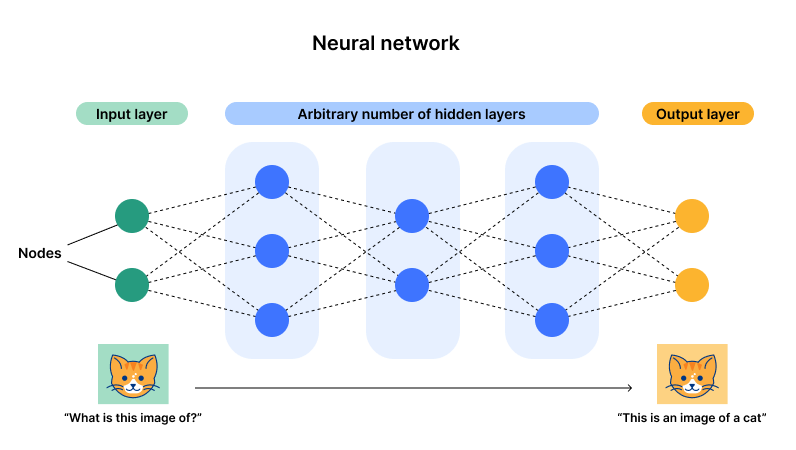
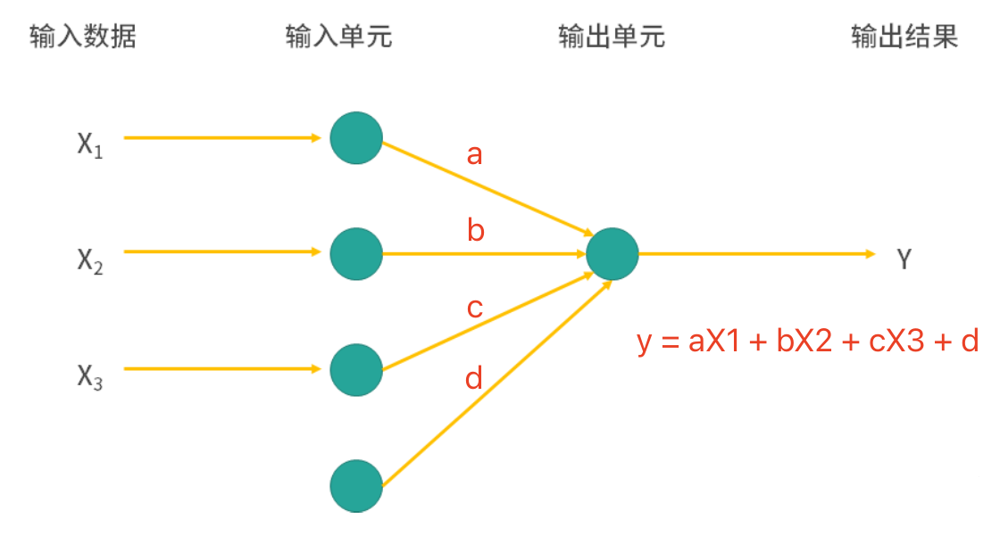
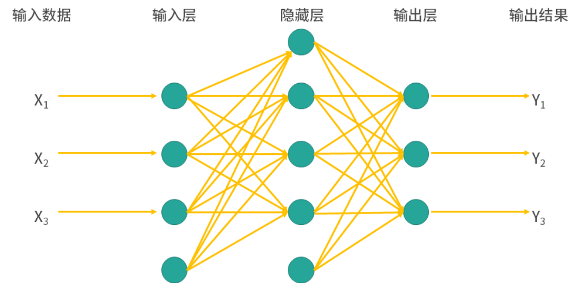
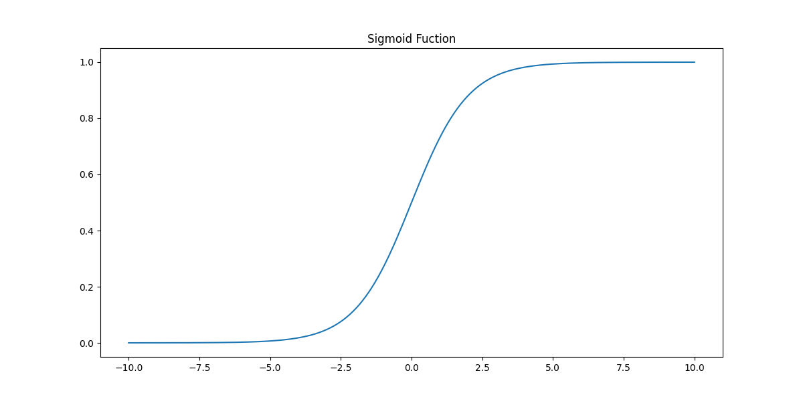
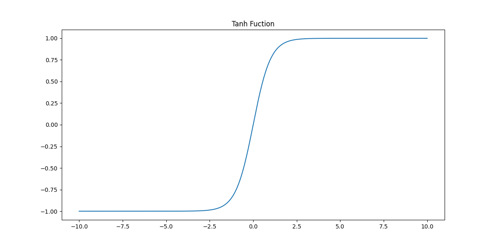

## 神经网络模型

在人类的大脑中，神经元（neuron）是负责信息传递和处理的单元，神经元通过化学信号和电信号进行交流，这是人类记忆、感觉、运动等功能的基础。神经元包含了轴突（axon）和树突（dendrite），树突负责接收信号，轴突负责发送信号，此外细胞体也是神经元的重要部分，起到整合和传递信息的作用。神经元之间的连接通过突触（synapse）传递化学信号或电信号来实现，一个神经元可能会与成千上万个神经元连接，构成错综复杂的神经网络。人在刚出生时，大脑中有约 860 亿神经元，大部分神经元是不会再生的，所以这个数字会随着年龄的增长而略为减少。新生儿的大脑拥有数量极其庞大的突触连接，为未来的学习和适应奠定基础。

神经网络模型是模拟人脑神经元的计算模型，通过多层神经元连接来完成复杂的非线性映射。神经网络由多个层组成，通常包括输入层、隐藏层和输出层。每层中的神经元与前一层的神经元相连接，通过权重调整和激活函数的作用，逐层传递和处理数据，最终完成复杂数据的特征提取和学习。神经网络被广泛应用于模式识别、图像处理、语音识别等领域，是深度学习（Deep Learning）中的核心技术之一。

### 基本构成

1. **输入层**：输入层神经元接收输入数据，每个神经元通常对应一个输入特征。输入层的任务是将输入数据传递给下一层的神经元。
2. **隐藏层**：隐藏层是网络的核心部分，负责对数据进行特征提取和处理。隐藏层可以有一层或多层，每层的神经元通过权重和激活函数来进行数据处理。深度神经网络通常会包含多层隐藏层，这样能够提取数据中的高阶特征。
3. **输出层**：输出层负责将隐藏层的结果转换为最终输出。输出层的激活函数通常与问题类型有关，例如二分类任务可能用 Sigmoid 函数以获得概率，而回归任务则可能直接输出数值。
4. **神经元**：每个神经元都接收来自前一层神经元的输入，进行加权求和，再通过激活函数计算输出。



神经网络的训练过程通常通过反向传播算法（Backpropagation）和梯度下降法来优化权重，以减少预测误差。深度神经网络通过多层非线性转换能够学习到更加复杂的特征表示，因此在许多任务中表现优异。

### 工作原理

我们先设计一个最简单的神经网络模型，它只有一层输入和一层输出，该模型会根据输入（$\small{X}$）去预测输出（$\small{y}$），而输出又满足下面的公式：
$$
y = aX_{1} + bX_{2} + cX_{3} + d
$$
其中，$\small{a, b, c, d}$ 都是模型的参数（权重和偏置），那么我们的神经网络模型应该是如下图所示的结构。



大家可能已经发现，这个最简单的神经网络模型跟线性回归根本没有区别，但是我们在输入层和输出层中间再加上一个隐藏层又会怎样呢？看看下面的图，是不是已经有一点“网络”的味道了，加入的隐藏层可以处理非线性关系，而且隐藏层可以有多个，层与层之间连接的方式可以是全连接或部分连接，甚至可以出现环形结构。上面我们也说过，引入非线性能够让模型学习到更加复杂的特征表示，这也是神经网络模型在很多任务中表现优异的原因。



接下来，我们看看神经网络的工作原理。每个神经元的计算过程可以表示为：
$$
y = f \left( \sum_{i=1}^{n}w_{i}x_{i} + b \right)
$$
其中，$\small{x_{1}, x_{2}, \dots, x_{n}}$ 是输入特征，$\small{w_1, w_2, \dots, w_n}$ 是与输入对应的权重；$\small{b}$ 是偏置项；$\small{f}$ 是激活函数，通常是非线性函数，如 Sigmoid、ReLU、Tanh 等。激活函数一个方面是引入非线性变换，增加了神经网络的表达能力，使得它可以模拟任意复杂的函数关系；另一方面，在训练神经网络时会使用反向传播来更新权重，激活函数的非线性属性使得梯度传递更有效，让神经网络收敛得更快，提高训练效率。下面我们对常用的激活函数做一个简要的介绍。

1. Sigmoid 函数

  
    $$
    f(x) = \frac{1}{1 + e^{-x}}
    $$
    

    - **特点**：Sigmoid 函数将输入值映射到$\small{(0, 1)}$的范围内，呈现出平滑的 S 型曲线。
    - **优点**：特别适用于概率预测，因为输出在$\small{(0, 1)}$之间，可以理解为概率值。
    - **缺点**：对于较大的正值或负值，梯度会变得很小，导致梯度消失问题，从而影响深层网络的训练。除此以外，由于输出非零中心，这会导致梯度更新不对称，可能使得收敛变慢。

2. Tanh 函数（双曲正切函数）
    $$
    f(x) = tanh(x) = \frac{e^{x} - e^{-x}}{e^{x} + e^{-x}}
    $$
    

    - **特点**：Tanh 函数将输入映射到$\small{(-1, 1)}$的范围内，也是 S 型曲线，但中心对称。
    - **优点**：与 Sigmoid 类似，但输出在$\small{(-1, 1)}$之间，这样的零中心输出使得梯度更新更对称，更适合用于深层网络。
    - **缺点**：在极值附近，梯度仍会趋向于零，导致梯度消失问题。

3. ReLU 函数（Rectified Linear Unit）
    $$
    f(x) = max(0, x)
    $$

    - **特点**：ReLU 将输入小于零的部分设为零，而大于零的部分保持不变，因此其输出范围是$\small{[0, +\infty]}$。
    - **优点**：计算简单，有效避免了梯度消失问题，因此被广泛应用于深层网络。能够保持稀疏性，许多神经元的输出为零，有利于网络简化计算。
    - **缺点**：当输入为负数时，ReLU 的梯度为零。若输入长期为负数，神经元可能“死亡”并停止更新。

4. Leaky ReLU 函数
    $$
    f(x) = \begin{cases} x & (x \gt 0) \\ {\alpha}x & (x \le 0)\end{cases}
    $$

    - **特点**：Leaky ReLU 是对 ReLU 的改进，它为输入小于零的部分引入了一个小的负斜率（通常取值$\small{\alpha = 0.01}$），使得梯度不为零。
    - **优点**：通过允许负值的输出，避免了死神经元问题，使得网络更健壮。

    - **缺点**：虽然 Leaky ReLU 能缓解死神经元问题，但其负值斜率的选择对网络性能会有一些影响，且对模型的非线性表示能力没有显著提升。

在一个包含多个层的神经网络中，信息会一层一层的进行传递。假设第 $\small{l}$ 层的输出是 $\small{\mathbf{a}^{[l]}}$，按照上面神经元计算公式，有：
$$
\mathbf{a}^{[l]} = f \left( \mathbf{W}^{[l]} \mathbf{a}^{[l-1]} + \mathbf{b}^{[l]} \right)
$$
其中，$\small{\mathbf{W}^{[l]}}$ 是第 $\small{l}$ 层的权重矩阵，$\small{\mathbf{a}^{[l-1]}}$ 是是第 $\small{l - 1}$ 层的输出，$\small{\mathbf{b}^{[l]}}$ 是第 $\small{l}$ 层的偏置项，$\small{f}$ 是激活函数。神经网络最终的输出是通过最后一层的激活函数得到的，这个过程叫做前向传播（forward-propagation）。

对于神经网络模型来说，还有一个极其重要的操作就是通过计算损失函数相对于每个权重和偏置的梯度来更新神经网络的参数（权重和偏置），这一过程通常称为反向传播（back-propagation）。反向传播有两个要点，一个是损失函数，一个是梯度下降法，前者用于衡量预测值与真实值之间的差距，常用的损失函数有均方误差（回归任务）和交叉熵损失函数（分类任务），后者通过更新参数 $\small{\theta}$（权重和偏置)，使得损失函数最小化，即：
$$
\theta^{\prime} = \theta - \eta \nabla L(\theta) \\
\theta = \theta^{\prime}
$$

其中，$\small{\eta}$ 是学习率，$\small{\nabla L(\theta)}$ 是损失函数相对于参数的梯度，跟我们讲解回归模型时使用的方法是一致的。

### 代码实现

根据上面讲到的神经网络模型的原理，要自己写一个简单的神经网络模型也并不困难。当然，我们也可以用 scikit-learn 库`neural_network` 模块来构建神经网络模型。下面，我们仍然以鸢尾花数据集为例，为大家展示神经网络模型的构建和预测效果。

```python
from sklearn.datasets import load_iris
from sklearn.model_selection import train_test_split
from sklearn.neural_network import MLPClassifier
from sklearn.metrics import classification_report

# 加载和划分数据集
iris = load_iris()
X, y = iris.data, iris.target
X_train, X_test, y_train, y_test = train_test_split(X, y, train_size=0.8, random_state=3)

# 创建多层感知机分类器模型
model = MLPClassifier(
    solver='lbfgs',            # 优化模型参数的求解器
    learning_rate='adaptive',  # 学习率的调节方式为自适应 
    activation='relu',         # 隐藏层中神经元的激活函数 
    hidden_layer_sizes=(1, )   # 每一层神经元的数量
)
# 训练和预测
model.fit(X_train, y_train)
y_pred = model.predict(X_test)

# 查看模型评估报告
print(classification_report(y_test, y_pred))
```

输出：

```
              precision    recall  f1-score   support

           0       1.00      0.10      0.18        10
           1       0.00      0.00      0.00        10
           2       0.34      1.00      0.51        10

    accuracy                           0.37        30
   macro avg       0.45      0.37      0.23        30
weighted avg       0.45      0.37      0.23        30
```

> **注意**：由于创建`MLPClassifier`时没有指定`random_state`参数，所以代码每次执行的结果可能并不相同。

模型的预测准确率只有`0.37`，大家对这个结果是不是感觉到不可思议，我们煞费苦心构建的模型预测效果竟然如此拉胯。别紧张，上面代码中我们创建神经网络模型时，`hidden_layer_sizes`参数设置的是`(1, )`，它表示我们的网络只有 1 个隐藏层，而且隐藏层只有 1 个神经元。我们只要增加隐藏层和神经元的数量，让模型可以更好的学习特征和目标之间的映射关系，预测的效果就会好起来。下面，我们将`hidden_layer_sizes`参数调整为`(32, 32, 32)`，即模型有三个隐藏层，每层有 32 个神经元，再来看看代码执行的结果。

```python
from sklearn.datasets import load_iris
from sklearn.model_selection import train_test_split
from sklearn.neural_network import MLPClassifier
from sklearn.metrics import classification_report

# 加载和划分数据集
iris = load_iris()
X, y = iris.data, iris.target
X_train, X_test, y_train, y_test = train_test_split(X, y, train_size=0.8, random_state=3)

# 创建多层感知机分类器模型
model = MLPClassifier(
    solver='lbfgs',                  # 优化模型参数的求解器
    learning_rate='adaptive',        # 学习率的调节方式为自适应 
    activation='relu',               # 隐藏层中神经元的激活函数 
    hidden_layer_sizes=(32, 32, 32)  # 每一层神经元的数量
)
# 训练和预测
model.fit(X_train, y_train)
y_pred = model.predict(X_test)

# 查看模型评估报告
print(classification_report(y_test, y_pred))
```

> **说明**：大家可以试着运行上面的代码，看看有没有获得更好的结果。当然，大家也可以重新设置`hidden_layer_sizes`参数，看看会得到怎样的结果。

下面，我们还是对`MLPClassifier`几个比较重要的超参数做一个说明。

1. `hidden_layer_sizes`：指定神经网络中每一层的神经元数目，元组类型，默认值为`(100, )`，表示只有一个隐藏层，包含 100 个神经元。该超参数可以改变网络的结构和容量，层数越多，神经元数目越多，模型的表示能力就越强，但也存在过拟合风险。
2. `activation`：隐藏层中神经元的激活函数，默认值为`relu`，表示使用 ReLU 激活函数。激活函数决定了网络每一层的输出形态，一般来说，`'relu'` 是训练深度网络时的首选，因为它能够缓解梯度消失问题，并且训练速度较快，可选值包括：
    - `'identity'`：线性激活函数，即$\small{f(x) = x}$，通常不推荐使用。
    - `'logistic'` / `'tanh'` / `'relu'`：Sigmoid / 双曲正切 / ReLU 激活函数。
3. `solver`：用来优化模型参数的求解器（优化算法）。常用的优化算法有：
    - `'lbfgs'`：拟牛顿法（Limited-memory Broyden-Fletcher-Goldfarb-Shanno），这种方法计算复杂度较高，但对小数据集表现较好。
    - `'sgd'`：随机梯度下降（Stochastic Gradient Descent），适用于大规模数据集，在训练时会随机选取小批量数据进行更新。
    - `'adam'`：自适应矩估计（Adaptive Moment Estimation），默认值，适用于大多数情况且计算效率较高。
4. `alpha`：L2 正则化项（也称为权重衰减），控制神经网络的复杂度，默认值为`0.0001`。
5. `batch_size`：每次迭代所用的样本批量大小，默认值为`'auto'`，根据样本数量自动决定批量大小。较小的批量会使训练更加不稳定，但有助于避免陷入局部最优解；较大的批量则可以加速训练，但可能导致内存不足。
6. `learning_rate`：学习率的调节方式，影响模型在每次迭代时调整权重的步长，默认值为`'constant'`，表示学习率保持不变。其他可选的值有`'invscaling'`和`'adaptive'`，前者表示学习率随着迭代次数的增加而逐步减小，后者表示学习率会根据当前梯度变化自动调整，当梯度更新较小时学习率会增加，当梯度较大时学习率会减小。
7. `learning_rate_init`：初始学习率，默认值为`0.001`。
8. `max_iter`：最大迭代次数，控制训练过程中优化算法的最大迭代次数，默认值为`200`。若达到最大迭代次数后模型仍未收敛，训练将停止。这对于防止过长时间训练是有用的，但过小的值可能会导致训练中止太早，导致欠拟合。
9. `tol`：训练过程中的优化容忍度，决定了当目标函数变化小于该值时训练停止，默认值为`0.0001`。较小的 `tol` 会导致更长的训练时间，较大的 `tol` 可能会提前停止训练。

除了 scikit-learn 库，我们还可以使用 TensorFlow、PyTorch、MXNet 等三方库来实现神经网络模型，这些库很多都支持 GPU（图形处理单元） 或 TPU（张量处理单元） 加速，而且内置很多深度网络模型（如卷积神经网络、循环神经网络、生成对抗网络等）以及相应的优化器，相较于 scikit-learn，这些库可能是更好的选择，有兴趣的读者可以自行了解。

### 模型优缺点

神经网络模型最可爱的一点就是可以像搭积木一样不断的扩展模型边界，对于模型内部具体的运行则不需要加以太多的干涉。神经网络能够学习和拟合非常复杂的映射关系，能够根据输入数据自动调整其结构和参数，因此具有较强的适应性。当面临不同类型的数据或任务时，神经网络可以通过调整网络的结构（层数、节点数等）来适应不同的需求，只要数据量足够大、算力足够强，最终都会得到一个不错的结果，表现常常优于传统的机器学习算法，这就是我们常说的“大力出奇迹”。此外，大家耳熟能详的深度学习一词中的“深度”二字，指的就是神经网络模型的层次具备了足够的深度，我们也通常把这样的神经网络称为深度神经网络（DNN）。

神经网络模型就像一个黑盒子，你给它数据它告诉你结果，至于为什么会出现这样的结果却缺乏可解释性。所以，在很多对模型的解释性要求非常高的场景（如信用评级、金融风控等），我们可能没有办法使用神经网络模型。再者，神经网络特别是深度神经网络需要大量的计算资源来训练，尤其是在处理高维数据时，训练时间和所需的计算资源可能非常庞大，需要强大的硬件支持，如高性能的图形处理单元（GPU）或专用硬件（TPU）。最后，也是我个人觉得神经网络模型最坑的一点是超参数调优过于困难，网络的层数、每层神经元的数量、学习率、激活函数的选择等都可能影响模型的性能，如果没有强大的计算资源作为支撑，很难完成超参数的调优，个人和小公司基本就被劝退了。

### 总结

神经网络模型使用了与传统机器学习算法不同的方式从海量数据中学习知识，尽管模型缺乏可解释性，但不能否认它在图像、语音和自然语言处理等多个领域已经取得了显著的成绩。当然，训练神经网络模型需要消耗大量的资源，在应用神经网络模型时建议权衡其优缺点，并根据具体的任务需求选择合适的模型和训练方法。对于那些数据量较小、需要可解释性或计算资源有限的场景，我们建议考虑使用传统的机器学习算法或者其他更轻量级的模型。
