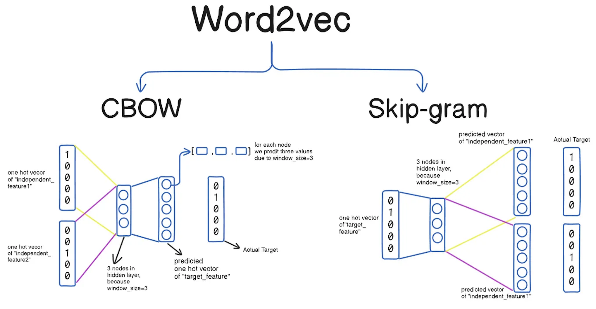
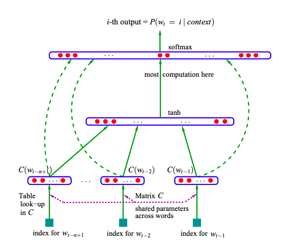
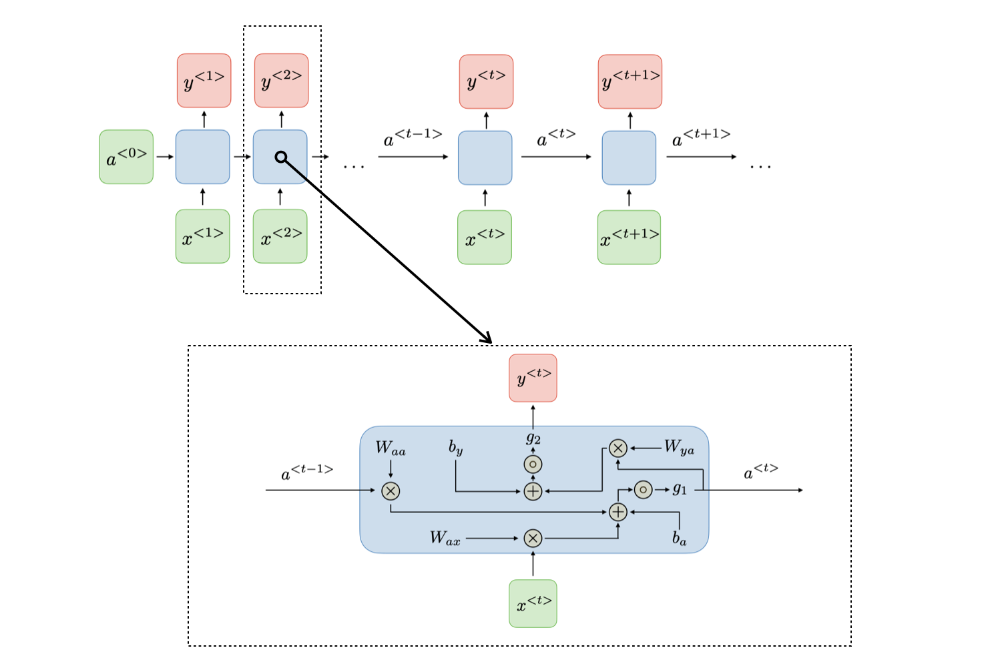
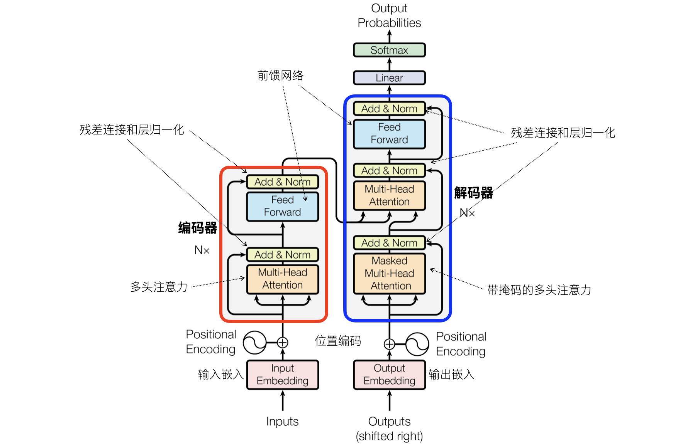

## 自然语言处理入门

自然语言处理（Natural Language Processing，NLP）是计算机科学和人工智能领域中的一个重要分支，旨在使计算机能够理解、生成和与人类语言进行交互。NLP 的应用场景广泛，包括文本分类、情感分析、机器翻译、语音识别、聊天机器人等。随着深度学习的迅猛发展，NLP 的研究也逐渐由传统的机器学习方法转向深度学习方法。经典的 NLP 方法依赖于特征工程和模型设计，而现代的深度学习方法则更多地依赖于数据驱动和自动特征学习。

### 词袋模型

词袋模型（Bag of Words）是 NLP 中最简单的文本表示方法之一，它将文本中的每个单词看作一个“词袋”，忽略了单词的顺序和语法，只考虑每个单词出现的频率。简单来说，词袋模型通过将文本转换为词频向量（TF）来表示文本。构造词袋模型有两个非常简单的步骤：

1. **构建词汇表**：首先扫描所有文档，列出文本中所有的单词（重复的单词只保留一项），形成一个词汇表。
2. **文本向量化**：将每个文档中的单词映射到词汇表中，并统计每个单词的出现次数，形成文档的向量表示。

例如，有三个文档分别是：

1. `I love programming.`
2. `I love machine learning.`
3. `I love apple.`

那么，构造词汇表将得到：`['I', 'love', 'programming', 'machine', 'learning', 'apple']`。然后，将每个文档转换为词频向量，分别是：

1. `[1, 1, 1, 0, 0, 0]`
2. `[1, 1, 0, 1, 1, 0]`
3. `[1, 1, 0, 0, 0, 1]`

Scikit-learn 库提供了构建词词袋模型的类`CountVectorizer`，使用的方法如下所示。

```python
from sklearn.feature_extraction.text import CountVectorizer

# 文档列表
documents = [
    'I love programming.',
    'I love machine learning.',
    'I love apple.'
]

# 创建词袋模型
cv = CountVectorizer()
X = cv.fit_transform(documents)

# 输出词汇表和词频向量
print('词汇表:\n', cv.get_feature_names_out())
print('词频向量:\n', X.toarray())
```

输出：

```
词汇表:  ['apple' 'learning' 'love' 'machine' 'programming']
词频向量:
[[0 0 1 0 1]
 [0 1 1 1 0]
 [1 0 1 0 0]]
```

> **注意**：上面的词汇表中没有单词`'I'`，因为这个单词被认为是停用词而忽略不计了。所谓停用词通常是指特定语言中高频出现但对文本分析任务贡献较小的词语。

对于中文文档，需要利用三方库`jieba`进行中文分词处理，先将句子拆分为词，然后再构造词频向量，代码如下所示。

```python
import jieba
from sklearn.feature_extraction.text import CountVectorizer

# 文档列表
documents = [
    '我在四川大学读书',
    '四川大学是四川最好的大学',
    '大学校园里面有很多学生',
]

# 创建词袋模型并指定分词函数
cv = CountVectorizer(
    tokenizer=lambda x: jieba.cut(x),
    token_pattern=None
)
X = cv.fit_transform(documents)

# 输出词汇表和词频向量
print('词汇表:\n', cv.get_feature_names_out())
print('词频向量:\n', X.toarray())
```

> **说明**：如果尚未安装中文分词库，可以通过命令`pip install jieba`进行安装。

输出：

```
词汇表:
 ['四川' '四川大学' '在' '大学' '大学校园' '学生' '很多' '我' '是' '最好' '有' '的' '读书' '里面']
词频向量:
 [[0 1 1 0 0 0 0 1 0 0 0 0 1 0]
  [1 1 0 1 0 0 0 0 1 1 0 1 0 0]
  [0 0 0 0 1 1 1 0 0 0 1 0 0 1]]
```

如果想去掉中文中常见的停用词，可以在创建`CountVectorizer`对象时指定`stop_words`参数，我们可以从中文停用词文件中加载停用词清单，代码如下所示。

```python
import jieba
from sklearn.feature_extraction.text import CountVectorizer

with open('哈工大停用词表.txt') as file_obj:
    stop_words_list = file_obj.read().split('\n')

# 文档列表
documents = [
    '我在四川大学读书',
    '四川大学是四川最好的大学',
    '大学校园里面有很多学生',
]

# 创建词袋模型并指定分词函数
cv = CountVectorizer(
    tokenizer=lambda x: jieba.lcut(x),
    token_pattern=None,
    stop_words=stop_words_list
)
X = cv.fit_transform(documents)

# 输出词汇表和词频向量
print('词汇表:\n', cv.get_feature_names_out())
print('词频向量:\n', X.toarray())
```

> **说明**：上面用到的中文停用词文件可以点击[传送门](https://github.com/goto456/stopwords)获得。

输出：

```
词汇表:
 ['四川' '四川大学' '大学' '大学校园' '学生' '很多' '最好' '读书' '里面']
词频向量:
 [[0 1 0 0 0 0 0 1 0]
  [1 1 1 0 0 0 1 0 0]
  [0 0 0 1 1 1 0 0 1]]
```

### 词向量

与词袋模型不同，词向量（Word Embedding）将每个单词映射到一个稠密的向量空间中，从而使计算机能够理解和处理文本数据。这些向量通过捕捉单词之间的语义和上下文关系，可以让模型更好地进行词义匹配和语义分析。例如，单词`'king'`和`'queen'`之间的关系、单词`'cat'`和`'dog'`之间的关系等在向量空间中应当有所体现。

常见的词向量模型有：

1. **Word2Vec**：通过浅层神经网络训练来学习词向量，分为两种架构：CBOW （Continuous Bag Of Words）和 Skip-Gram。
    - CBOW 模型的核心思想是：给定一个上下文词汇，预测中心词，即通过上下文中的词汇来预测目标词汇，上下文的顺序不重要，因为词袋是一个集合，而集合没有顺序的概念。假设你有一个句子"The cat sits on the mat."，如果目标是预测 "sits" 这个词，那么 CBOW 会使用上下文词汇"The"、"cat"、"on"、"the"、"mat"来预测"sits"。在训练过程中，CBOW 会根据上下文中的词来调整 "sits" 的词向量，使得在上下文环境下该词能够更准确地表示语义。通过这种方式，CBOW 学习到的是一个词汇的上下文相关的表示。
    - 与 CBOW 相反，Skip-Gram 模型的核心思想是：给定一个目标词，预测该词的上下文词汇。即通过一个中心词来预测其周围的词汇。假设我们还是以句子"The cat sits on the mat."为例，目标词是"sits"。在 Skip-Gram 模型中，系统会用"sits"来预测它的上下文词汇，即"The"、"cat"、"on"、"the"、"mat"。Skip-Gram 模型会通过训练，使得"sits"的词向量能最大化其在训练数据中与上下文词的关联度。
2. **GloVe**：基于词频矩阵的分解，能够捕捉到词汇的全局统计信息，由斯坦福大学的研究团队在2014年提出。GloVe 的词向量可以用于多种自然语言处理任务，如文本分类、情感分析、机器翻译等。它为后续的深度学习模型提供了有效的输入特征。

下面，我们简单讲一下词向量学习的基本思路，主要有三个核心要素：

1. **输入和目标**：假设我们使用 Word2Vec 模型（CBOW 或 Skip-Gram），目标是通过一个单词（中心词）或上下文词来学习词向量。在 Skip-Gram 中，给定一个单词，目标是预测其上下文中的单词；在 CBOW 中，给定上下文单词，目标是预测中心词。

2. **神经网络模型**：Word2Vec 通过一个简单的神经网络来学习词向量，输入层是每个单词对应的独热编码；隐藏层是一个低维的稠密向量（即词向量），它在训练过程中通过反向传播逐渐优化；输出层是目标单词的概率分布，如下图所示。

    

3. **训练过程**：通过上下文和目标单词的共现信息，模型根据每个单词的上下文调整词向量，使得语义上相似的词向量距离更近。训练过程中，神经网络通过最小化误差（即预测的词与实际词之间的差距）来调整词向量，使得能够准确预测词汇之间的联系。

词向量的维度通常是一个超参数，需要根据实际情况来选择。通常，常见的维度范围为 50 到 300 之间，但有时可以更高或更低。较低的维度可能无法捕捉到词汇的丰富语义信息，但会减少计算复杂度，适用于训练数据比较少或对精度要求不高的场景；较高的维度可以捕捉更多的语义特征，适用于大规模数据集，但计算成本也会增加。

一旦词向量被训练出来，它们就能捕捉到词汇之间的多种关系。最常见的方式是通过计算词向量之间的距离或相似度来理解它们的关系。计算两个词向量之间的余弦相似度是最常用的方式，余弦相似度的公式我们之前提到过，如下所示。
$$
\text{Cosine Similarity}(\bold{A}, \bold{B}) = \frac{\bold{A} \cdot \bold{B}}{\lVert \bold{A} \rVert \lVert \bold{B} \rVert}
$$
其中，$\small{\bold{A}}$ 和 $\small{\bold{B}}$ 是两个词的词向量，$\small{\cdot}$ 是向量的点积运算，$\small{\lVert \bold{A} \rVert}$ 和 $\small{\lVert \bold{B} \rVert}$ 是它们的模长。余弦相似度的值介于 -1 到 1 之间，值越大表示两个词越相似，越小则表示越不相似。

另一方面，我们可以研究词向量的空间关系并完成一些有趣的运算。例如，如果我们想知道`'king'`（国王）和`'queen'`（王后）之间的关系，可以通过这样的方式来探索：
$$
\text{king} − \text{man} + \text{woman} \approx \text{queen}
$$
这个式子表示，`'king'`去掉`'man'`（男人）的部分，再加上`'woman'`（女人）的部分，得到的结果约等于`'queen'`。这样的运算可以捕捉到性别上的相似性。此外，利用词向量我们还可以进行聚类分析、词义消歧（通过上下文和相似度判断词在特定场景中的意思）、文本分类、情感分析等操作。

我们用下面的代码为大家展示词向量的构建以及词与词相似性的度量，这里需要安装一个名为`gensim`的三方库。

```bash
pip install gensim
```

此外，我们还需要提前加载训练模型的语料库，这里我用的是 Hugging Face 提供了的 `datasets` 库，通过它能够加载多种公开数据集，包括一些常用的语料库。当然，你也可以选择像`nltk`这样专门用于自然语言处理的工具包来下载语料库。如果还没有安装`datasets`库，需要使用下面的命令进行安装。

```bash
pip install datasets
```

我们先加载 IMDB 数据集，它是一个广泛使用的文本分类数据集，尤其在情感分析和自然语言处理领域中。IMDB 数据集包含大量电影评论，标注了每条评论的情感倾向（这里我们暂时用不到）。IMDB 数据集通常包含 50000 条评论，其中 25000 条用于训练，25000 条用于测试。每条评论都是观众对电影的评价，内容有长有短，我们就用它来作为训练模型的语料库。

```python
import re

from datasets import load_dataset
from gensim.models import Word2Vec
from sklearn.metrics.pairwise import cosine_similarity

# 加载 IMDB 数据集
imdb = load_dataset('imdb')
# 直接将 50000 条评论用作语料
temp = [imdb['unsupervised'][i]['text'] for i in range(50000)]
# 用正则表达式对评论文本进行简单处理
corpus = [re.sub(r'[^\w\s]', '', x) for x in temp]

# 预处理语料库（英文分词）
sentences = [sentence.lower().split() for sentence in corpus]
# 训练 Word2Vec 模型
# sentences - 输入语料库（句子构成的列表，每个句子是一个或多个单词的列表）
# vector_size - 词向量的维度（维度越高能够表示的信息越多）
# windows - 上下文窗口大小（模型在训练时使用的上下文单词的范围）
# min_count - 忽略频率低于此值的单词（过滤掉在语料库中出现次数较少的单词）
# workers - 训练时使用的 CPU 核心数量
# seed - 随机数种子（用于初始化模型的权重）
model = Word2Vec(sentences, vector_size=100, window=10, min_count=2, workers=4, seed=3)

# 通过模型获取 king 和 queen 的词向量
king_vec, queen_vec = model.wv['king'], model.wv['queen']

# 计算两个词向量的余弦相似度
cos_similarity = cosine_similarity([king_vec], [queen_vec])
print(f'king 和 queen 的余弦相似度: {cos_similarity[0, 0]:.2f}')

# 通过词向量进行推理（king - man + woman ≈ queen）
man_vec, woman_vec = model.wv['man'], model.wv['woman']
result_vec = king_vec - man_vec + woman_vec
# 查找与计算结果最相似的三个词
similar_words = model.wv.similar_by_vector(result_vec, topn=3)
print(f'跟 king - man + woman 最相似的词:\n {similar_words}')

# 查找与 dog 最相似的五个词
dog_similar_words = model.wv.most_similar('dog', topn=5)
print(f'跟 dog 最相似的词:\n {dog_similar_words}')
```

输出：

```
king 和 queen 的余弦相似度: 0.43
跟 king - man + woman 最相似的词:
 [('queen', 0.7126370668411255), ('princess', 0.6760246753692627), ('mary', 0.5891180038452148)]
跟 dog 最相似的词:
 [('cat', 0.7801533937454224), ('sheep', 0.6783771514892578), ('pet', 0.6658452749252319), 
  ('doll', 0.655034065246582), ('dude', 0.6548768877983093)]
```

从代码的输出可以看出，跟`'king' - 'man' + 'woman'`最相似的词就是`'queen'`和`'princess'`（公主、王妃），另外一个单词是女孩子的名字。跟`'dog'`（狗）最相似的单词有：`'cat'`（猫）、`'sheep'`（绵羊）、`'pet'`（宠物）、`'doll'`（玩偶）和`'dude'`（家伙）。

### NPLM和RNN

Word2Vec 虽然已经帮助我们掌握了词与词之间的联系，但是由于无法捕捉长距离依赖（超出上下文窗口的词汇）和无法处理未知词（训练中没有出现的词汇）等问题，无法让 NLP 在具体的下游任务中实现突破和应用落地。随着对 Word2Vec 局限性的认识，研究者提出了 **NPLM**（神经网络语言模型），采用神经网络结构来预测单词序列中的下一个词。与传统的语言模型不同，NPLM 通过神经网络（通常是前馈神经网络）来处理整个单词序列，而不仅仅是局部的上下文信息，从而能够建模更为复杂的语言结构，其结构如下图所示。



当然，NPLM 模型也存在无法有效捕捉长期依赖关系的问题，为此，研究者又提出了 **RNN**（循环神经网络）模型。RNN 是一种能够处理序列数据的神经网络，它的关键特性是能够将前一时刻的隐藏状态传递到下一时刻，从而在时间维度上建立联系。RNN 在训练时能够捕捉文本中的时序依赖关系，并且不局限于固定长度的上下文窗口。RNN 在每个时间步依赖于当前输入和上一时刻的隐藏状态，能够有效捕捉序列数据中的时间依赖性，通过反向传播算法更新权重，如下图所示。



为了解决传统 RNN 中的梯度消失和梯度爆炸问题，研究人员又提出了**长短期记忆**（LSTM） 和**门控循环单元**（GRU）等改进算法。LSTM 和 GRU 都引入了门控机制，允许模型控制信息的流动和遗忘，从而有效防止了梯度消失问题，可以捕捉长时间序列的依赖关系。但是，LSTM 和 GRU 仍然存在计算效率低、训练速度慢的问题，且无法进行并行化训练的问题。

### Seq2Seq

起初，研究人员尝试用一个独立的 RNN 来解决机器翻译、文本摘要、语音识别等 NLP 任务，但是发现效果并不理想。主要原因是 RNN 在同时处理输入和输出序列时，既要负责编码又要负责解码，所以很容易出现信息损失。后来，谷歌提出了 Seq2Seq 模型，核心思想是通过学习输入与输出序列之间的映射关系，从而实现序列到序列的转换。Seq2Seq 模型通常包含一个**编码器**和一个**解码器**，编码器通常由 RNN 或其变体构成（LSTM、GRU等）构成，其主要任务是读取输入序列并将其转换成上下文向量，上下文向量包含了整个输入序列的语义信息，并作为解码器生成输出的基础；解码器通常也是由 RNN 或其变体构成，其主要任务是根据上下文向量生成目标序列。Seq2Seq 模型的结构如下图所示。


简单的 Seq2Seq 模型将整个输入序列的信息压缩到一个固定大小的上下文向量中，这可能导致信息丢失，尤其是在处理长序列时。**注意力机制**是 Seq2Seq 模型的一个重要扩展，通过在每个解码步骤中动态的对编码器输出的不同部分进行加权求和，允许解码器在生成每个词时能够关注输入序列中的相关部分。这样，模型能够根据当前的解码需求自动“聚焦”在输入的某个子部分，而不是依赖于一个固定大小的上下文向量。

### Transformer

为了进一步克服 LSTM、GRU 等模型在长序列建模中的局限，2017 年谷歌大脑（Google Brain）团队的 Vaswani 等人在其论文 [*Attention Is All You Need*](https://proceedings.neurips.cc/paper_files/paper/2017/file/3f5ee243547dee91fbd053c1c4a845aa-Paper.pdf) 中提出了 **Transformer** 架构，这个架构迅速成为 NLP 领域的主流方法，彻底改变了这个领域的生态，大名鼎鼎的 GPT 和 BERT 都是基于 Transformer 架构的。Transformer 的核心是**自注意力机制**（Self-Attention），它能够为输入序列中的每个元素分配不同的权重，从而更好的捕捉序列内部的依赖关系。此外，Transformer 摒弃了 RNN 和 LSTM 中的循环结构，采用了全新的编码器-解码器架构，这种设计使得模型可以并行处理输入数据，进一步加速训练的过程。除了 NLP 领域，Transformer 在计算机视觉、语音识别等领域也取得了显著的成果。



Transformer 架构如上图所示，它也是一个编码器-解码器结构，图左边部分红框中是堆叠的 N 组编码器，右边部分蓝框中是堆叠的 N 组解码器。编码器负责处理输入序列并将其转化为一个上下文相关的表示，解码器则根据编码器的输出生成目标序列（例如翻译任务中的目标语言）。下面，我们先简单说一下编码器和解码器的构成。

1. 编码器：每个编码器都包括多头注意力机制、前馈神经网络、残差连接和层归一化。
2. 解码器：解码器结构类似编码器，但在自注意力层和编码器-解码器注意力层之间引入了额外的层，以便处理编码器输出的上下文信息。

我们再来展开说说 Transformer 的核心组件，如下所示。

1. 嵌入层（输入嵌入和输出嵌入）：与传统的词向量方法（如 Word2Vec 或 GloVe）类似，Transformer 的输入首先需要通过词嵌入层将离散的单词映射为稠密的向量。

2. 位置编码：由于 Transformer 不像 RNN 或 LSTM 那样处理序列中的时序信息，因此需要通过位置编码（Positional Encoding）来注入词序信息。位置编码的形式通常是一个与词嵌入大小相同的向量，每个维度编码了该词在序列中的位置信息。常见的做法是使用正弦和余弦函数来构造这些位置编码。

3. 自注意力机制：允许模型在每个时间步根据输入序列中的所有其他词来计算每个词的表示。这样每个词都能关注到序列中其他位置的信息，而不依赖于输入的顺序。自注意力机制的原理是：对每个输入的词，通过嵌入层计算三个向量，分别是：**查询向量**（Q）、**键向量**（K）、**值向量**（V）。

    - 查询向量：用来查询其他词信息的向量，它代表我们关注的内容，每个输入词都会有一个对应的查询向量。

    - 键向量：根据输入序列中每个元素生成的一个向量，它与查询向量进行对比，计算每个词与其他词的注意力分数，这个分数决定了当前词和其他词的相关性，计算公式如下：
        $$
        \text{Attention Score}(Q, K) = \frac{Q \cdot K^{T}}{\sqrt{d_{k}}}
        $$
        其中，$\small{d_{k}}$ 是键向量的维度，这里除以 $\small{\sqrt{d_k}}$ 的操作是为了防止点积值过大。

    - 值向量：实际的信息载体。在计算出注意力分数后，通过加权和运算得到的就是每个词的最终表示，这个最终表示是该词的上下文相关的向量，反映了该词在上下文中的重要性。
        $$
        \text{Output} = \sum_{i} \text{softmax} \left( \frac{Q \cdot K^{T}}{\sqrt{d_{k}}} \right) \cdot V_{i}
        $$

    这里，我们得到的某个词的最终表示，不仅仅是它自身的语义，还包含了它与其他词的关系和上下文信息。

4. 多头注意力：在标准的自注意力机制中，Q、K、V 向量都是通过同一个线性变换得到的，但这可能会限制信息的捕获。多头注意力通过使用多个并行的注意力头来解决这个问题，每个头使用不同的线性变换来捕捉不同的特征或关系。

5. 前馈神经网络：为每个词提供非线性的变换，提取更高级别的特征，增强模型的能力。

6. 残差连接和层归一化：Transformer 中广泛使用了残差连接（将输入直接加到输出上）和层归一化（对每个样本的各个特征进行标准化），这些技术有助于避免训练过程中梯度消失并加速训练。

### 总结

从传统的基于规则、基于统计的方法到深度学习和 Transformer 架构，研究人员一直没有停下对 NLP 探索的脚本，即便经历了人工智能的几次寒冬。随着 GPT 和 BERT 的出现，再到今天各种大模型在不同领域得到广泛应用，计算机已经能够理解和生成几乎所有语言的精髓并顺利的通过“图灵测试”。这一切不仅改变了我们与机器的互动方式，更为信息的获取、理解和交流开辟了崭新的天地，语言的力量永不止步！


