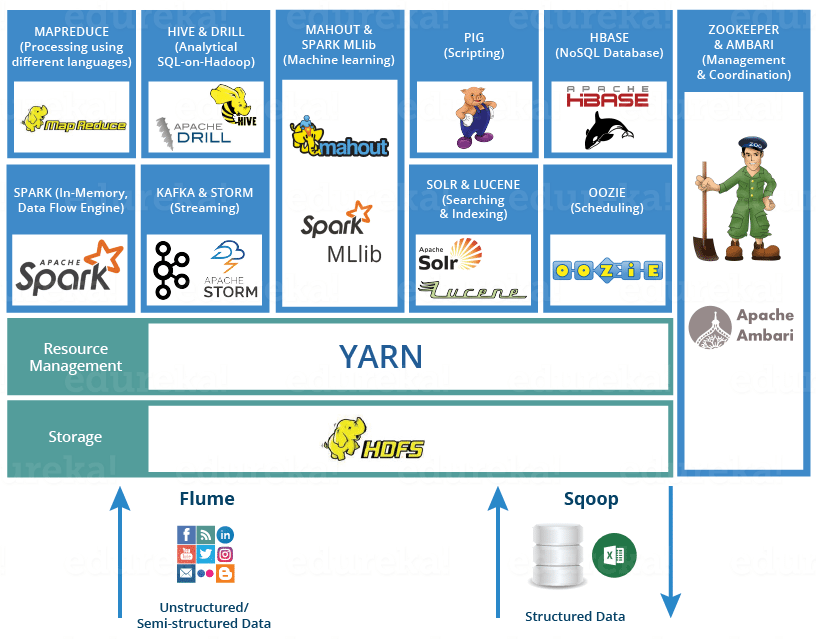

## Hive简介

Hive是Facebook开源的一款基于Hadoop的数据仓库工具，是目前应用最广泛的大数据处理解决方案，它能将SQL查询转变为 MapReduce（Google提出的一个软件架构，用于大规模数据集的并行运算）任务，对SQL提供了完美的支持，能够非常方便的实现大数据统计。



> **说明**：可以通过<https://www.edureka.co/blog/hadoop-ecosystem>来了解Hadoop生态圈。

如果要简单的介绍Hive，那么以下两点是其核心：

1. 把HDFS中结构化的数据映射成表。
2. 通过把Hive-SQL进行解析和转换，最终生成一系列基于Hadoop的MapReduce任务/Spark任务，通过执行这些任务完成对数据的处理。也就是说，即便不学习Java、Scala这样的编程语言，一样可以实现对数据的处理。

Hive和传统关系型数据库的对比如下表所示。

|          | Hive              | RDBMS        |
| -------- | ----------------- | ------------ |
| 查询语言 | HQL               | SQL          |
| 存储数据 | HDFS              | 本地文件系统 |
| 执行方式 | MapReduce / Spark | Executor     |
| 执行延迟 | 高                | 低           |
| 数据规模 | 大                | 小           |

### 准备工作

1. 搭建如下图所示的大数据平台。

    

2. 通过Client节点访问大数据平台。

    

3. 创建文件Hadoop的文件系统。

    ```Shell
    hadoop fs -mkdir /data
    hadoop fs -chmod g+w /data
    ```

4. 将准备好的数据文件拷贝到Hadoop文件系统中。

    ```Shell
    hadoop fs -put /home/ubuntu/data/* /data
    ```

### 创建/删除数据库

创建。

```SQL
create database if not exists demo;
```

或

```Shell
hive -e "create database demo;"
```

删除。

```SQL
drop database if exists demo;
```

切换。

```SQL
use demo;
```

### 数据类型

Hive的数据类型如下所示。

基本数据类型。

| 数据类型  | 占用空间 | 支持版本 |
| --------- | -------- | -------- |
| tinyint   | 1-Byte   |          |
| smallint  | 2-Byte   |          |
| int       | 4-Byte   |          |
| bigint    | 8-Byte   |          |
| boolean   |          |          |
| float     | 4-Byte   |          |
| double    | 8-Byte   |          |
| string    |          |          |
| binary    |          | 0.8版本  |
| timestamp |          | 0.8版本  |
| decimal   |          | 0.11版本 |
| char      |          | 0.13版本 |
| varchar   |          | 0.12版本 |
| date      |          | 0.12版本 |

复杂数据类型。

| 数据类型 | 描述                     | 例子                                          |
| -------- | ------------------------ | --------------------------------------------- |
| struct   | 和C语言中的结构体类似    | `struct<first_name:string, last_name:string>` |
| map      | 由键值对构成的元素的集合 | `map<string,int>`                             |
| array    | 具有相同类型的变量的容器 | `array<string>`                               |

### 创建和使用表

1. 创建内部表。

    ```SQL
    create table if not exists user_info 
    (
    user_id string,
    user_name string, 
    sex string,
    age int,
    city string,
    firstactivetime string,
    level int,
    extra1 string,
    extra2 map<string,string>
    )
    row format delimited fields terminated by '\t'
    collection items terminated by ','
    map keys terminated by ':'
    lines terminated by '\n'
    stored as textfile;
    ```

2. 加载数据。

    ```SQL
    load data local inpath '/home/ubuntu/data/user_info/user_info.txt' overwrite into table user_info;
    ```

    或

    ```SQL
    load data inpath '/data/user_info/user_info.txt' overwrite into table user_info;
    ```

3. 创建分区表。

    ```SQL
    create table if not exists user_trade 
    (
    user_name string,
    piece int,
    price double,
    pay_amount double,
    goods_category string,
    pay_time bigint
    )  
    partitioned by (dt string)
    row format delimited fields terminated by '\t';
    ```

4. 设置动态分区。

    ```SQL
    set hive.exec.dynamic.partition=true;
    set hive.exec.dynamic.partition.mode=nonstrict;
    set hive.exec.max.dynamic.partitions=10000;
    set hive.exec.max.dynamic.partitions.pernode=10000;
    ```

5. 拷贝数据（Shell命令）。

    ```Shell
    hdfs dfs -put /home/ubuntu/data/user_trade/* /user/hive/warehouse/demo.db/user_trade
    ```

6. 修复分区表。

    ```SQL
    msck repair table user_trade;
    ```

### 查询

#### 基本语法

```SQL
select user_name from user_info where city='beijing' and sex='female' limit 10;
select user_name, piece, pay_amount from user_trade where dt='2019-03-24' and goods_category='food';
```

#### group by

```SQL
-- 查询2019年1月到4月，每个品类有多少人购买，累计金额是多少
select goods_category, count(distinct user_name) as user_num, sum(pay_amount) as total from user_trade where dt between '2019-01-01' and '2019-04-30' group by goods_category;
```

```SQL
-- 查询2019年4月支付金额超过5万元的用户
select user_name, sum(pay_amount) as total from user_trade where dt between '2019-04-01' and '2019-04-30' group by user_name having sum(pay_amount) > 50000;
```

#### order by

```SQL
-- 查询2019年4月支付金额最多的用户前5名
select user_name, sum(pay_amount) as total from user_trade where dt between '2019-04-01' and '2019-04-30' group by user_name order by total desc limit 5;
```

#### 常用函数

1. `from_unixtime`：将时间戳转换成日期
2. `unix_timestamp`：将日期转换成时间戳
3. `datediff`：计算两个日期的时间差
4. `if`：根据条件返回不同的值
5. `substr`：字符串取子串
6. `get_json_object`：从JSON字符串中取出指定的`key`对应的`value`，如：`get_json_object(info, '$.first_name')`。

