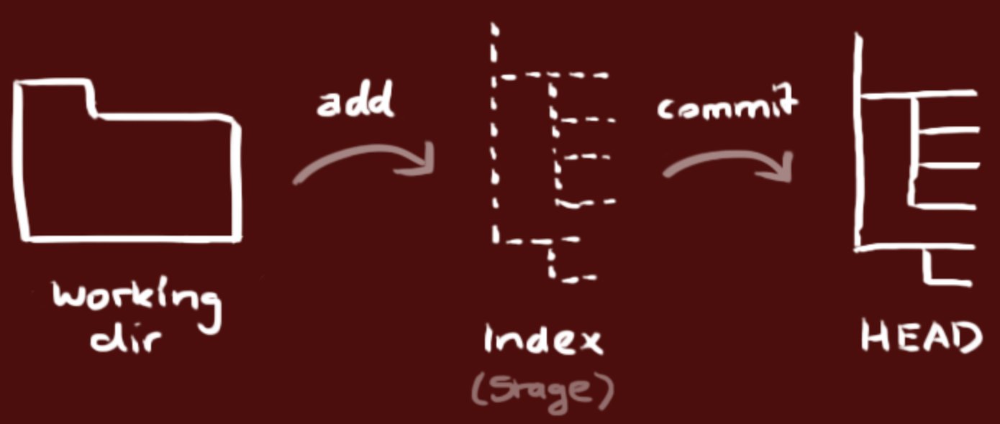
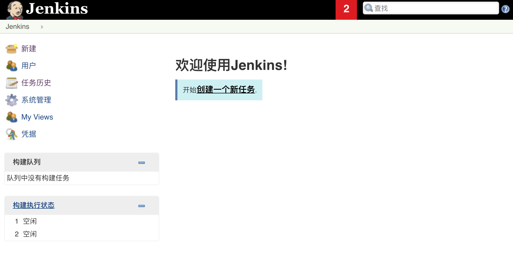

## 团队项目开发准备

我们经常听到个人开发和团队开发这两个词，所谓个人开发就是一个人把控产品的所有内容；而团队开发则是由多个人组成团队并完成产品的开发。要实施团队开发以下几点是必不可少的：

1. 必须对开发过程中的各种事件（例如：谁到什么时间完成了什么事情）进行管理和共享。
2. 各类工作成果以及新的知识技巧等必须在团队内部共享。
3. 管理工作成果的变更，既要防止成果被破坏，又要保证各个成员利用现有成果并行作业。
4. 能够证明团队开发出的软件在任何时候都是可以正常运行的。
5. 尽可能的使用自动化的工作流程，让团队成员能够正确的实施开发、测试和部署。

### 团队项目开发常见问题

#### 问题1：传统的沟通方式无法确定处理的优先级

例如：使用邮件进行沟通可能出现邮件数量太多导致重要的邮件被埋没，无法管理状态，不知道哪些问题已经解决，哪些问题尚未处理，如果用全文检索邮件的方式来查询相关问题效率过于低下。

解决方案：使用缺陷管理工具。

#### 问题2：没有能够用于验证的环境

例如：收到项目正式环境中发生的故障报告后，需要还原正式环境需要花费很长的时间。

解决方法：实施持续交付。

#### 问题3：用别名目录管理项目分支

解决方法：实施版本控制。

#### 问题4：重新制作数据库非常困难

例如：正式环境和开发环境中数据库表结构不一致或者某个表列的顺序不一致。

解决方法：实施版本控制。

#### 问题5：不运行系统就无法察觉问题

例如：解决一个bug可能引入其他的bug或者造成系统退化，不正确的使用版本系统覆盖了其他人的修改，修改的内容相互发生了干扰，如果问题不能尽早发现，那么等过去几个月后再想追溯问题就非常麻烦了。

解决方法：实施持续集成，将团队成员的工作成果经常、持续的进行构建和测试。

#### 问题6：覆盖了其他成员修正的代码

解决方法：实施版本控制。

#### 问题7：无法实施代码重构

重构：在不影响代码产生的结果的前提下对代码内部的构造进行调整。

例如：在实施代码重构时可能引发退化。

解决方法：大量的可重用的测试并实施持续集成。

#### 问题8：不知道bug的修正日期无法追踪退化

解决方法：版本控制系统、缺陷管理系统和持续集成之间需要交互，最好能够和自动化部署工具集成到一起来使用。

#### 问题9：发布过程太复杂

解决方法：实施持续交付。

基于对上述问题的阐述和分析，我们基本上可以得到以下的结论，在团队开发中版本控制、缺陷管理和持续集成都是非常重要且不可或缺的。

### 版本控制

针对上面提到的一些问题，在团队开发的首要前提就是实施版本控制，对必要的信息进行管理，需要管理的内容包括：

1. 代码。
2. 需求和设计的相关文档。
3. 数据库模式和初始数据。
4. 配置文件。
5. 库的依赖关系定义。

#### Git简介


Git是诞生于2005年的一个开源分布式版本控制系统，最初是Linus Torvalds（Linux之父） 为了帮助管理Linux内核开发而开发的一个版本控制软件。Git与常用的版本控制工具Subversion等不同，它采用了分布式版本控制的方式，在没有中央服务器支持的环境下也能够实施版本控制。

对于有使用Subversion（以下简称为SVN）经验的人来说，Git和SVN一样摒弃了基于锁定模式的版本控制方案（早期的CVS和VSS使用的就是锁定模式）采用了合并模式，而二者的区别在于：
    1. Git是分布式的，SVN是集中式的，SVN需要中央服务器才能工作。
    2. Git把内容按元数据方式存储，而SVN是按文件，即把文件的元信息隐藏在一个.svn文件夹里。
    3. Git分支和SVN的分支不同。
    4. Git没有一个全局版本号而SVN有。
    5. Git的内容完整性要优于SVN，Git的内容存储使用的是SHA-1哈希算法。这能确保代码内容的完整性，确保在遇到磁盘故障和网络问题时降低对版本库的破坏。  

#### 安装Git

可以在[Git官方网站](http://git-scm.com/)找到适合自己系统的Git下载链接并进行安装，安装成功后可以在终端中键入下面的命令检查自己的Git版本。

```Shell
git --version
```

如果之前完全没有接触过Git，可以先阅读[《git - 简易指南》](http://www.bootcss.com/p/git-guide/)来对Git有一个大致的了解。

#### 本地实施版本控制

可以使用下面的命令将目录创建为Git仓库。
```Shell
git init 
```

当你完成了上述操作后，本地目录就变成了下面的样子，左边是你正在操作的工作目录，而右边是你的本地仓库，中间是工作目录和本地仓库之间的一个暂存区（也称为缓存区）。



通过`git add`可以将文件添加到暂存区。

```Shell
git add <file> ...
```

可以用下面的方式将暂存区的指定文件恢复到工作区。

```Shell
git checkout -- <file>
```

通过下面的命令可以将暂存区的内容纳入本地仓库。

```Shell
git commit -m '本次提交的说明'
```

可以使用下面的命令查看文件状态和进行版本比较。

```Shell
git status -s
git diff
```

可以通过`git log`查看提交日志。

```Shell
git log
git log --graph --pretty=oneline --abbrev-commit
```

如果要回到历史版本，可以使用下面的命令。

```Shell
git reset --hard <commit-id>
git reset --hard HEAD^
```

其他的一些命令可以参考阮一峰老师的[《常用Git命令清单》](http://www.ruanyifeng.com/blog/2015/12/git-cheat-sheet.html)或者是码云上的[《Git大全》](https://gitee.com/all-about-git)。

#### Git服务器概述

对于Git来说不像SVN那样一定需要一个中心服务器，刚才我们的操作都是在本地执行的，如果你想通过Git分享你的代码或者与其他人协作，那么就需要服务器的支持。Github为Git提供了远程仓库，它是一个基于Git的代码托管平台，企业用户（付费用户）可以创建仓库，普通用户只能创建公开仓库（代码是可以是他人可见的）。Github是在2008年4月创办的，它上面代码库惊人的增长速度已经证明了它是非常成功的，在2018年6月，微软以75亿美元的天价收购了Github。国内也有类似的代码托管平台，最有名的当属[码云](https://gitee.com/)和[CODING](https://coding.net/)，目前码云和CODING对注册用户都提供了受限的使用私有仓库的功能，同时还提供了对Pull Request的支持（后面会讲到），而且目前提供代码托管服务的平台都集成了“缺陷管理”、“WebHook”等一系列的功能，让我们能做的事情不仅仅是版本控制。当然，如果公司需要也可以搭建自己的Git服务器，具体的方式我们就不在这里进行介绍了，有兴趣的可以自行了解。


我们可以在码云或者CODING上注册账号，也可以使用第三方登录（github账号、微信账号、新浪微博账号、CSDN账号等）的方式。登录成功后就可以创建项目，创建项目几乎是“傻瓜式”的，我们只说几个值得注意的地方。

1. 添加项目成员。创建项目后，可以在项目的“设置”或“管理”中找到“成员管理”功能，这样就可以将其他开发者设置为项目团队的成员，项目成员通常分为“所有者”、“管理者”、“普通成员”和“受限成员”几种角色。

2. 设置公钥实现免密操作。在项目的“设置”或“管理”中我们还可以找到“部署公钥管理”的选项，通过添加部署公钥，可以通过SSH（安全远程连接）的形式访问服务器而不用每次输入用户名和口令。可以使用`ssh-keygen`命令来创建密钥对。

   ```Shell
   ssh-keygen -t rsa -C "your_email@example.com"
   ```

#### 使用Git进行开发

克隆服务器上的代码到本地机器。

```Shell
git clone <url>
```

在自己的分支上进行开发。

```Shell
git branch <branch-name>
git checkout <branch-name>
```

或者

```Shell
git checkout -b <branch-name>
```

接下来可以先在本地实施版本控制（操作的方式与前面相同不再赘述），然后再将自己的分支Push到服务器。

```Shell
git push origin <branch-name>
```

最后，当工作完成时，可以发起一个Pull Request，请求将代码合并到master分支。

#### 分支策略的模式

上面讲解的方式，其实是一种称为github-flow的分支策略模式，这种模式的操作步骤包括：

1. master的内容都是可以进行发布的内容。
2. 开发时应该以master为基础建立新分支。
3. 分支先在本地实施版本控制，然后以同名分支定期向服务器进行Push。
4. 开发结束后向master发送Pull Request。
5. Pull Request通过代码审查之后合并到master，并从master向正式环境发布。

在使用github-flow时的注意事项有以下三点：

1. master是用于发布的，不能直接在master上进行修改。
2. 开始日常开发工作时要首先建立分支。
3. 工作完成后向master发送Pull Request。

除了上述的github-flow工作方式外，还有一种名为git-flow的分支策略模式，它借鉴了中央集权型版本控制系统的长处，为团队内部统一管理建立分支的方法、合并操作和关闭分支的方法。在这种模式下，项目有两个长线分支，分别是master和develop，其他的都是临时的、短暂的辅助分支，包括feature（开发特定功能的分支，开发结束后合并到develop）、release（从develop分离出来的为发布做准备的分支，发布结束后合并到master和develop）和hotfix（产品发布后出现问题时紧急建立的分支，直接从master分离，问题修复后合并到master并打上标签，同时还要合并到develop来避免将来的版本遗漏了这个修复工作，如果此时有正在发布中的release分支，还要合并到release分支）。这套方式分支策略简单清晰且容易理解，但是在运用上会稍微有些复杂，需要一些脚本来辅助版本控制的实施。

### 缺陷管理

没有好的团队管理工具必然导致项目进展不顺利，任务管理困难，而引入缺陷管理系统正好可以解决这些问题，通常一个缺陷管理系统都包含了以下的功能：

1. 任务管理（包括必须做什么、谁来做、什么时候完成、现在处于什么状态等）。
2. 直观而且可以检索过去发生的各种问题。
3. 能够对信息进行统一的管理和共享。
4. 能够生成各类报表。
5. 能够关联到其他系统，具有可扩展性。

Redmine是基于Ruby on Rails框架的开源缺陷管理系统，提供了问题管理、代码管理、Wiki等必要的功能，而且支持插件系统，扩展起来也非常容易。


如果希望了解和使用Redmine，可以关注[Redmine中文网](http://www.redmine.org.cn/)，上面提供了视频教程、经验分享以及其他的安装和使用上的指导。

### 持续集成

为了快速的产生高品质的软件，在团队开发中，持续集成（CI）也是一个非常重要的基础。按照经典的软件过程模型（瀑布模型），集成的工作一般要等到所有的开发工作都结束后才能开始，但这个时候如果发现了问题，修复问题的代价是非常具体的。基本上，集成实施得越晚，代码量越大，解决问题就越困难。持续集成将版本控制、自动化构建、代码测试融入到一起，让这些工作变得自动化和可协作。由于其频繁重复整个开发流程（在指定时间内多次pull源代码并运行测试代码），所以能帮助开发者提早发现问题。

在所有的CI工具中，Jenkins和TravisCI是最具有代表性的。

Jenkins 是基 Java的开源CI工具，其安装和操作都很简单。另外，Jenkins不仅能在面板上轻松看出任务成功或失败，还可以借助通知功能将结果以邮件或RSS订阅的形式发给用户。与此同时，Jenkins也允许通过插件进行功能扩展，所需功能可以随用随添加，而且还支持主从式集群，能够轻松的进行水平扩展。