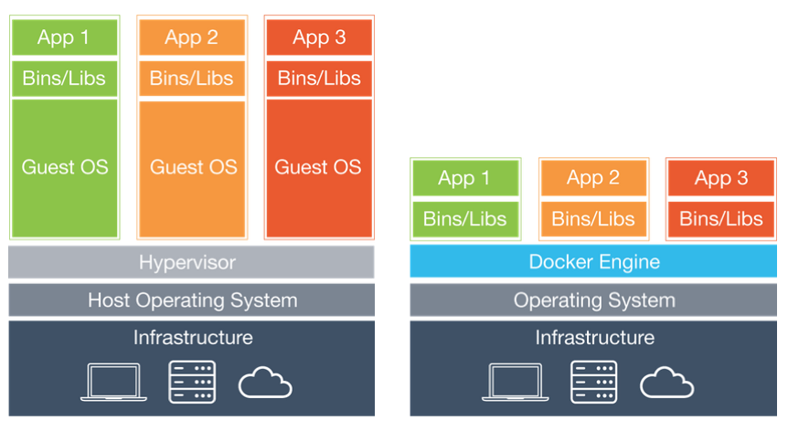
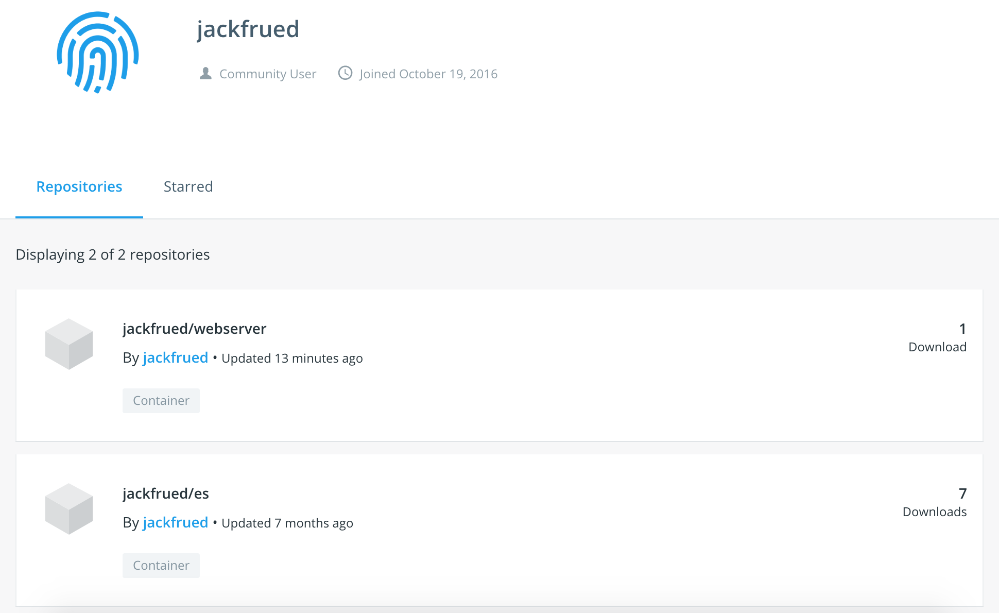

## Docker容器技术详解

Docker是基于Go语言开发的开源应用容器引擎，遵从Apache Licence 2.0协议，可以让开发者打包应用以及应用的依赖包到一个可移植的容器中，然后发布到各种发行版本的Linux系统上。

### Docker简介

软件开发中最为麻烦的事情可能就是配置环境了。由于用户使用的操作系统具有多样性，即便使用跨平台的开发语言（如Java和Python）都不能保证代码能够在各种平台下都可以正常的运转，而且在不同的环境下我们安装的软件需要依赖的软件包也是不一样的。

那么问题来了，我们安装软件的时候可不可以把软件运行的环境一并安装？我们是不是可以把原始环境一模一样地复制过来呢？

虚拟机（virtual machine）就是带环境安装的一种解决方案，它可以在一种操作系统里面运行另一种操作系统，比如在Windows系统里面运行Linux系统，在macOS上运行Windows，而应用程序对此毫无感知。使用过虚拟机的人都知道，虚拟机用起来跟真实系统一模一样，而对于虚拟机的宿主系统来说，虚拟机就是一个普通文件，不需要了就删掉，对宿主系统或者其他的程序并没有影响。但是虚拟机通常会占用较多的系统资源，启动和关闭也非常的缓慢，总之用户体验并没有想象中的那么好。

Docker属于对Linux容器技术（LXC）的一种封装（利用了Linux的namespace和cgroup技术），它提供了简单易用的容器使用接口，是目前最流行的 Linux 容器解决方案。Docker将应用程序与该程序的依赖打包在一个文件里面，运行这个文件，就会生成一个虚拟容器。程序在这个虚拟容器里运行，就好像在真实的物理机上运行一样。下图是虚拟机和容器的对比，左边是传统的虚拟机，右边是Docker。



目前，Docker主要用于几下几个方面：

1. 提供一次性的环境。
2. 提供弹性的云服务（利用Docker很容易实现扩容和收缩）。
3. 实践微服务架构（隔离真实环境在容器中运行多个服务）。

### 安装Docker

下面以CentOS为例讲解如何安装Docker，使用[Ubuntu](https://docs.docker.com/install/linux/docker-ce/ubuntu/)、[macOS](https://docs.docker.com/docker-for-mac/install/)或[Windows](https://docs.docker.com/docker-for-windows/install/)的用户可以通过点击对应的链接了解这些平台下如何进行安装。

1. 确定操作系统内核版本（CentOS 7要求64位，内核版本3.10+；CentOS 6要求64位，内核版本2.6+）。

   ```Bash
   uname -r
   ```

2. 更新系统底层的库文件（建议一定要执行，否则在使用Docker时可能会出现莫名其妙的问题）。

   ```Bash
   yum update
   ```

3. 移除可能存在的旧的Docker版本。

   ```Bash
   yum list installed | grep docker
   yum erase -y docker docker-common docker-engine
   ```

4. 安装yum工具包和依赖项。

   ```Bash
   yum install -y yum-utils device-mapper-persistent-data lvm2
   ```

5. 通过yum工具包添加yum源（安装Docker-ce的源）。

   ```Bash
   yum-config-manager --add-repo https://download.docker.com/linux/centos/docker-ce.repo
   ```

6. 在CentOS下使用yum安装Docker-ce并启动。

   ```Bash
   yum -y install docker-ce
   systemctl start docker
   ```

7. 查看Docker的信息和版本。

   ```Shell
   docker version
   docker info
   ```

接下来可以通过下载镜像和创建容器来看看Docker是否可以运转起来。可以使用下面的命令从Docker的镜像仓库下载名为hello-world的镜像文件。

 ```Shell
docker pull hello-world
 ```

查看所有镜像文件。

```Shell
docker images
```

```
REPOSITORY               TAG        IMAGE ID            CREATED             SIZE
docker.io/hello-world    latest     fce289e99eb9        7 months ago        1.84 kB
```

通过镜像文件创建并运行容器。

```Shell
docker container run --name mycontainer hello-world
```

> 说明：其中`mycontainer`是我们给容器起的名字，跟在`--name`参数之后；`hello-world`就是我们刚才下载的镜像文件。

```
Hello from Docker!
This message shows that your installation appears to be working correctly.

To generate this message, Docker took the following steps:
 1. The Docker client contacted the Docker daemon.
 2. The Docker daemon pulled the "hello-world" image from the Docker Hub.
    (amd64)
 3. The Docker daemon created a new container from that image which runs the
    executable that produces the output you are currently reading.
 4. The Docker daemon streamed that output to the Docker client, which sent it
    to your terminal.

To try something more ambitious, you can run an Ubuntu container with:
 $ docker run -it ubuntu bash

Share images, automate workflows, and more with a free Docker ID:
 https://hub.docker.com/

For more examples and ideas, visit:
 https://docs.docker.com/get-started/
```

如果要删除这个容器，可以使用下面的命令。

```Shell
docker container rm mycontainer
```

在删除容器之后，我们还可以删除刚才下载的镜像文件。

```Shell
docker rmi hello-world
```

> 说明：如果要在Ubuntu（内核版本3.10+）下面安装和启动Docker，可以按照如下的步骤进行。
>
> ```Shell
> apt update
> apt install docker-ce
> service docker start
> ```
>
> 国内用户可以通过更换Ubuntu软件下载源来提升下载速度，具体请参照清华大学开源软件镜像站上的[《Ubuntu镜像使用帮助》](<https://mirrors.tuna.tsinghua.edu.cn/help/ubuntu/>)。

安装Docker后，由于直接访问[dockerhub](https://hub.docker.com/)下载镜像会非常缓慢，建议将服务器更换为国内镜像，可以通过修改 `/etc/docker/daemon.json` 文件来做到。一般的云服务器会有自己专属的镜像，就不需要手动修改了。

```JavaScript
{
	"registry-mirrors": [
        "http://hub-mirror.c.163.com",
        "https://registry.docker-cn.com"
    ]
}
```

### 使用Docker

想要玩转Docker，最简单的办法就是马上用Docker创建一些自己学习和工作中需要用到的容器，下面我们带着大家一起来创建这些容器。

#### 运行Nginx

Nginx是高性能的Web服务器，同时也是做反向代理服务器的上佳选择。使用Docker可以非常简单的创建一个运行Nginx的容器，命令如下所示。

```Shell
docker container run -d -p 80:80 --rm --name mynginx nginx
```

> 说明：上面的参数`-d`表示容器在后台运行（不产生输出到Shell）并显示容器的ID；`-p`是用来映射容器的端口到宿主机的端口，冒号前面是宿主机的端口，冒号后面是容器内部使用的端口；`--rm`表示容器停止后自动删除容器，例如执行命令`docker container stop mynginx`后，容器就不复存在了；`--name`后面的mynginx是自定义的容器名字；在创建容器的过程中，需要用到nginx的镜像文件，镜像文件的下载是自动完成的，如果没有指定版本号，默认是最新版本（latest）。

如果需要将自己的Web项目（页面）部署到Nginx上，可以使用容器拷贝命令将指定路径下所有的文件和文件夹拷贝到容器的指定目录中。

```Shell
docker container cp /root/web/index.html mynginx:/usr/share/nginx/html
```

如果不愿意拷贝文件也可以在创建容器时通过数据卷操作`--volume`将指定的文件夹映射到容器的某个目录中，例如将Web项目的文件夹直接映射到`/usr/share/nginx/html`目录。我们先通过下面的命令让刚才创建的容器停止运行。

```Shell
docker container stop mynginx
```

然后用下面的命令重新创建容器。

```Shell
docker container run -d -p 80:80 --rm --name mynginx --volume /root/docker/nginx/html:/usr/share/nginx/html nginx
```

> 说明：上面创建容器和拷贝文件的命令中，`container`是可以省略的，也就是说`docker container run`和`docker run`是一样的，而`docker container cp`和`docker cp`是一样的。此外，命令中的`--volume`也可以缩写为`-v`，就如同`-d`是`--detach`的缩写，`-p`是`--publish`的缩写。`$PWD`代表宿主系统当前文件夹，这些对于使用过Unix或者Linux系统的人来说，应该是很容易理解的。

要查看运行中的容器，可以使用下面的命令。

```Shell
docker ps
```

```
CONTAINER ID    IMAGE    COMMAND                  CREATED            STATUS             PORTS                 NAMES
3c38d2476384    nginx    "nginx -g 'daemon ..."   4 seconds ago      Up 4 seconds       0.0.0.0:80->80/tcp    mynginx
```

要启动和停止容器，可以使用下面的命令。

```Shell
docker start mynginx
docker stop mynginx
```

由于在创建容器时使用了`--rm`选项，容器在停止时会被移除，当我们使用下面的命令查看所有容器时，应该已经看不到刚才的`mynginx`容器了。

```Shell
docker container ls -a
```

如果在创建容器时没有指定`--rm`选项，那么也可以使用下面的命令来删除容器。

```Shell
docker rm mynginx
```

要删除正在运行中的容器，需要使用`-f`选项。

```Shell
docker rm -f mynginx
```

#### 运行MySQL

我们再来尝试用Docker安装一台MySQL服务器，首先可以先检查一下有没有MySQL的镜像文件。

```Shell
docker search mysql
```

```
INDEX        NAME            DESCRIPTION        STARS        OFFICIAL        AUTOMATED
docker.io    docker.io/mysql MySQL is a ...     8486         [OK]
...
```

> 说明：上面查询结果的列依次代表索引、镜像名、镜像描述、用户评价、是否官方镜像、自动构建。

下载MySQL镜像并指定镜像的版本号。

```Shell
docker pull mysql:5.7
```

如果需要查看已经下载的镜像文件，可以使用下面的命令。

```Shell
docker images
```

```
REPOSITORY          TAG                 IMAGE ID            CREATED             SIZE
docker.io/nginx     latest              e445ab08b2be        2 weeks ago         126 MB
docker.io/mysql     5.7                 f6509bac4980        3 weeks ago         373 MB
```

创建并运行MySQL容器。

```Shell
docker run -d -p 3306:3306 --name mysql57 -v /root/docker/mysql/conf:/etc/mysql/mysql.conf.d -v /root/docker/mysql/data:/var/lib/mysql -e MYSQL_ROOT_PASSWORD=123456 mysql:5.7
```

> **注意**：上面创建容器时我们又一次使用了数据卷操作，那是因为通常容器是随时创建随时删除的，而数据库中的数据却是需要保留下来的。

上面的两个数据卷操作一个是映射了MySQL配置文件所在的文件夹，一个是映射了MySQL数据所在的文件夹，这两个数据卷操作非常重要。我们可以将MySQL的配置文件放在`$PWD/mysql/conf`目录下，配置文件的具体内容如下所示：

```INI
[mysqld]
pid-file=/var/run/mysqld/mysqld.pid
socket=/var/run/mysqld/mysqld.sock
datadir=/var/lib/mysql
log-error=/var/log/mysql/error.log
server-id=1
log-bin=/var/log/mysql/mysql-bin.log
expire_logs_days=30
max_binlog_size=256M
symbolic-links=0
```

如果安装了MySQL 8.x版本（目前的最新版本），在使用客户端工具连接服务器时可能会遇到`error 2059: Authentication plugin 'caching_sha2_password' cannot be loaded`的问题，这是因为MySQL 8.x默认使用了名为“caching_sha2_password”的机制对用户口令进行了更好的保护，但是如果客户端工具不支持新的认证方式，连接就会失败。解决这个问题有两种方式：一是升级客户端工具来支持MySQL 8.x的认证方式；二是进入容器，修改MySQL的用户口令认证方式。下面是具体的步骤，我们先用`docker exec`命令进入容器的交互式环境，假设运行MySQL 8.x的容器名字叫`mysql8x`。

```Shell
docker exec -it mysql8x /bin/bash
```

进入容器的交互式Shell之后，可以首先利用MySQL的客户端工具连接MySQL服务器。

```Shell
mysql -u root -p
Enter password:
Your MySQL connection id is 16
Server version: 8.0.12 MySQL Community Server - GPL
Copyright (c) 2000, 2018, Oracle and/or its affiliates. All rights reserved.
Oracle is a registered trademark of Oracle Corporation and/or its
affiliates. Other names may be trademarks of their respective
owners.
Type 'help;' or '\h' for help. Type '\c' to clear the current input statement.
mysql>
```

接下来通过SQL来修改用户口令就可以了。

```SQL
alter user 'root'@'%' identified with mysql_native_password by '123456' password expire never;
```

当然，如果愿意你也可以查看一下用户表检查是否修改成功。

```SQL
use mysql;
select user, host, plugin, authentication_string from user where user='root';
+------+-----------+-----------------------+-------------------------------------------+
| user | host      | plugin                | authentication_string                     |
+------+-----------+-----------------------+-------------------------------------------+
| root | %         | mysql_native_password | *6BB4837EB74329105EE4568DDA7DC67ED2CA2AD9 |
| root | localhost | mysql_native_password | *6BB4837EB74329105EE4568DDA7DC67ED2CA2AD9 |
+------+-----------+-----------------------+-------------------------------------------+
2 rows in set (0.00 sec)
```

在完成上面的步骤后，现在即便不更新客户端工具也可以连接MySQL 8.x了。

#### 运行Redis

接下来我们试一试运行多个容器并让多个容器之间通过网络通信。我们创建4个Redis容器来实现一主三从的主从复制结构。

```Shell
docker run -d -p 6379:6379 --name redis-master redis
docker run -d -p 6380:6379 --name redis-slave-1 --link redis-master:redis-master redis redis-server --replicaof redis-master 6379
docker run -d -p 6381:6379 --name redis-slave-2 --link redis-master:redis-master redis redis-server --replicaof redis-master 6379
docker run -d -p 6382:6379 --name redis-slave-3 --link redis-master:redis-master redis redis-server --replicaof redis-master 6379
```

上面的命令中，`--link`参数用于给容器创建网络别名，因为三台从机（slave）需要通过网络连接自己的主机（master）。虽然，我们可以通过`docker inspect --format '{{ .NetworkSettings.IPAddress }}' <container-ID>`命令来查看到容器的IP地址，但是由于容器的即装即用性，容器的IP地址有可能会发生变化，如果直接使用IP地址，在容器重启后就可能会因为IP地址的变化导致从机无法连接到主机。使用`--link`参数创建网络别名就是为了在启动Redis服务器时在`redis-server`后面的`--replicaof`参数后使用这个别名而不是IP地址。

接下来我们进入名为`redis-master`的容器，看看主从复制的配置是否成功。

```Shell
docker exec -it redis-master /bin/bash
```

通过`redis-cli`启动命令行工具。

```Shell
redis-cli
127.0.0.1:6379> info replication
# Replication
role:master
connected_slaves:3
slave0:ip=172.17.0.4,port=6379,state=online,offset=1988,lag=0
slave1:ip=172.17.0.5,port=6379,state=online,offset=1988,lag=1
slave2:ip=172.17.0.6,port=6379,state=online,offset=1988,lag=1
master_replid:94703cfa03c3ddc7decc74ca5b8dd13cb8b113ea
master_replid2:0000000000000000000000000000000000000000
master_repl_offset:1988
second_repl_offset:-1
repl_backlog_active:1
repl_backlog_size:1048576
repl_backlog_first_byte_offset:1
repl_backlog_histlen:1988
```

#### 运行GitLab

GitLab是由GitLab Inc.开发的Git仓库管理工具，具有wiki、问题跟踪、持续集成等一系列的功能，分为社区版和企业版。通过Docker提供的虚拟化容器，我们可以安装社区版的Docker。因为GitLab需要使用SSH协议进行安全连接，我们要暴露容器的22端口，所以可以先将宿主机SSH连接的22端口修改为其他端口（如：12345），然后再进行后续的操作。

```Shell
vim /etc/ssh/sshd_config
```

将其中定义端口的那行代码去掉注释并将端口修改为12345。

```
Port 12345
```

重新启动`sshd`服务。 

```Shell
systemctl restart sshd
```

> **提示**：修改端口后应该确保防火墙上也开启对应的端口，否则无法使用SSH连接到Linux服务器。

创建需要用于数据卷映射操作的文件夹。

```Shell
mkdir -p /root/gitlab/{config,logs,data}
```

基于`gitlab/gitlab-ce`镜像创建容器，并暴露80端口（HTTP连接）和22端口（SSH连接）。

```Shell
docker run -d -p 80:80 -p 22:22 --name gitlab -v /root/gitlab/config:/etc/gitlab -v /root/gitlab/logs:/var/log/gitlab -v /root/gitlab/data:/var/opt/gitlab gitlab/gitlab-ce
```

> 说明：GitLab的启动比较缓慢，创建好容器后可能需要等待一段时间才能通过浏览器来进行访问。

首次进入GitLab访问界面会提示我们修改管理员密码，设置好管理员密码后就可以在登录界面输入用户名`root`和刚才设置的密码登录到管理员控制台，在使用上还是非常简单和人性化的。

### 构建镜像

通过上面的讲解，我们已经掌握了如何通过官方提供的镜像来创建容器。当然如果愿意，我们也可以用配置好的容器来生成镜像。简而言之，**Docker镜像是由文件系统叠加而成的，系统的最底层是bootfs，相当于就是Linux内核的引导文件系统；接下来第二层是rootfs，这一层可以是一种或多种操作系统（如Debian或Ubuntu文件系统），Docker中的rootfs是只读状态的；Docker利用联合挂载技术将各层文件系统叠加到一起，最终的文件系统会包含有底层的文件和目录，这样的文件系统就是一个镜像**。

之前我们讲过了如何查找、列出镜像和拉取（下载）镜像，接下来看看构建镜像的两种方式：

1. 使用`docker commit`命令。（不推荐）
2. 使用`docker build`命令和Dockerfile文件。

#### 使用commit命令构建镜像

为了演示如何构建镜像，我们先使用Ubuntu镜像来定制一个容器，命令如下所示。

```Shell
docker run --name myubuntu -it ubuntu /bin/bash
```

在容器中执行下面的命令来安装Apache服务器并退出容器。

```Shell
apt -y upgrade
apt -y install apache2
exit
```

我们将这个容器作为一个定制的Web服务器保存起来，当需要这样一台Web服务器的时候，就没有必要重新创建容器并安装Apache了。

首先我们通过下面的命令查看容器的ID。

```Shell
docker container ls -a
```

```
docker container ls -a
CONTAINER ID    IMAGE    COMMAND        CREATED        STATUS        PORTS    NAMES
014bdb321612    ubuntu   "/bin/bash"    5 minutes ago  Exited (0)             myubuntu
```

提交定制的容器。

```Shell
docker commit 014bdb321612 jackfrued/mywebserver
```

查看镜像文件。

```Shell
docker images
```

```
REPOSITORY              TAG       IMAGE ID        CREATED             SIZE
jackfrued/mywebserver   latest    795b294d265a    14 seconds ago      189 MB
```

生成镜像文件以后，后面就可以利用刚才创建的镜像文件来创建新的容器。

#### 使用Dockerfile构建镜像

Dockerfile使用DSL（Domain Specific Language）来构建一个Docker镜像，只要编辑好了Dockerfile文件，就可以使用`docker build`命令来构建一个新的镜像。

我们先创建一个名为myapp的文件夹来保存项目代码和Dockerfile的文件，如下所示：

```Shell
[ECS-root temp]# tree myapp
myapp
├── api
│   ├── app.py
│   ├── requirements.txt
│   └── start.sh
└── Dockerfile
```

其中api是Flask项目的文件夹，其中包括了项目代码、依赖项以及启动脚本等文件，具体内容如下所示：

`app.py`文件：

```Python
from flask import Flask
from flask_restful import Resource, Api
from flask_cors import CORS

app = Flask(__name__)
CORS(app, resources={r'/api/*': {'origins': '*'}})
api = Api(app)


class Product(Resource):

    def get(self):
        products = ['Ice Cream', 'Chocolate', 'Coca Cola', 'Hamburger']
        return {'products': products}


api.add_resource(Product, '/api/products')
```

`requirements.txt`文件：

```INI
flask
flask-restful
flask-cors
gunicorn
```

`start.sh`文件：

```Shell
#!/bin/bash
exec gunicorn -w 4 -b 0.0.0.0:8000 app:app
```

> **提示**：需要给start.sh文件以执行权限，可以使用`chmod 755 start.sh`命令来做到。

Dockerfile文件：

```Dockerfile
# 指定基础镜像
FROM python:3.7
# 指定镜像的维护者
MAINTAINER jackfrued "jackfrued@126.com"
# 将指定文件添加到容器中指定的位置
ADD api/* /root/api/
# 设置工作目录
WORKDIR /root/api
# 执行命令(安装Flask项目的依赖项)
RUN pip install -r requirements.txt -i https://pypi.doubanio.com/simple/
# 容器启动时要执行的命令
ENTRYPOINT ["./start.sh"]
# 暴露端口
EXPOSE 8000
```

我们来解释一下上面的Dockerfile文件。Dockerfile文件通过特殊的指令来指定基础镜像（FROM指令）、创建容器后需要指定的命令（RUN指令）以及需要暴露的端口（EXPOSE）等信息。我们稍后会专门为大家介绍这些Dockfile中的指令。

接下来我们可以使用`docker build`命令来创建镜像，如下所示。

```Shell
docker build -t "jackfrued/myapp" .
```

> 提示：上面的命令最后面的`.` 千万不要漏掉了哦，它表示从当前路径下寻找Dockerfile。

通过下面的命令可以查看创建好的镜像。

```Shell
docker images
```

```
REPOSITORY                   TAG                 IMAGE ID            CREATED             SIZE
jackfrued/myapp              latest              6d6f026a7896        5 seconds ago       930 MB
```

如果想知道镜像文件是如何创建出来的，可以使用下面的命令。

```Shell
docker history jackfrued/myapp
```

```
IMAGE               CREATED             CREATED BY                                      SIZE                COMMENT
6d6f026a7896        31 seconds ago      /bin/sh -c #(nop)  EXPOSE 8000/tcp              0 B                 
3f7739173a79        31 seconds ago      /bin/sh -c #(nop)  ENTRYPOINT ["./start.sh"]    0 B                 
321e6bf09bf1        32 seconds ago      /bin/sh -c pip install -r requirements.txt...   13 MB               
2f9bf2c89ac7        37 seconds ago      /bin/sh -c #(nop) WORKDIR /root/api             0 B                 
86119afbe1f8        37 seconds ago      /bin/sh -c #(nop) ADD multi:4b76f9c9dfaee8...   870 B               
08d465e90d4d        3 hours ago         /bin/sh -c #(nop)  MAINTAINER jackfrued "j...   0 B                 
fbf9f709ca9f        12 days ago         /bin/sh -c #(nop)  CMD ["python3"]              0 B 
```

使用该镜像来创建容器运行Web服务器。

```Shell
docker run -d -p 8000:8000 --name myapp jackfrued/myapp
```

如果希望将上面创建的镜像文件放到dockerhub仓库中，可以按照如下所示的步骤进行操作。

通过下面的命令登录到dockerhub。

```Shell
docker login
```

输入用户名和口令进行登录。

```
Login with your Docker ID to push and pull images from Docker Hub. If you don't have a Docker ID, head over to https://hub.docker.com to create one.
Username: jackfrued
Password: 
Login Succeeded
```

通过下面的命令将镜像推到仓库中。

```Shell
docker push jackfrued/webserver
```



#### Dockerfile指令

想了解Dockerfile的指令可以查看官方提供的[参考手册](<https://docs.docker.com/engine/reference/builder/>)，下面我们为大家介绍一些常用的指令。

1. **FROM**：设置基础镜像，必须是Dockerfile中的第一条指令。

   ```Dockerfile
   FROM <镜像名> [AS <别名>]
   ```

   或

   ```Dockerfile
   FROM <镜像名>[:<标签>] [AS <别名>]
   ```

2. **RUN**：指定构建镜像时要执行的命令。

   ```Dockerfile
   RUN <命令> [参数1], [参数2], ... 
   ```

   或

   ```Dockerfile
   RUN ["可执行文件", "参数1", "参数2", ...]
   ```

3. **CMD**：指定构建镜像后要执行的命令。

   ```Dockerfile
   CMD <命令> [参数1], [参数2], ...
   ```

   或

   ```Dockerfile
   CMD ["可执行文件", "参数1", "参数2", ...]
   ```

   > 说明：Docker不同于虚拟机，容器本身就是一个进程，容器中的应用应该位于前台运行。CMD命令相当于就是用来指定容器主进程（创建容器后要在前台执行的程序）的，如果主进程结束了，容器也就停止运行了。所以在容器中启动Nginx不能使用`service nginx start`或是`systemctl start nginx`而是要通过`CMD ["nginx", "-g", "daemon off;"]`让它在前台运行。

4. **ENTRYPOINT**：和CMD类似，也可以执行命令，但`docker run`命令行中指定的任何参数都会被当做参数再次传给ENTRYPOINT指令中的命令，这就使得我们可以构建一个镜像，它既可以运行一个默认的命令，也支持通过`docker run`命令行为该命令指定可覆盖的参数选项。

   ```Dockerfile
   ENTRYPOINT <命令> [参数1], [参数2], ...
   ```

   或

   ```Dockerfile
   ENTRYPOINT ["可执行文件", "参数1", "参数2", ...]
   ```

5. **WORKDIR**：在通过镜像创建新容器时，在容器内部创建一个工作目录，ENTRYPOINT和CMD指定的程序会在这个目录下执行。在使用`docker run`命令时可以通过`-w`参数来覆盖由WORKDIR指定的工作目录。例如：

   ```Dockerfile
   WORKDIR /opt/webapp
   ```

   ```Shell
   docker run -w /usr/share/webapp ...
   ```

6. **ENV**：在创建镜像时设置环境变量。在使用`docker run`命令时，可以通过`-e`参数来修改环境变量的设置。例如：

   ```Dockerfile
   ENV DEFAULT_PORT=8080
   ```

   ```Shell
   docker run -e "DEFAULT_PORT=8000" ...
   ```

7. **USER**：指定镜像会以什么用户身份去运行。例如：

   ```Dockerfile
   USER nginx
   ```

8. **VOLUME**：在创建容器时添加一个数据卷的挂载点。通过数据卷操作可以实现容器间数据的共享和重用，对卷所作的修改可以马上生效而不需要重新启动容器，我们之前创建容器时使用`--volume`参数就是为了实现数据卷的映射操作。

   ```Dockerfile
   VOLUME ["/路径1", "/路径2/子路径2.1/", ...]
   ```

9. **ADD**：将构建目录下的文件和文件夹复制到镜像中，如果是压缩文件和归档文件，ADD命令会对这些文件进行解压缩解归档的操作。

   ```Dockerfile
   ADD [--chown=<用户>:<用户组>] <源文件> <目标文件>
   ```

10. **COPY**：非常类似于ADD，但不会主动对文件进行提取操作。

11. **LABEL**：为Docker镜像添加一些元数据，在使用`docker inspect`命令时会看到这些元数据。

    ```Dockerfile
    LABEL version="1.0.0" location="Chengdu"
    ```

12. **ONBUILD**：为镜像添加触发器，当一个镜像被用作其他镜像的基础镜像，触发器将会被执行。例如：

    ```Dockerfile
    ONBUILD ADD . /app/src
    ONBUILD RUN cd /app/src && make
    ```

### 多容器管理

我们的项目可能会使用了多个容器，容器多了之后管理容器的工作就会变得麻烦。如果要对多个容器进行自动配置使得容器可以相互协作甚至实现复杂的调度，这就需要进行容器编排。Docker原生对容器编排的支持非常弱，但是可以通过社区提供的工具来实现容器编排。

#### Docker Compose

可以通过安装Docker Compose工具来实现基于YAML文件的容器编排，YAML文件会定义一系列的容器以及容器运行时的属性，Docker Compose会根据这些配置来管理容器。

1. 安装Docker Compose。

   ```Shell
   curl -L "https://github.com/docker/compose/releases/download/1.25.4/docker-compose-$(uname -s)-$(uname -m)" -o /usr/local/bin/docker-compose
   chmod +x /usr/local/bin/docker-compose
   ```

   > 说明：如果没有curl工具，在CentOS下可以先通过包管理工具yum安装curl再执行上面的命令。

   当然我们也可以使用Python的包管理工具pip来安装Docker Compose，命令如下所示。

   ```Shell
   pip3 install -U docker-compose
   ```

2. 使用Docker Compose。

   我们在刚才的Flask项目中引入缓存，然后再利用Flask提供的数据接口为前端页面提供数据，使用Vue.js进行页面渲染并将静态页面部署在Nginx服务器上。项目文件夹结构如下所示：

   ```Shell
   [ECS-root ~]# tree temp
   temp
   ├── docker-compose.yml
   ├── html
   │   └── index.html
   └── myapp
       ├── api
       │   ├── app.py
       │   ├── requirements.txt
       │   └── start.sh
       └── Dockerfile
   ```

   修改后的app.py文件代码如下所示：

   ```Python
   from pickle import dumps, loads
   
   from flask import Flask
   from flask_restful import Resource, Api
   from flask_cors import CORS
   from redis import Redis
   
   app = Flask(__name__)
   CORS(app, resources={r'/api/*': {'origins': '*'}})
   api = Api(app)
   redis = Redis(host='redis-master', port=6379)
   
   
   class Product(Resource):
   
       def get(self):
           data = redis.get('products')
           if data:
               products = loads(data)
           else:
               products = ['Ice Cream', 'Chocolate', 'Coca Cola', 'Hamburger']
               redis.set('products', dumps(products))
           return {'products': products}
   
   
   api.add_resource(Product, '/api/products')
   ```

   html文件夹用来保存静态页面，稍后我们会通一个运行Nginx的容器来向浏览器提供静态页面。index.html文件的内容如下所示：

   ```HTML
   <!DOCTYPE html>
   <html lang="en">
   <head>
       <meta charset="utf-8">
       <title>首页</title>
   </head>
   <body>
       <div id="app">
           <h2>产品列表</h2>
           <ul>
               <li v-for="product in products">{{ product }}</li>
           </ul>
       </div>
       <script src="https://cdn.bootcss.com/vue/2.6.10/vue.min.js"></script>
       <script>
           new Vue({
               el: '#app', 
               data: {
                   products: []
               },
               created() {
                   fetch('http://1.2.3.4:8000/api/products')
                       .then(resp => resp.json())
                       .then(json => {this.products = json.products})
               }
           })
       </script>
   </body>
   </html>
   ```

   接下来，我们要通过docker-compose.yml文件来创建三个容器并指明容器之间的依赖关系。

   ```YAML
   version: '3'
   services:
     api-server:
       build: ./myapp
       ports:
         - '8000:8000'
       links:
         - redis-master
     web-server:
       image: nginx
       ports:
         - '80:80'
       volumes:
         - ./html:/usr/share/nginx/html
     redis-master:
       image: redis
       expose:
         - '6379'
   ```

   有了这个YAML文件，我们就可以使用`docker-compose`命令来创建容器运行项目，其命令如下所示：

   ```Shell
   [ECS-root temp]# docker-compose up
   Creating network "temp_default" with the default driver
   Creating temp_web-server_1   ... done
   Creating temp_redis-master_1 ... done
   Creating temp_api-server_1   ... done
   Attaching to temp_redis-master_1, temp_web-server_1, temp_api-server_1
   redis-master_1  | 1:C 05 Dec 2019 11:57:26.828 # oO0OoO0OoO0Oo Redis is starting oO0OoO0OoO0Oo
   redis-master_1  | 1:C 05 Dec 2019 11:57:26.828 # Redis version=5.0.6, bits=64, commit=00000000, modified=0, pid=1, just started
   redis-master_1  | 1:C 05 Dec 2019 11:57:26.828 # Warning: no config file specified, using the default config. In order to specify a config file use redis-server /path/to/redis.conf
   redis-master_1  | 1:M 05 Dec 2019 11:57:26.830 * Running mode=standalone, port=6379.
   redis-master_1  | 1:M 05 Dec 2019 11:57:26.831 # WARNING: The TCP backlog setting of 511 cannot be enforced because /proc/sys/net/core/somaxconn is set to the lower value of 128.
   redis-master_1  | 1:M 05 Dec 2019 11:57:26.831 # Server initialized
   redis-master_1  | 1:M 05 Dec 2019 11:57:26.831 # WARNING overcommit_memory is set to 0! Background save may fail under low memory condition. To fix this issue add 'vm.overcommit_memory = 1' to /etc/sysctl.conf and then reboot or run the command 'sysctl vm.overcommit_memory=1' for this to take effect.
   redis-master_1  | 1:M 05 Dec 2019 11:57:26.831 # WARNING you have Transparent Huge Pages (THP) support enabled in your kernel. This will create latency and memory usage issues with Redis. To fix this issue run the command 'echo never > /sys/kernel/mm/transparent_hugepage/enabled' as root, and add it to your /etc/rc.local in order to retain the setting after a reboot. Redis must be restarted after THP is disabled.
   redis-master_1  | 1:M 05 Dec 2019 11:57:26.831 * Ready to accept connections
   api-server_1    | [2019-12-05 11:57:27 +0000] [1] [INFO] Starting gunicorn 20.0.4
   api-server_1    | [2019-12-05 11:57:27 +0000] [1] [INFO] Listening at: http://0.0.0.0:8000 (1)
   api-server_1    | [2019-12-05 11:57:27 +0000] [1] [INFO] Using worker: sync
   api-server_1    | [2019-12-05 11:57:27 +0000] [8] [INFO] Booting worker with pid: 8
   api-server_1    | [2019-12-05 11:57:27 +0000] [9] [INFO] Booting worker with pid: 9
   api-server_1    | [2019-12-05 11:57:27 +0000] [10] [INFO] Booting worker with pid: 10
   api-server_1    | [2019-12-05 11:57:27 +0000] [11] [INFO] Booting worker with pid: 11
   ```

    要停止容器的运行，可以使用下面的命令。

   ```Shell
   docker-compose down
   ```

#### Kubernetes（K8S）

实际的生产环境中常常需要部署和管理多个协同工作的容器，docker compose解决了多容器创建和管理的问题，但是实际项目中，我们还需要Kubernetes（以下都简称为K8S）来提供一个跨主机集群的容器调度平台。K8S可以进行自动化容器的部署、扩展和操作，从而提供以容器为中心的基础架构。该项目是谷歌在2014年启动的项目，建立在谷歌公司十余年运维经验的基础之上，而且谷歌自己的应用也是运行在容器上的。

