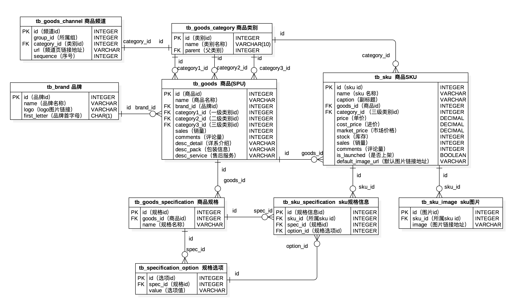
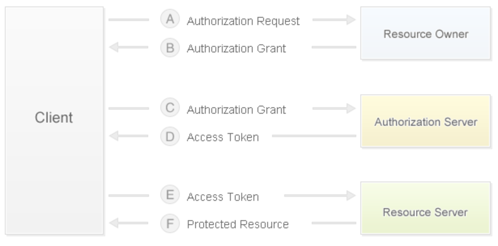
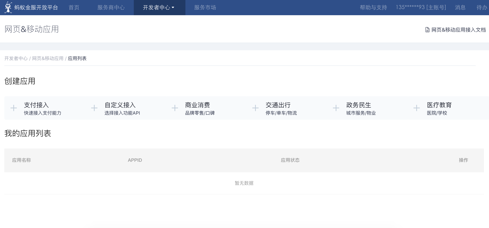

## 电商网站技术要点剖析

### 商业模式

1. B2B - 商家对商家，交易双方都是企业（商家），最典型的案例就是阿里巴巴。
2. C2C - 个人对个人，例如：淘宝、人人车。
3. B2C - 商家对个人，例如：唯品会，聚美优品。
4. C2B - 个人对商家，先有消费者提出需求，后有商家按需求组织生产，例如： 尚品宅配。
5. O2O - 线上到线下，将线下的商务机会与互联网结合，让互联网成为线下交易的平台，例如：美团外卖、饿了么。
6. B2B2C - 商家对商家对个人，例如：天猫、京东。

### 需求要点

1. 用户端
   - 首页（商品分类、广告轮播、滚动快讯、瀑布加载、推荐、折扣、热销、……）

   - 用户（登录（第三方登录）、注册、注销、自服务（个人信息、浏览历史、收货地址、……））

   - 商品（分类、列表、详情、搜索、热门搜索、搜索历史、添加到购物车、收藏、关注、评论、……）
   - 购物车（查看、编辑（修改数量、删除商品、清空））
   - 订单（提交订单（支付）、历史订单、订单详情、订单评价、……）
2. 管理端
   - 核心业务实体的CRUD
   - 定时任务（周期性和非周期性，如处理未支付订单、采集数据对异常事件报警、……）
   - 报表功能（导入导出Excel、PDF等以及前端ECharts统计图表展示）
   - 权限控制（RBAC、白名单、黑名单、……）
   - 业务流转（如发起退款流程，常用流程引擎有：Activity、Airflow、Spiff等）
   - 三方服务（接入地图、短信、物流、支付、实名认证、天气、监控、云存储、……）

### 物理模型设计

首先要搞清楚两个概念：SPU（Standard Product Unit）和SKU（Stock Keeping Unit）。

- SPU：iPhone 6s
- SKU：iPhone 6s 64G 土豪金



### 第三方登录

第三方登录是指利用第三方网站（通常是知名社交网站）的账号进行登录验证（主要是通过知名第三方网站获取到用户相关信息），比如国内的 QQ、微博，国外的Google、Facebook等。第三方登录大部分都是使用[OAuth](<https://en.wikipedia.org/wiki/OAuth>)协议，它是一个关于授权的开放网络标准（**数据的所有者告诉系统，同意授权第三方应用进入系统，获取这些数据。系统从而产生一个短期的进入令牌，用来代替密码，供第三方应用使用**），得到了广泛的应用，目前通常使用的是2.0版本。关于OAuth的基础知识，可以阅读阮一峰老师的[《理解OAuth 2.0》](http://www.ruanyifeng.com/blog/2014/05/oauth_2_0.html)。关于**令牌**和**密码**的区别，我们可以简单总结出以下三点差异：

1. 令牌是短期的，到期会自动失效，用户自己无法修改。密码一般长期有效，用户不修改，就不会发生变化。
2. 令牌可以被数据所有者撤销，会立即失效。以上例而言，屋主可以随时取消快递员的令牌。密码一般不允许被他人撤销。
3. 令牌有权限范围（scope），比如只能进小区的二号门。对于网络服务来说，只读令牌就比读写令牌更安全。密码一般是完整权限。

所以，通过令牌既可以让第三方应用获得权限，同时又随时可控，不会危及系统安全。这就是OAuth协议的优势。

#### OAuth 2.0授权流程

1. 用户打开客户端以后，客户端要求用户（资源所有者）给予授权。
2. 用户（资源所有者）同意给予客户端授权。
3. 客户端使用上一步获得的授权，向认证服务器申请访问令牌。
4. 认证服务器对客户端进行认证以后，发放访问令牌。
5. 客户端使用访问令牌向资源服务器申请获取资源。
6. 资源服务器确认访问令牌无误，同意向客户端开放资源。



如果使用微博登录进行接入，其具体步骤可以参考微博开放平台上的[“微博登录接入”](http://open.weibo.com/wiki/Connect/login)文档。使用QQ登录进行接入，需要首先注册成为QQ互联开发者并通过审核，具体的步骤可以参考QQ互联上的[“接入指南”](http://wiki.connect.qq.com/)，具体的步骤可以参考[“网站开发流程”](http://wiki.connect.qq.com/%E5%87%86%E5%A4%87%E5%B7%A5%E4%BD%9C_oauth2-0)。

> 提示：在Gitbook上面有一本名为[《Django博客入门》](https://shenxgan.gitbooks.io/django/content/publish/2015-08-10-django-oauth-login.html)的书以Github为例介绍了第三方账号登录，有兴趣的可以自行阅读。

通常电商网站在使用第三方登录时，会要求与网站账号进行绑定或者根据获取到的第三方账号信息（如：手机号）自动完成账号绑定。

### 缓存预热和查询缓存

#### 缓存预热

所谓缓存预热，是指在启动服务器时将数据提前加载到缓存中，为此可以在Django应用的`apps.py`模块中编写`AppConfig`的子类并重写`ready()`方法，代码如下所示。

```Python
import pymysql

from django.apps import AppConfig
from django.core.cache import cache

SELECT_PROVINCE_SQL = 'select distid, name from tb_district where pid is null'


class CommonConfig(AppConfig):
    name = 'common'

    def ready(self):
        conn = pymysql.connect(host='1.2.3.4', port=3306,
                               user='root', password='pass',
                               database='db', charset='utf8',
                               cursorclass=pymysql.cursors.DictCursor)
        try:
            with conn.cursor() as cursor:
                cursor.execute(SELECT_PROVINCE_SQL)
                provinces = cursor.fetchall()
                cache.set('provinces', provinces)
        finally:
            conn.close()
```

接下来，还需要在应用的`__init__.py`中编写下面的代码。

```Python
default_app_config = 'common.apps.CommonConfig'
```

或者在项目的`settings.py`文件中注册应用。

```Python
INSTALLED_APPS = [
    ...
    'common.apps.CommonConfig',
    ...
]
```

#### 查询缓存

自定义装饰器实现查询结果的缓存。

```Python
from pickle import dumps, loads

from django.core.cache import caches

MODEL_CACHE_KEY = 'project:modelcache:%s'


def my_model_cache(key, section='default', timeout=None):
    """实现模型缓存的装饰器"""

    def wrapper1(func):

        def wrapper2(*args, **kwargs):
            real_key = '%s:%s' % (MODEL_CACHE_KEY % key, ':'.join(map(str, args)))
            serialized_data = caches[section].get(real_key)
            if serialized_data:
                data = loads(serialized_data)
            else:
                data = func(*args, **kwargs)
                cache.set(real_key, dumps(data), timeout=timeout)
            return data

        return wrapper2

    return wrapper1
```

```Python
@my_model_cache(key='provinces')
def get_all_provinces():
    return list(Province.objects.all())
```

### 购物车实现

问题一：已登录用户的购物车放在哪里？未登录用户的购物车放在哪里？

```Python
class CartItem(object):
    """购物车中的商品项"""

    def __init__(self, sku, amount=1, selected=False):
        self.sku = sku
        self.amount = amount
        self.selected = selected

    @property
    def total(self):
        return self.sku.price * self.amount


class ShoppingCart(object):
    """购物车"""

    def __init__(self):
        self.items = {}
        self.index = 0

    def add_item(self, item):
        if item.sku.id in self.items:
            self.items[item.sku.id].amount += item.amount
        else:
            self.items[item.sku.id] = item

    def remove_item(self, sku_id):
        if sku_id in self.items:
            self.items.remove(sku_id)

    def clear_all_items(self):
        self.items.clear()

    @property
    def cart_items(self):
        return self.items.values()

    @property
    def cart_total(self):
        total = 0
        for item in self.items.values():
            total += item.total
        return total
```

已登录用户的购物车可以放在数据库中（可以先在Redis中缓存）；未登录用户的购物车可以保存在Cookie、localStorage或sessionStorage中（减少服务器端内存开销）。

```JSON
{
    '1001': {sku: {...}, 'amount': 1, 'selected': True}, 
    '1002': {sku: {...}, 'amount': 2, 'selected': False},
    '1003': {sku: {...}, 'amount': 3, 'selected': True},
}
```

```Python
request.get_signed_cookie('cart')

cart_base64 = base64.base64encode(pickle.dumps(cart))
response.set_signed_cookie('cart', cart_base64)
```

问题二：用户登录之后，如何合并购物车？（目前电商应用的购物车几乎都做了持久化处理，主要是方便在多个终端之间共享数据）

### 集成支付功能

问题一：支付信息如何持久化？（必须保证每笔交易都有记录）

问题二：如何接入支付宝？（接入其他平台基本类似）

1. [蚂蚁金服开放平台](https://open.alipay.com/platform/home.htm)。
2. [入驻平台](https://open.alipay.com/platform/homeRoleSelection.htm)。
3. [开发者中心](https://openhome.alipay.com/platform/appManage.htm#/apps)。
4. [文档中心](https://docs.open.alipay.com/270/105899/)。
5. [SDK集成](https://docs.open.alipay.com/54/103419) - [PYPI链接](https://pypi.org/project/alipay-sdk-python/)。
6. [API列表](https://docs.open.alipay.com/270/105900/)。



配置文件：

```Python
ALIPAY_APPID = '......'
ALIPAY_URL = 'https://openapi.alipaydev.com/gateway.do'
ALIPAY_DEBUG = False
```

获得支付链接（发起支付）：

```Python
# 创建调用支付宝的对象
alipay = AliPay(
    # 在线创建应用时分配的ID
    appid=settings.ALIPAY_APPID,
    app_notify_url=None,
    # 自己应用的私钥
    app_private_key_path=os.path.join(
        os.path.dirname(os.path.abspath(__file__)), 
        'keys/app_private_key.pem'),
    # 支付宝的公钥
    alipay_public_key_path=os.path.join(
        os.path.dirname(os.path.abspath(__file__)), 
        'keys/alipay_public_key.pem'),
    sign_type='RSA2',
    debug=settings.ALIPAY_DEBUG
)
# 调用获取支付页面操作
order_info = alipay.api_alipay_trade_page_pay(
    out_trade_no='...',
    total_amount='...',
    subject='...',
    return_url='http://...'
)
# 生成完整的支付页面URL
alipay_url = settings.ALIPAY_URL + '?' + order_info
return JsonResponse({'alipay_url': alipay_url})
```

通过上面返回的链接可以进入支付页面，支付完成后会自动跳转回上面代码中设定好的项目页面，在该页面中可以获得订单号（out_trade_no）、支付流水号（trade_no）、交易金额（total_amount）和对应的签名（sign）并请求后端验证和保存交易结果，代码如下所示：

```Python
# 创建调用支付宝的对象
alipay = AliPay(
    # 在线创建应用时分配的ID
    appid=settings.ALIPAY_APPID,
    app_notify_url=None,
    # 自己应用的私钥
    app_private_key_path=os.path.join(
        os.path.dirname(os.path.abspath(__file__)), 
        'keys/app_private_key.pem'),
    # 支付宝的公钥
    alipay_public_key_path=os.path.join(
        os.path.dirname(os.path.abspath(__file__)), 
        'keys/alipay_public_key.pem'),
    sign_type='RSA2',
    debug=settings.ALIPAY_DEBUG
)
# 请求参数（假设是POST请求）中包括订单号、支付流水号、交易金额和签名
params = request.POST.dict()
# 调用验证操作
if alipay.verify(params, params.pop('sign')):
    # 对交易进行持久化操作
```

支付宝的支付API还提供了交易查询、交易结算、退款、退款查询等一系列的接口，可以根据业务需要进行调用，此处不再进行赘述。

### 秒杀和超卖

1. 秒杀：秒杀是通常意味着要在很短的时间处理极高的并发，系统在短时间需要承受平时百倍以上的流量，因此秒杀架构是一个比较复杂的问题，其核心思路是流量控制和性能优化，需要从前端（通过JavaScript实现倒计时、避免重复提交和限制频繁刷新）到后台各个环节的配合。流量控制主要是限制只有少部分流量进入服务后端（毕竟最终只有少部分用户能够秒杀成功），同时在物理架构上使用缓存（一方面是因为读操作多写操作少；另外可以将库存放在Redis中，利用DECR原语实现减库存；同时也可以利用Redis来进行限流，道理跟限制频繁发送手机验证码是一样的）和消息队列（消息队列最为重要的作用就是“削峰”和“上下游节点解耦合”）来进行优化；此外还要采用无状态服务设计，这样才便于进行水平扩展（通过增加设备来为系统扩容）。
2. 超卖现象：比如某商品的库存为1，此时用户1和用户2并发购买该商品，用户1提交订单后该商品的库存被修改为0，而此时用户2并不知道的情况下提交订单，该商品的库存再次被修改为-1这就是超卖现象。解决超卖现象有三种常见的思路：
   - 悲观锁控制：查询商品数量的时候就用`select ... for update`对数据加锁，这样的话用户1查询库存时，用户2因无法读取库存数量被阻塞，直到用户1提交或者回滚了更新库存的操作后才能继续，从而解决了超卖问题。但是这种做法对并发访问量很高的商品来说性能太过糟糕，实际开发中可以在库存小于某个值时才考虑加锁，但是总的来说这种做法不太可取。
   - 乐观锁控制：查询商品数量不用加锁，更新库存的时候设定商品数量必须与之前查询数量相同才能更新，否则说明其他事务已经更新了库存，必须重新发出请求。这种做法要求事务隔离级别为可重复读（repeatable read），否则仍然会产生问题。
   - 尝试减库存：将上面的查询（`select`）和更新（`update`）操作合并为一条SQL操作，更新库存的时候，在`where`筛选条件中加上`库存>=购买数量`或`库存-购买数量>=0`的条件，这种做法要求事务隔离级别为读提交（read committed）。

> 提示：有兴趣的可以自己在知乎上看看关于这类问题的讨论。

### 静态资源管理

静态资源的管理可以自己架设文件服务器或者分布式文件服务器（FastDFS），但是一般的项目中没有必要这样做而且效果未必是最好的，我们建议使用云存储服务来管理网站的静态资源，国内外的云服务提供商如[亚马逊](<https://amazonaws-china.com/cn/>)、[阿里云](<https://www.aliyun.com/product/oss>)、[七牛](<https://www.qiniu.com/products/kodo>)、[LeanCloud](<https://leancloud.cn/storage/>)、[Bmob](<https://www.bmob.cn/cloud>)等都提供了非常优质的云存储服务，而且价格也是一般公司可以接受的，具体的操作可以参考官方文档，例如：阿里云的[对象存储 OSS开发人员指南](https://www.alibabacloud.com/zh/support/developer-resources)。

### 全文检索

####  方案选择

1. 使用数据库的模糊查询功能 - 效率低，每次需要全表扫描，不支持分词。
2. 使用数据库的全文检索功能 - MySQL 5.6以前只适用于MyISAM引擎，检索操作和其他的DML操作耦合在数据库中，可能导致检索操作非常缓慢，数据量达到百万级性能显著下降，查询时间很长。
3. 使用开源搜索引擎 - 索引数据和原始数据分离，可以使用ElasticSearch或Solr来提供外置索引服务，如果不考虑高并发的全文检索需求，纯Python的Whoosh也可以考虑。

#### ElasticSearch

ElasticSearch既是一个分布式文档数据库又是一个高可扩展的开源全文搜索和分析引擎，它允许存储、搜索和分析大量的数据，并且这个过程是近实时的。它通常被用作底层引擎和技术，为复杂的搜索功能和要求提供动力，大家熟知的维基百科、Stack-Overflow、Github都使用了ElasticSearch。

ElasticSearch的底层是开源搜索引擎[Lucene](https://lucene.apache.org/)，但是直接用Lucene会非常麻烦，必须自己编写代码去调用它的接口而且只支持Java语言。ElasticSearch相当于对Lucene进行了一次全面的封装，提供了REST风格的API接口，通过基于HTTP协议的访问方式屏蔽了编程语言的差异。ElasticSearch会为数据构建[倒排索引](https://zh.wikipedia.org/zh-hans/%E5%80%92%E6%8E%92%E7%B4%A2%E5%BC%95)，但是ElasticSearch内置的分词器对中文分词的支持几乎为零，因此需要通过安装elasticsearch-analysis-ik插件来提供中文分词服务。

ElasticSearch的安装和配置可以参考[《ElasticSearch之Docker安装》](https://blog.csdn.net/jinyidong/article/details/80475320)。除了ElasticSearch之外，也可以使用Solr、Whoosh等来提供搜索引擎服务，基本上Django项目中可以考虑如下几种方案：

- haystack（django-haystack / drf-haystack） + whoosh + Jieba
- haystack （django-haystack / drf-haystack）+ elasticsearch
- requests + elasticsearch
- django-elasticsearch-dsl

####安装和使用ElasticSearch

1. 使用Docker安装ElasticSearch。

   ```Shell
   docker pull elasticsearch:6.5.3
   docker run -d -p 9200:9200 -p 9300:9300 -e "discovery.type=single-node" -e ES_JAVA_OPTS="-Xms512m -Xmx512m" --name es elasticsearch:6.5.3
   ```

   > 说明：上面创建容器时通过`-e`参数指定了使用单机模式和Java虚拟机最小最大可用堆空间的大小，堆空间大小可以根据服务器实际能够提供给ElasticSearch的内存大小来决定，默认为2G。

2. 创建数据库。

   请求：PUT - `http://1.2.3.4:9200/demo`

   响应：

    ```JSON
   {
       "acknowledged": true,
       "shards_acknowledged": true,
       "index": "demo"
   }
    ```

3. 查看创建的数据库。

   请求：GET - `http://1.2.3.4:9200/demo`

   响应：

   ```JSON
   {
       "demo": {
           "aliases": {},
           "mappings": {},
           "settings": {
               "index": {
                   "creation_date": "1552213970199",
                   "number_of_shards": "5",
                   "number_of_replicas": "1",
                   "uuid": "ny3rCn10SAmCsqW6xPP1gw",
                   "version": {
                       "created": "6050399"
                   },
                   "provided_name": "demo"
               }
           }
       }
   }
   ```

4. 插入数据。

   请求：POST - `http://1.2.3.4:9200/demo/goods/1/`

   请求头：Content-Type: application/json

   参数：

   ```JSON
   {
       "no": "5089253",
       "title": "Apple iPhone X (A1865) 64GB 深空灰色 移动联通电信4G手机",
       "brand": "Apple",
       "name": "Apple iPhone X",
       "product": "中国大陆",
       "resolution": "2436 x 1125",
       "intro": "一直以来，Apple都心存一个设想，期待能够打造出这样一部iPhone：它有整面屏幕，能让你在使用时，完全沉浸其中，仿佛忘了它的存在。它是如此智能，哪怕轻轻一瞥，都能得到它心有灵犀的回应。而这个设想，终于随着iPhone X的到来成为了现实。现在，就跟未来见个面吧。"
   }
   ```

   响应：

   ```JSON
   {
       "_index": "demo",
       "_type": "goods",
       "_id": "1",
       "_version": 4,
       "result": "created",
       "_shards": {
           "total": 2,
           "successful": 1,
           "failed": 0
       },
       "_seq_no": 3,
       "_primary_term": 1
   }
   ```

5. 删除数据。

   请求：DELETE -  `http://1.2.3.4:9200/demo/goods/1/`

   响应：

   ```JSON
   {
       "_index": "demo",
       "_type": "goods",
       "_id": "1",
       "_version": 2,
       "result": "deleted",
       "_shards": {
           "total": 2,
           "successful": 1,
           "failed": 0
       },
       "_seq_no": 1,
       "_primary_term": 1
   }
   ```

6. 更新数据。

   请求：PUT - `http://1.2.3.4:9200/demo/goods/1/_update`

   请求头：Content-Type: application/json

   参数：

   ```JSON
   {
   	"doc": {
   		"no": "5089253",
       	"title": "Apple iPhone X (A1865) 64GB 深空灰色 移动联通电信4G手机",
       	"brand": "Apple(苹果)",
       	"name": "Apple iPhone X",
       	"product": "美国",
       	"resolution": "2436 x 1125",
       	"intro": "一直以来，Apple都心存一个设想，期待能够打造出这样一部iPhone：它有整面屏幕，能让你在使用时，完全沉浸其中，仿佛忘了它的存在。它是如此智能，哪怕轻轻一瞥，都能得到它心有灵犀的回应。而这个设想，终于随着iPhone X的到来成为了现实。现在，就跟未来见个面吧。"
       }
   }
   ```

   响应：

   ```JSON
   {
       "_index": "demo",
       "_type": "goods",
       "_id": "1",
       "_version": 10,
       "result": "updated",
       "_shards": {
           "total": 2,
           "successful": 1,
           "failed": 0
       },
       "_seq_no": 9,
       "_primary_term": 1
   }
   ```

7. 查询数据。

   请求：GET - `http://1.2.3.4:9200/demo/goods/1/`

   响应：

   ```JSON
   {
       "_index": "demo",
       "_type": "goods",
       "_id": "1",
       "_version": 10,
       "found": true,
       "_source": {
           "doc": {
               "no": "5089253",
               "title": "Apple iPhone X (A1865) 64GB 深空灰色 移动联通电信4G手机",
               "brand": "Apple(苹果)",
               "name": "Apple iPhone X",
               "product": "美国",
               "resolution": "2436 x 1125",
               "intro": "一直以来，Apple都心存一个设想，期待能够打造出这样一部iPhone：它有整面屏幕，能让你在使用时，完全沉浸其中，仿佛忘了它的存在。它是如此智能，哪怕轻轻一瞥，都能得到它心有灵犀的回应。而这个设想，终于随着iPhone X的到来成为了现实。现在，就跟未来见个面吧。"
           }
       }
   }
   ```

#### 配置中文分词和拼音插件

1. 进入Docker容器的plugins目录。

   ```Shell
   docker exec -it es /bin/bash
   ```

2. 下载和ElasticSearch版本对应的[ik](https://github.com/medcl/elasticsearch-analysis-ik)和[pinyin](https://github.com/medcl/elasticsearch-analysis-pinyin)插件。

   ```Shell
   cd plugins/
   mkdir ik
   cd ik
   wget https://github.com/medcl/elasticsearch-analysis-ik/releases/download/v6.5.3/elasticsearch-analysis-ik-6.5.3.zip
   unzip elasticsearch-analysis-ik-6.5.3.zip
   rm -f elasticsearch-analysis-ik-6.5.3.zip
   cd ..
   mkdir pinyin
   cd pinyin
   wget https://github.com/medcl/elasticsearch-analysis-pinyin/releases/download/v6.5.3/elasticsearch-analysis-pinyin-6.5.3.zip
   unzip elasticsearch-analysis-pinyin-6.5.3.zip
   rm -f elasticsearch-analysis-pinyin-6.5.3.zip
   ```

3. 退出容器，重启ElasticSearch。

   ```Shell
   docker restart es
   ```

4. 测试中文分词效果。

   请求：POST - `http://1.2.3.4:9200/_analyze`

   请求头：Content-Type: application/json

   参数：

   ```JSON
   {
     "analyzer": "ik_smart",
     "text": "中国男足在2022年卡塔尔世界杯预选赛中勇夺小组最后一名"
   }
   ```

   响应：

   ```JSON
   {
       "tokens": [
           {
               "token": "中国",
               "start_offset": 0,
               "end_offset": 2,
               "type": "CN_WORD",
               "position": 0
           },
           {
               "token": "男足",
               "start_offset": 2,
               "end_offset": 4,
               "type": "CN_WORD",
               "position": 1
           },
           {
               "token": "在",
               "start_offset": 4,
               "end_offset": 5,
               "type": "CN_CHAR",
               "position": 2
           },
           {
               "token": "2022年",
               "start_offset": 5,
               "end_offset": 10,
               "type": "TYPE_CQUAN",
               "position": 3
           },
           {
               "token": "卡塔尔",
               "start_offset": 10,
               "end_offset": 13,
               "type": "CN_WORD",
               "position": 4
           },
           {
               "token": "世界杯",
               "start_offset": 13,
               "end_offset": 16,
               "type": "CN_WORD",
               "position": 5
           },
           {
               "token": "预选赛",
               "start_offset": 16,
               "end_offset": 19,
               "type": "CN_WORD",
               "position": 6
           },
           {
               "token": "中",
               "start_offset": 19,
               "end_offset": 20,
               "type": "CN_CHAR",
               "position": 7
           },
           {
               "token": "勇夺",
               "start_offset": 20,
               "end_offset": 22,
               "type": "CN_WORD",
               "position": 8
           },
           {
               "token": "小组",
               "start_offset": 22,
               "end_offset": 24,
               "type": "CN_WORD",
               "position": 9
           },
           {
               "token": "最后",
               "start_offset": 24,
               "end_offset": 26,
               "type": "CN_WORD",
               "position": 10
           },
           {
               "token": "一名",
               "start_offset": 26,
               "end_offset": 28,
               "type": "CN_WORD",
               "position": 11
           }
       ]
   }
   ```

5. 测试拼音分词效果。

   请求：POST - `http://1.2.3.4:9200/_analyze`

   请求头：Content-Type: application/json

   参数：

   ```JSON
   {
     "analyzer": "pinyin",
     "text": "张学友"
   }
   ```

   响应：

   ```JSON
   {
       "tokens": [
           {
               "token": "zhang",
               "start_offset": 0,
               "end_offset": 0,
               "type": "word",
               "position": 0
           },
           {
               "token": "zxy",
               "start_offset": 0,
               "end_offset": 0,
               "type": "word",
               "position": 0
           },
           {
               "token": "xue",
               "start_offset": 0,
               "end_offset": 0,
               "type": "word",
               "position": 1
           },
           {
               "token": "you",
               "start_offset": 0,
               "end_offset": 0,
               "type": "word",
               "position": 2
           }
       ]
   }
   ```

#### 全文检索功能

可以通过GET或者POST请求进行搜索，下面演示了搜索有“未来”关键词商品。

1. GET - `http://120.77.222.217:9200/demo/goods/_search?q=未来`

   > 注意：URL中的中文应该要处理成百分号编码。

   ```JSON
   {
       "took": 19,
       "timed_out": false,
       "_shards": {
           "total": 5,
           "successful": 5,
           "skipped": 0,
           "failed": 0
       },
       "hits": {
           "total": 2,
           "max_score": 0.73975396,
           "hits": [
               {
                   "_index": "demo",
                   "_type": "goods",
                   "_id": "1",
                   "_score": 0.73975396,
                   "_source": {
                       "doc": {
                           "no": "5089253",
                           "title": "Apple iPhone X (A1865) 64GB 深空灰色 移动联通电信4G手机",
                           "brand": "Apple(苹果)",
                           "name": "Apple iPhone X",
                           "product": "美国",
                           "resolution": "2436*1125",
                           "intro": "一直以来，Apple都心存一个设想，期待能够打造出这样一部iPhone：它有整面屏幕，能让你在使用时，完全沉浸其中，仿佛忘了它的存在。它是如此智能，哪怕轻轻一瞥，都能得到它心有灵犀的回应。而这个设想，终于随着iPhone X的到来成为了现实。现在，就跟未来见个面吧。"
                       }
                   }
               },
               {
                   "_index": "demo",
                   "_type": "goods",
                   "_id": "3",
                   "_score": 0.68324494,
                   "_source": {
                       "no": "42417956432",
                       "title": "小米9 透明尊享版 手机 透明尊享 全网通(12GB + 256GB)",
                       "brand": "小米（MI）",
                       "name": "小米（MI）小米9透明",
                       "product": "中国大陆",
                       "resolution": "2340*1080",
                       "intro": "全面透明机身，独特科幻机甲风，来自未来的设计。"
                   }
               }
           ]
       }
   }
   ```

   URL中可用的搜索参数如下表所示：

   | 参数             | 说明                                              |
   | ---------------- | ------------------------------------------------- |
   | q                | 查询字符串                                        |
   | analyzer         | 分析查询字符串使用的分词器                        |
   | analyze_wildcard | 通配符或者前缀查询是否被分析，默认为false         |
   | default_operator | 多个条件之间的关系，默认为OR，可以修改为AND       |
   | explain          | 在返回的结果中包含评分机制的解释                  |
   | fields           | 只返回索引中指定的列，多个列中间用逗号隔开        |
   | sort             | 排序参考的字段，可以用:asc和:desc来指定升序和降序 |
   | timeout          | 超时时间                                          |
   | from             | 匹配结果的开始值，默认为0                         |
   | size             | 匹配结果的条数，默认为10                          |

2. POST - `http://120.77.222.217:9200/demo/goods/_search`

   请求头：Content-Type: application/json

   参数：

   ```JSON
   {
       "query": {
           "term": {
               "type": ""
           }
       }
   }
   ```

   POST搜索是基于DSL的。


#### Django对接ElasticSearch

Python对接ElasticSearch的第三方库是HayStack，在Django项目中可以使用django-haystack，通过HayStack可以在不修改代码对接多种搜索引擎服务。

```shell
pip install django-haystack elasticsearch
```

配置文件：

```Python
INSTALLED_APPS = [
    ...
    'haystack',
    ...
]

HAYSTACK_CONNECTIONS = {
    'default': {
        # 引擎配置
        'ENGINE': 'haystack.backends.elasticsearch_backend.ElasticsearchSearchEngine',
        # 搜索引擎服务的URL
        'URL': 'http://1.2.3.4:9200',
        # 索引库的名称
        'INDEX_NAME': 'goods',
    },
}

# 添加/删除/更新数据时自动生成索引
HAYSTACK_SIGNAL_PROCESSOR = 'haystack.signals.RealtimeSignalProcessor'
```

索引类：

```Python
from haystack import indexes


class GoodsIndex(indexes.SearchIndex, indexes.Indexable):
    text = indexes.CharField(document=True, use_template=True)

    def get_model(self):
        return Goods

    def index_queryset(self, using=None):
        return self.get_model().objects.all()
```

编辑text字段的模板（需要放在templates/search/indexes/demo/goods_text.txt）：

```
{{object.title}}
{{object.intro}}
```

配置URL：

```Python
urlpatterns = [
    # ...
    url('search/', include('haystack.urls')),
]
```

生成初始索引：

```Shell
python manage.py rebuild_index
```

>  说明：可以参考[《Django Haystack 全文检索与关键词高亮》](https://www.zmrenwu.com/post/45/)一文来更深入的了解基于Haystack的全文检索操作。

