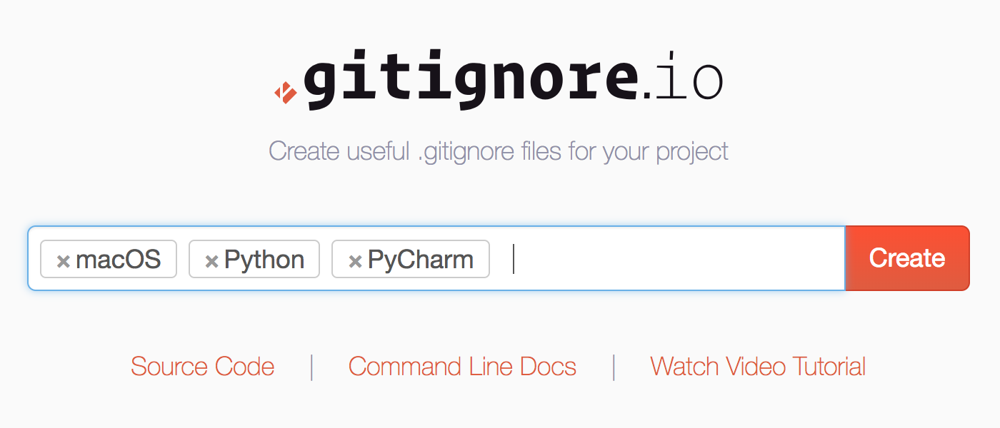

## 项目实战 - 开启团队项目

### 创建项目

我们的项目使用Git作为版本控制工具，首先可以在代码托管平台上创建一个新项目。这里我们使用了国内的[“码云”](https://gitee.com)来创建项目，并通过该平台实现版本控制和缺陷管理，当然如果愿意也可以使用[github](https://github.com/)或者国内的[CODING](https://coding.net/))来做同样的事情，当然也可以自己用诸如[Gitlab](https://gitlab.com)这样的工具来搭建自己的代码仓库。创建好项目之后，我们先为项目添加一个名为`.gitignore`文件，该文件用来忽略掉那些不需要纳入版本控制系统的文件，如果不知道怎么编写该文件，可以使用gitignore.io](https://www.gitignore.io/)网站提供的在线生成工具，如下所示。



### 初始版本

接下来，我们将项目克隆到本地，并为项目创建真正意义上的初始版本。

```Shell
git clone https://gitee.com/jackfrued/fang.com.git
cd fang.com

python3 -m venv venv
source venv/bin/activate
pip install -U pip
pip install django django-celery django-redis djangorestframework pymysql redis pillow
pip freeze > requirements.txt
```

**提示**：在使用pip安装依赖项以后，可以通过`pip check`来检查依赖项是否兼容，确保万无一失。如果希望使用国内的PyPI源，可以按照如下所示的方式进行配置。在用户主目录下找到或创建名为`.pip`的文件夹，并在该文件夹中添加一个`pip.conf`文件，其内容如下所示。

```INI
[global]
trusted-host=mirrors.aliyun.com
index-url=http://mirrors.aliyun.com/pypi/simple/

# index-url=https://pypi.tuna.tsinghua.edu.cn/simple/
# index-url=https://mirrors.ustc.edu.cn/pypi/web/
# index-url=https://pypi.douban.com/simple
```

上面的配置文件中使用了阿里云的PyPI镜像，由于该镜像没有使用HTTPS，所以要先将其设置为受信任的站点，当然也可以直接使用下面提供的其他HTTPS镜像。使用Windows的用户可以在用户主目录下创建`pip`文件夹（注意前面有没有点）并添加该配置文件，文件名为`pip.ini`。

接下来创建项目和应用，通常我们会对项目中的功能进行垂直拆分，因此需要创建多个应用来对应不同的功能模块。

```Shell
django-admin startproject fang .

python manage.py startapp common
python manage.py startapp forum
python manage.py startapp rent
```

对项目的公共配置文件进行必要修改后，就可以通过反向工程（根据关系型数据库中的表来生成模型从而减少不必要的重复劳动）完成对模型类的创建，反向工程生成的模型可能需要适当的修改和调整才能应用于项目，尤其是存在多对多关系的时候。

```Shell
python manage.py inspectdb > common/models.py
```

如果需要使用Django的admin项目或者第三方xadmin，还需要执行迁移操作来创建额外的数据库表。

```Shell
python manage.py migrate
```

至此，我们就可以将当前的工作纳入版本控制并同步到服务器。

```Shell
git add .
git commit -m '项目初始版本'
git push
```

### 日常开发

不管是使用“git-flow”还是“github-flow”，都不能够在master上面直接进行开发，对于后者要创建自己的分支并在上面进行开发。

```Shell
git checkout -b jackfrued
git add .
git commit -m '提交的原因'
git push origin jackfrued

git branch -d jackfrued
git checkout master
git pull

git checkout -b jackfrued
```

