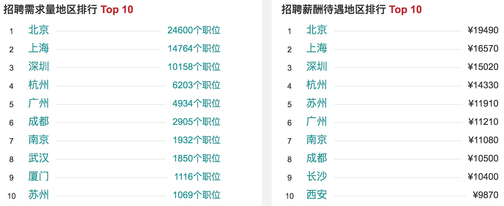
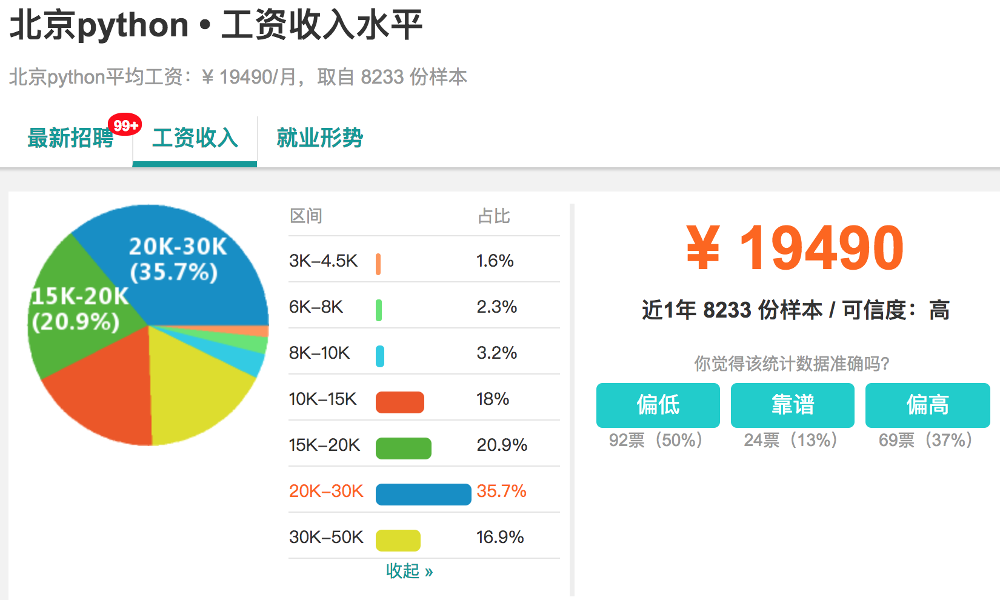
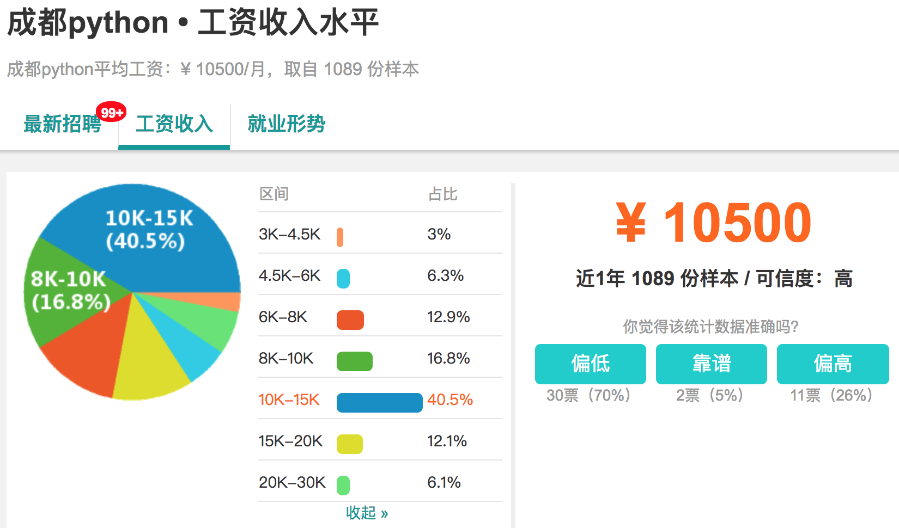

## Python - 100天从新手到大师

> 作者：骆昊

### Python应用领域和就业形势分析

简单的说，Python是一个“优雅”、“明确”、“简单”的编程语言。

 - 学习曲线低，非专业人士也能上手
 - 开源系统，拥有强大的生态圈
 - 解释型语言，完美的平台可移植性
 - 支持面向对象和函数式编程，动态语言
 - 能够通过调用C/C++代码扩展功能
 - 代码规范程度高，可读性强

目前几个比较流行的领域，Python都有用武之地。

 - 云基础设施 - Python / Java / Go
 - DevOps - Python / Shell / Ruby / Go
 - 网络爬虫 - Python / PHP / C++
 - 数据分析挖掘 - Python / R / Scala / Matlab
 - 机器学习 - Python / R / Java / Lisp

作为一名Python开发者，主要的就业领域包括：

- Python服务器后台开发 / 游戏服务器开发 / 数据接口开发工程师
- Python自动化运维工程师
- Python数据分析 / 数据可视化 / 大数据工程师
- Python爬虫工程师
- Python聊天机器人开发 / 图像识别和视觉算法 / 深度学习工程师

下图显示了主要城市Python招聘需求量及薪资待遇排行榜（截止到2018年5月）。

给初学者的几个建议：

- Make English as your working language.
- Practice makes perfect.
- All experience comes from mistakes.
- Don't be one of the leeches.
- Either stand out or kicked out.

### Day01~15 - [Python语言基础](./Day01-15)

#### Day01 - [初识Python](./Day01-15/Day01/初识Python.md)

- Python简介 - Python的历史 / Python的优缺点 / Python的应用领域
- 搭建编程环境 - Windows环境 / Linux环境 / MacOS环境
- 从终端运行Python程序 - DOS命令 / Hello, world / print函数 / 运行程序
- 使用IDLE - 交互式环境(REPL) / 编写多行代码 / 运行程序 / 退出IDLE
- 注释 - 注释的作用 / 单行注释 / 多行注释

#### Day02 - [语言元素](./Day01-15/Day02/语言元素.md)

- 程序和进制 - 指令和程序 / 冯诺依曼机 / 二进制和十进制 / 八进制和十六进制
- 变量和类型 - 变量的命名 / 变量的使用 / input函数 / 检查变量类型 / 类型转换
- 数字和字符串 - 整数 / 浮点数 / 复数 / 字符串 / 字符串基本操作 / 字符编码
- 运算符 - 数学运算符 / 赋值运算符 / 比较运算符 / 逻辑运算符 / 身份运算符 / 运算符的优先级
- 应用案例 - 华氏温度转换成摄氏温度 / 输入圆的半径计算周长和面积 / 输入年份判断是否是闰年

#### Day03 - [分支结构](./Day01-15/Day03/分支结构.md)

- 分支结构的应用场景 - 条件 / 缩进 / 代码块 / 流程图
- if语句 - 简单的if / if-else结构 / if-elif-else结构 / 嵌套的if
- 应用案例 - 用户身份验证 / 英制单位与公制单位互换 / 掷骰子决定做什么 / 百分制成绩转等级制 / 分段函数求值 / 输入三条边的长度如果能构成三角形就计算周长和面积

#### Day04 - [循环结构](./Day01-15/Day04/循环结构.md)

- 循环结构的应用场景 - 条件 / 缩进 / 代码块 / 流程图
- while循环 - 基本结构 / break语句 / continue语句
- for循环 - 基本结构 / range类型 / 循环中的分支结构 / 嵌套的循环 / 提前结束程序 
- 应用案例 - 1~100求和 / 判断素数 / 猜数字游戏 / 打印九九表 / 打印三角形图案 / 猴子吃桃 / 百钱百鸡

#### Day05 - [总结和练习](./Day01-15/Day05/总结和练习.md)

- 基础练习 - 水仙花数 / 完美数 / 五人分鱼 / Fibonacci数列 / 回文素数 
- 综合练习 - Craps赌博游戏

#### Day06 - [函数和模块的使用](./Day01-15/Day06/函数和模块的使用.md)

- 函数的作用 - 代码的坏味道 / 用函数封装功能模块
- 定义函数 - def语句 / 函数名 / 参数列表 / return语句 / 调用自定义函数
- 调用函数 - Python内置函数 /  导入模块和函数
- 函数的参数 - 默认参数 / 可变参数 / 关键字参数 / 命名关键字参数
- 函数的返回值 - 没有返回值  / 返回单个值 / 返回多个值
- 作用域问题 - 局部作用域 / 嵌套作用域 / 全局作用域 / 内置作用域 / 和作用域相关的关键字
- 用模块管理函数 - 模块的概念 / 用自定义模块管理函数 / 命名冲突的时候会怎样（同一个模块和不同的模块）

#### Day07 - [字符串和常用数据结构](./Day01-15/Day07/字符串和常用数据结构.md)

- 字符串的使用 - 计算长度 / 下标运算 / 切片 / 常用方法
- 列表基本用法 - 定义列表 / 用下表访问元素 / 下标越界 / 添加元素 / 删除元素 / 修改元素 / 切片 / 循环遍历
- 列表常用操作 - 连接 / 复制(复制元素和复制数组) / 长度 / 排序 / 倒转 / 查找
- 生成列表 - 使用range创建数字列表 / 生成表达式 / 生成器
- 元组的使用 - 定义元组 / 使用元组中的值 / 修改元组变量 / 元组和列表转换
- 集合基本用法 - 集合和列表的区别 /  创建集合 / 添加元素 / 删除元素 /  清空
- 集合常用操作 - 交集 / 并集 / 差集 / 对称差 / 子集 / 超集
- 字典的基本用法 - 字典的特点 / 创建字典 / 添加元素 / 删除元素 / 取值 / 清空
- 字典常用操作 - keys()方法 / values()方法 / items()方法 / setdefault()方法
- 基础练习 - 跑马灯效果 / 列表找最大元素 / 统计考试成绩的平均分 / Fibonacci数列 / 杨辉三角
- 综合案例 - 双色球选号 / 井字棋

#### Day08 - [面向对象编程基础](./Day01-15/Day08/面向对象编程基础.md)

- 类和对象 - 什么是类 / 什么是对象 / 面向对象其他相关概念
- 定义类 - 基本结构 / 属性和方法 / 构造器 / 析构器 / \_\_str\_\_方法
- 使用对象 - 创建对象 / 给对象发消息
- 面向对象的四大支柱 - 抽象 / 封装 / 继承 / 多态
- 基础练习 - 定义学生类 / 定义时钟类 / 定义图形类 / 定义汽车类

#### Day09 - [面向对象进阶](./Day01-15/Day09/面向对象进阶.md)

- 属性 - 类属性 / 实例属性 / 属性访问器 / 属性修改器 / 属性删除器 / 使用\_\_slots\_\_
- 类中的方法 - 实例方法 / 类方法 / 静态方法
- 运算符重载 - \_\_add\_\_ / \_\_sub\_\_ / \_\_or\_\_ /\_\_getitem\_\_ / \_\_setitem\_\_ / \_\_len\_\_ / \_\_repr\_\_ / \_\_gt\_\_ / \_\_lt\_\_ / \_\_le\_\_ / \_\_ge\_\_ / \_\_eq\_\_ / \_\_ne\_\_ / \_\_contains\_\_ 
- 类(的对象)之间的关系 - 关联 / 继承 / 依赖
- 继承和多态 - 什么是继承 / 继承的语法 / 调用父类方法 / 方法重写 / 类型判定 / 多重继承 / 菱形继承(钻石继承)和C3算法
- 综合案例 - 工资结算系统 / 图书自动折扣系统 / 自定义分数类

#### Day10 - [图形用户界面和游戏开发](./Day01-15/Day10/图形用户界面和游戏开发.md)

#### Day11 - [文件和异常](./Day01-15/Day11/文件和异常.md)

- 读文件 - 读取整个文件 / 逐行读取 / 文件路径
- 写文件 - 覆盖写入 / 追加写入 / 文本文件 / 二进制文件
- 异常处理 - 异常机制的重要性 / try-except代码块 / else代码块 / finally代码块 / 内置异常类型 / 异常栈 / raise语句
- 数据持久化 - CSV文件概述 / csv模块的应用 / JSON数据格式 / json模块的应用
- 综合案例 - 歌词解析

#### Day12 - [字符串和正则表达式](./Day01-15/Day12/字符串和正则表达式.md)

- 字符串高级操作 - 转义字符 \ 原始字符串 \ 多行字符串 \ in和 not in运算符 \ is开头的方法 \ join和split方法 \ strip相关方法 \ pyperclip模块 \ 不变字符串和可变字符串 \ StringIO的使用
- 正则表达式入门 - 正则表达式的作用 \ 元字符 \ 转义 \ 量词 \ 分组 \ 零宽断言 \贪婪匹配与惰性匹配懒惰 \ 使用re模块实现正则表达式操作（匹配、搜索、替换、捕获）
- 使用正则表达式 - re模块 \ compile函数 \ group和groups方法 \ match方法 \ search方法 \ findall和finditer方法 \ sub和subn方法 \ split方法
- 应用案例 - 使用正则表达式验证输入的字符串

#### Day13 - [进程和线程](./Day01-15/Day13/进程和线程.md)

- 进程和线程的概念 - 什么是进程 / 什么是线程 / 多线程的应用场景
- 使用进程 - fork函数 / multiprocessing模块 / 进程池 / 进程间通信
- 使用线程 - thread模块 / threading模块 / Thread类 / Lock类

#### Day14 - [网络编程入门](./Day01-15/Day14/网络编程入门.md)

- 计算机网络基础 - 计算机网络发展史 / “TCP-IP”模型 / IP地址 / 端口 / 协议 / 其他相关概念
- 网络应用架构 - “客户端-服务器”架构 / “浏览器-服务器”架构
- Python网络编程 - 套接字的概念 / socket模块 /  socket函数 / 创建TCP服务器 / 创建TCP客户端 / 创建UDP服务器 / 创建UDP客户端 / SocketServer模块

#### Day15 - [网络应用开发](./Day01-15/Day15/网络应用开发.md)

- 访问网络API - 网络API概述 / 访问URL / requests模块 / 解析JSON格式数据
- 文件传输 - FTP协议 / ftplib模块 / 交互式FTP应用
- 电子邮件 - SMTP协议 / POP3协议 / IMAP协议 / smtplib模块 / poplib模块 / imaplib模块
- 短信服务 - twilio模块 / 国内的短信服务

### Day16~Day20 - [Python语言进阶 ](./Day16-20/Python语言进阶.md)

- 常用数据结构
- 函数的高级用法
- 面向对象高级知识
- 迭代器和生成器
- 并发和异步编程

### Day21~30 - [Web前端入门](./Day21-30/Web前端概述.md)

- 用HTML标签承载页面内容
- 用CSS渲染页面
- 用JavaScript处理交互式行为
- jQuery入门和提高
- Bootstrap在Web项目中的应用

### Day31~35 - [玩转Linux操作系统](./Day31-35/玩转Linux操作系统.md)

- 操作系统发展史和Linux概述
- Linux基础命令
- Linux中的实用程序
- Linux的文件系统
- Vim编辑器的应用
- 环境变量和Shell编程
- 软件的安装和服务的配置
- 网络访问和管理
- 其他相关内容

### Day36~40 - [数据库基础和进阶](./Day36-40)

- [关系型数据库MySQL](./Day36-40/关系型数据库MySQL.md)
  - 关系型数据库概述
  - MySQL的安装和使用
  - SQL的使用
    - DDL
    - DML
    - DQL
    - DCL
  - 在Python中操作MySQL
  - MySQL高级知识
- [NoSQL入门](./Day36-40/NoSQL入门.md)
  - NoSQL概述
  - 主流NoSQL数据库
  - Redis概述
  - Mongo概述

### Day41~55 - [Django实战](./Day41-55)

#### Day41 - [快速上手](./Day41-55/01.快速上手.md)

#### Day42 - [深入模型](./Day41-55/02.深入模型.md)

#### Day43 - [静态资源和Ajax请求](./Day41-55/03.静态资源和Ajax请求.md)

#### Day44 - [表单的应用](./Day41-55/04.表单的应用.md)

#### Day45 - [Cookie和会话](./Day41-55/05.Cookie和会话.md)

#### Day46 - [中间件的应用](./Day41-55/06.中间件的应用.md)

#### Day47 - [日志和缓存](./Day41-55/07.日志和缓存.md)

#### Day48 - [文件上传](./Day41-55/08.文件上传.md)

#### Day49-50 - [RESTful架构和应用](./Day41-55/09-10.RESTful架构和应用.md)

#### Day51-55 - [项目实战](./Day41-55/11-15.项目实战.md)

- 项目开发流程和相关工具
- 生成非HTML内容
- 项目部署和测试
- 项目性能初步调优
- Web应用安全保护

### Day56~65 - [Flask实战](./Day56-65)

#### Day56 - [安装和入门](./Day56-65/01.安装和入门.md) 

#### Day57 - [模板的使用](./Day56-65/02.模板的使用.md) 

#### Day58 - [表单的处理](./Day56-65/03.表单的处理.md) 

#### Day59 - [数据库操作](./Day56-65/04.数据库操作.md)

#### Day60 - [项目结构](./Day56-65/05.项目结构.md)  

#### Day61-65 - [项目实战](./Day56-65/06-10.项目实战.md)

### Day66~75 - [爬虫开发](./Day66-75)

#### Day66 - [网络爬虫和相关工具](./Day66-75/01.网络爬虫和相关工具.md)

#### Day67 - [数据采集和解析](./Day66-75/02.数据采集和解析.md)

#### Day68 - [存储数据](./Day66-75/03.存储数据.md)

#### Day69 - [并发下载](./Day66-75/04.并发下载.md)

#### Day70 - [解析动态内容](./Day66-75/05.解析动态内容.md)

#### Day71 - [表单交互和验证码处理](./Day66-75/06.表单交互和验证码处理.md)

#### Day72 - [Scrapy入门](./Day66-75/07.Scrapy入门.md)

#### Day73 - [Scrapy高级应用](./Day66-75/08.Scrapy高级应用.md)

#### Day74 - [Scrapy分布式实现](./Day66-75/09.Scrapy分布式实现.md)

#### Day75 - [爬虫项目实战](./Day66-75/10.爬虫项目实战.md)

### Day76~90 - [数据处理和机器学习](./Day76-90)

#### Day76 - [机器学习基础](./Day76-90/01.机器学习基础.md)

#### Day77 - [Pandas的应用](./Day76-90/02.Pandas的应用.md)

#### Day78 - [NumPy和SciPy的应用](./Day76-90/03.NumPy和SciPy的应用)

#### Day79 - [Matplotlib和数据可视化](./Day76-90/04.Matplotlib和数据可视化)

#### Day80 - [k最近邻(KNN)分类](./Day76-90/05.k最近邻分类.md)

#### Day81 - [决策树](./Day76-90/06.决策树.md)

#### Day82 - [贝叶斯分类](./Day76-90/07.贝叶斯分类.md)

#### Day83 - [支持向量机(SVM)](./Day76-90/08.支持向量机.md)

#### Day84 - [K-均值聚类](./Day76-90/09.K-均值聚类.md)

#### Day85 - [回归分析](./Day76-90/10.回归分析.md)

#### Day86~Day87 - [大数据分析](./Day76-90/11-12.大数据分析.md)

#### Day88~Day89 - [Tensorflow实战](./Day76-90/13-14.Tensorflow实战.md)

#### Day90 - [推荐系统](./Day76-90/15.推荐系统.md)

### Day91~100 - [团队项目开发](./Day91-100)

#### Day91 - [过程模型和团队开发工具](./Day91-100/过程模型和团队开发工具.md)

#### Day92 - [模块分割与单元测试](./Day91-100/模块分割与单元测试.md)

#### Day93~Day97 - [开发中的常见问题](./Day91-100/开发中的常见问题.md)

#### Day98 - [持续集成](./Day91-100/持续集成.md)

#### Day99 - [项目部署和安全性措施](./Day91-100/项目部署和安全性措施.md)

#### Day100 - [性能测试和性能调优](./Day91-100/性能测试和性能调优.md)

