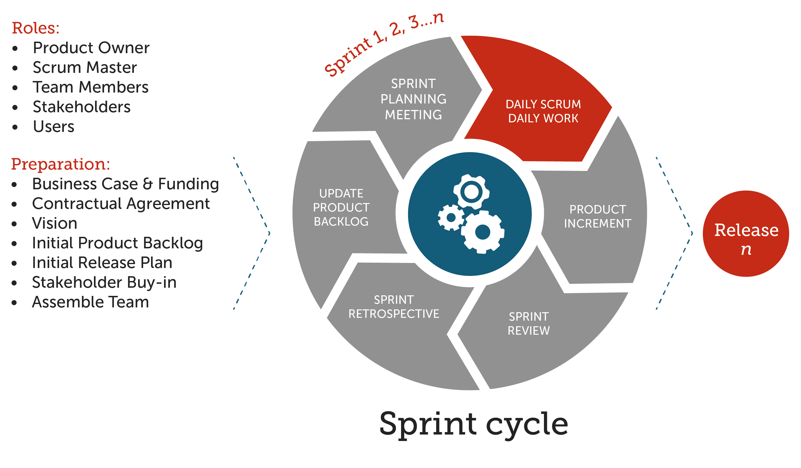
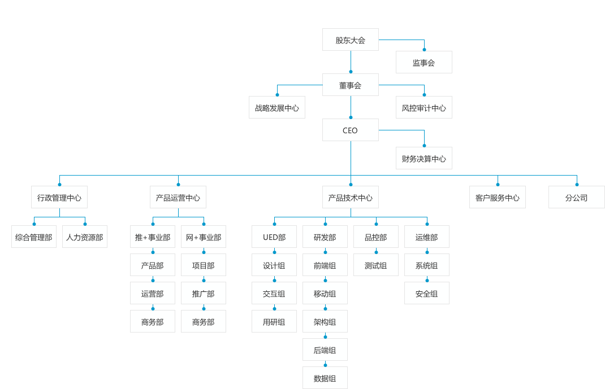
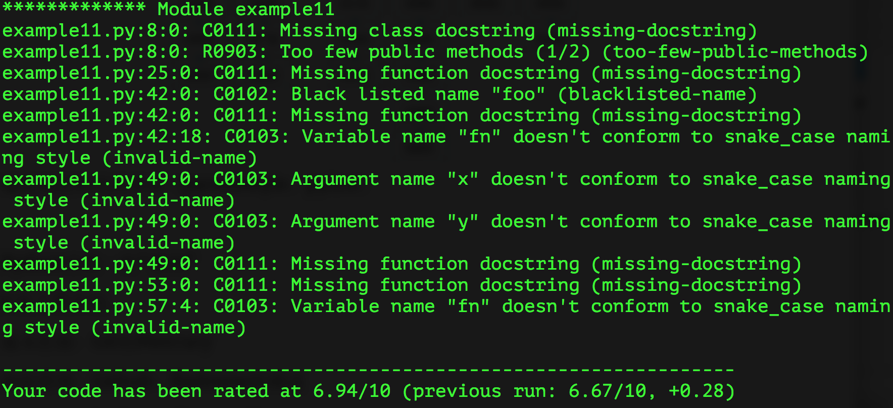
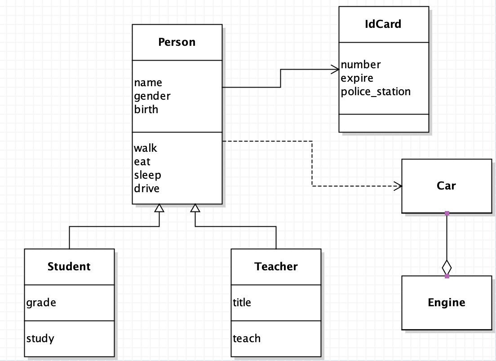
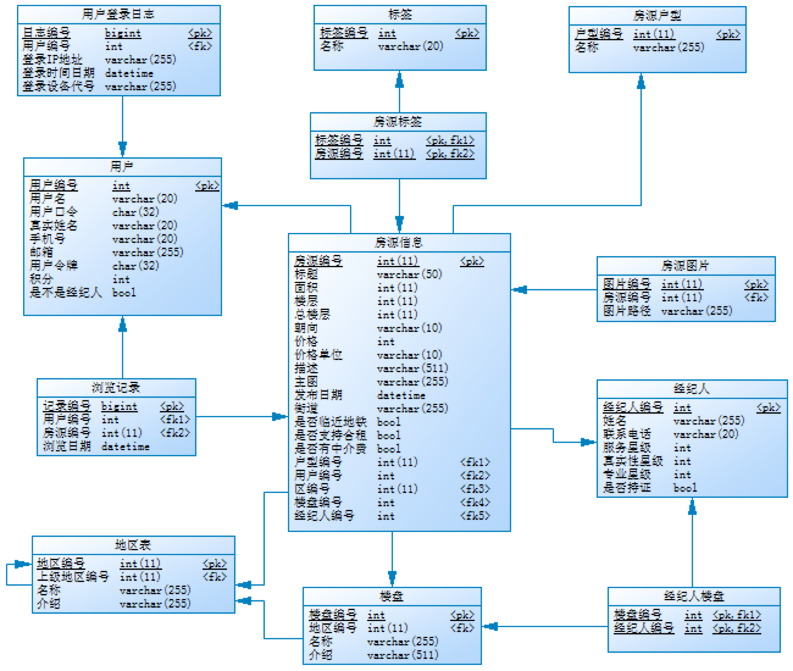

## Python - 100天从新手到大师

> **作者**：骆昊
>
> **说明**：从项目上线到获得8w+星标以来，一直收到反馈说基础部分（前15天的内容）对新手来说是比较困难的，建议有配套视频进行讲解。最近把基础部分的内容重新制作了一个名为[“Python-Core-50-Courses”](<https://github.com/jackfrued/Python-Core-50-Courses>)的项目，用更为简单通俗的方式重写了这部分内容并附带了视频讲解，初学者可以看看这个新的仓库。国内用户如果访问GitHub比较慢的话，可以关注我的**知乎号[Python-Jack](https://www.zhihu.com/people/jackfrued)**，上面的[“从零开始学Python”](<https://zhuanlan.zhihu.com/c_1216656665569013760>)专栏比较适合初学者，其他的专栏如“数据思维和统计思维”、“基于Python的数据分析”等也在持续创作和更新中，欢迎大家关注、点赞和评论。
>
> 想获取学习视频的小伙伴，大家可以扫描下面的二维码进入微信小程序，看看有没有适合自己的内容。大家心心念念的机器学习的内容在小程序中都可以找到，由我和我的同事为大家录制的。
>
> 
>
> 大家在学习过程中如果遇到一些棘手的问题或者需要相关的学习资源，可以加入下面的QQ交流群，三个群是一样的加入一个即可，请不要重复加群，也不要在群里发布广告和其他色情、低俗或敏感内容。**如果缺乏自律性，有付费学习的需求，可以添加我的微信（jackfrued）私聊，备注好自己的称呼和需求，我会给大家提供一些学习方案和职业规划方面的指导**。
>
> 
>
> 配套的视频在抖音和B站持续更新中，有兴趣的小伙伴可以关注我的抖音或B站账号，最近刚刚起号，还希望大家多多支持，非常感谢您！
>
> 
>
> 大家一直催更的《机器学习和深度学习》因个人和公司的原因，一直处于停滞状态，近期会开始更新相关内容，感谢大家一如既往的支持和理解。

### Python应用领域和职业发展分析

简单的说，Python是一个“优雅”、“明确”、“简单”的编程语言。

 - 学习曲线低，非专业人士也能上手
 - 开源系统，拥有强大的生态圈
 - 解释型语言，完美的平台可移植性
 - 动态类型语言，支持面向对象和函数式编程
 - 代码规范程度高，可读性强

Python在以下领域都有用武之地。

 - 后端开发 - Python / Java / Go / PHP
 - DevOps - Python / Shell / Ruby
 - 数据采集 - Python / C++ / Java
 - 量化交易 - Python / C++ / R
 - 数据科学 - Python / R / Julia / Matlab
 - 机器学习 - Python / R / C++ / Julia
 - 自动化测试 - Python / Shell

作为一名Python开发者，根据个人的喜好和职业规划，可以选择的就业领域也非常多。

- Python后端开发工程师（服务器、云平台、数据接口）
- Python运维工程师（自动化运维、SRE、DevOps）
- Python数据分析师（数据分析、商业智能、数字化运营）
- Python数据挖掘工程师（机器学习、深度学习、算法专家）
- Python爬虫工程师
- Python测试工程师（自动化测试、测试开发）

> **说明**：目前，**数据分析和数据挖掘是非常热门的方向**，因为不管是互联网行业还是传统行业都已经积累了大量的数据，各行各业都需要数据分析师从已有的数据中发现更多的商业价值，从而为企业的决策提供数据的支撑，这就是所谓的数据驱动决策。

给初学者的几个建议：

- Make English as your working language. （让英语成为你的工作语言）
- Practice makes perfect. （熟能生巧）
- All experience comes from mistakes. （所有的经验都源于你犯过的错误）
- Don't be one of the leeches. （不要当伸手党）
- Either outstanding or out. （要么出众，要么出局）

### Day01~15 - Python语言基础

#### Day01 - [初识Python](./Day01-15/01.初识Python.md)

- Python简介 - Python的历史 / Python的优缺点 / Python的应用领域
- 搭建编程环境 - Windows环境 / Linux环境 / MacOS环境
- 从终端运行Python程序 - Hello, world / `print`函数 / 运行程序
- 使用IDLE - 交互式环境(REPL) / 编写多行代码 / 运行程序 / 退出IDLE
- 注释 - 注释的作用 / 单行注释 / 多行注释

#### Day02 - [语言元素](./Day01-15/02.语言元素.md)

- 程序和进制 - 指令和程序 / 冯诺依曼机 / 二进制和十进制 / 八进制和十六进制
- 变量和类型 - 变量的命名 / 变量的使用 / `input`函数 / 检查变量类型 / 类型转换
- 数字和字符串 - 整数 / 浮点数 / 复数 / 字符串 / 字符串基本操作 / 字符编码
- 运算符 - 数学运算符 / 赋值运算符 / 比较运算符 / 逻辑运算符 / 身份运算符 / 运算符的优先级
- 应用案例 - 华氏温度转换成摄氏温度 / 输入圆的半径计算周长和面积 / 输入年份判断是否是闰年

#### Day03 - [分支结构](./Day01-15/03.分支结构.md)

- 分支结构的应用场景 - 条件 / 缩进 / 代码块 / 流程图
- if语句 - 简单的`if` / `if`-`else`结构 / `if`-`elif`-`else`结构 / 嵌套的`if`
- 应用案例 - 用户身份验证 / 英制单位与公制单位互换 / 掷骰子决定做什么 / 百分制成绩转等级制 / 分段函数求值 / 输入三条边的长度如果能构成三角形就计算周长和面积

#### Day04 - [循环结构](./Day01-15/04.循环结构.md)

- 循环结构的应用场景 - 条件 / 缩进 / 代码块 / 流程图
- while循环 - 基本结构 / `break`语句 / `continue`语句
- for循环 - 基本结构 / `range`类型 / 循环中的分支结构 / 嵌套的循环 / 提前结束程序 
- 应用案例 - 1~100求和 / 判断素数 / 猜数字游戏 / 打印九九表 / 打印三角形图案 / 猴子吃桃 / 百钱百鸡

#### Day05 - [构造程序逻辑](./Day01-15/05.构造程序逻辑.md)

- 经典案例：水仙花数 / 百钱百鸡 / Craps赌博游戏
- 练习题目：斐波那契数列 / 完美数 / 素数

#### Day06 - [函数和模块的使用](./Day01-15/06.函数和模块的使用.md)

- 函数的作用 - 代码的坏味道 / 用函数封装功能模块
- 定义函数 - `def`关键字 / 函数名 / 参数列表 / `return`语句 / 调用自定义函数
- 调用函数 - Python内置函数 /  导入模块和函数
- 函数的参数 - 默认参数 / 可变参数 / 关键字参数 / 命名关键字参数
- 函数的返回值 - 没有返回值  / 返回单个值 / 返回多个值
- 作用域问题 - 局部作用域 / 嵌套作用域 / 全局作用域 / 内置作用域 / 和作用域相关的关键字
- 用模块管理函数 - 模块的概念 / 用自定义模块管理函数 / 命名冲突的时候会怎样（同一个模块和不同的模块）

#### Day07 - [字符串和常用数据结构](./Day01-15/07.字符串和常用数据结构.md)

- 字符串的使用 - 计算长度 / 下标运算 / 切片 / 常用方法
- 列表基本用法 - 定义列表 / 用下表访问元素 / 下标越界 / 添加元素 / 删除元素 / 修改元素 / 切片 / 循环遍历
- 列表常用操作 - 连接 / 复制(复制元素和复制数组) / 长度 / 排序 / 倒转 / 查找
- 生成列表 - 使用`range`创建数字列表 / 生成表达式 / 生成器
- 元组的使用 - 定义元组 / 使用元组中的值 / 修改元组变量 / 元组和列表转换
- 集合基本用法 - 集合和列表的区别 /  创建集合 / 添加元素 / 删除元素 /  清空
- 集合常用操作 - 交集 / 并集 / 差集 / 对称差 / 子集 / 超集
- 字典的基本用法 - 字典的特点 / 创建字典 / 添加元素 / 删除元素 / 取值 / 清空
- 字典常用操作 - `keys`方法 / `values`方法 / `items`方法 / `setdefault`方法
- 基础练习 - 跑马灯效果 / 列表找最大元素 / 统计考试成绩的平均分 / Fibonacci数列 / 杨辉三角
- 综合案例 - 双色球选号 / 井字棋

#### Day08 - [面向对象编程基础](./Day01-15/08.面向对象编程基础.md)

- 类和对象 - 什么是类 / 什么是对象 / 面向对象其他相关概念
- 定义类 - 基本结构 / 属性和方法 / 构造器 / 析构器 / `__str__`方法
- 使用对象 - 创建对象 / 给对象发消息
- 面向对象的四大支柱 - 抽象 / 封装 / 继承 / 多态
- 基础练习 - 定义学生类 / 定义时钟类 / 定义图形类 / 定义汽车类

#### Day09 - [面向对象进阶](./Day01-15/09.面向对象进阶.md)

- 属性 - 类属性 / 实例属性 / 属性访问器 / 属性修改器 / 属性删除器 / 使用`__slots__`
- 类中的方法 - 实例方法 / 类方法 / 静态方法
- 运算符重载 - `__add__` / `__sub__` / `__or__` /`__getitem__` / `__setitem__` / `__len__` / `__repr__` / `__gt__` / `__lt__` / `__le__` / `__ge__` / `__eq__` / `__ne__` / `__contains__` 
- 类(的对象)之间的关系 - 关联 / 继承 / 依赖
- 继承和多态 - 什么是继承 / 继承的语法 / 调用父类方法 / 方法重写 / 类型判定 / 多重继承 / 菱形继承(钻石继承)和C3算法
- 综合案例 - 工资结算系统 / 图书自动折扣系统 / 自定义分数类

#### Day10 - [图形用户界面和游戏开发](./Day01-15/10.图形用户界面和游戏开发.md)

- 使用`tkinter`开发GUI程序
- 使用`pygame`三方库开发游戏应用
- “大球吃小球”游戏

#### Day11 - [文件和异常](./Day01-15/11.文件和异常.md)

- 读文件 - 读取整个文件 / 逐行读取 / 文件路径
- 写文件 - 覆盖写入 / 追加写入 / 文本文件 / 二进制文件
- 异常处理 - 异常机制的重要性 / `try`-`except`代码块 / `else`代码块 / `finally`代码块 / 内置异常类型 / 异常栈 / `raise`语句
- 数据持久化 - CSV文件概述 / `csv`模块的应用 / JSON数据格式 / `json`模块的应用

#### Day12 - [字符串和正则表达式](./Day01-15/12.字符串和正则表达式.md)

- 字符串高级操作 - 转义字符 / 原始字符串 / 多行字符串 / `in`和`not in`运算符 / `is_xxx`方法 / `join`和`split`方法 / `strip`相关方法 / `pyperclip`模块 / 不变字符串和可变字符串 / `StringIO`的使用
- 正则表达式入门 - 正则表达式的作用 / 元字符 / 转义 / 量词 / 分组 / 零宽断言 /贪婪匹配与惰性匹配懒惰 / 使用`re`模块实现正则表达式操作（匹配、搜索、替换、捕获）
- 使用正则表达式 - `re`模块 / `compile`函数 / `group`和`groups`方法 / `match`方法 / `search`方法 / `findall`和`finditer`方法 / `sub`和`subn`方法 / `split`方法
- 应用案例 - 使用正则表达式验证输入的字符串

#### Day13 - [进程和线程](./Day01-15/13.进程和线程.md)

- 进程和线程的概念 - 什么是进程 / 什么是线程 / 多线程的应用场景
- 使用进程 - `fork`函数 / `multiprocessing`模块 / 进程池 / 进程间通信
- 使用线程 -  `threading`模块 / `Thread`类 / `RLock`类 / `Condition`类 / 线程池

#### Day14 - [网络编程入门和网络应用开发](./Day01-15/14.网络编程入门和网络应用开发.md)

- 计算机网络基础 - 计算机网络发展史 / “TCP-IP”模型 / IP地址 / 端口 / 协议 / 其他相关概念
- 网络应用模式 - “客户端-服务器”模式 / “浏览器-服务器”模式
- 基于HTTP协议访问网络资源 - 网络API概述 / 访问URL / `requests`三方库 / 解析JSON格式数据
- Python网络编程 - 套接字的概念 / `socket`模块 /  `socket`函数 / 创建TCP服务器 / 创建TCP客户端 / 创建UDP服务器 / 创建UDP客户端
- 电子邮件 - SMTP协议 / POP3协议 / IMAP协议 / `smtplib`模块 / `poplib`模块 / `imaplib`模块
- 短信服务 - 调用短信服务网关

#### Day15 - [图像和文档处理](./Day01-15/15.图像和办公文档处理.md)

- 用Pillow处理图片 - 图片读写 / 图片合成 / 几何变换 / 色彩转换 / 滤镜效果
- 读写Word文档 - 文本内容的处理 / 段落 / 页眉和页脚 / 样式的处理
- 读写Excel文件 - `xlrd` / `xlwt` / `openpyxl`

### Day16~Day20 - [Python语言进阶 ](./Day16-20/16-20.Python语言进阶.md)

- 常用数据结构
- 函数的高级用法 - “一等公民” / 高阶函数 / Lambda函数 / 作用域和闭包 / 装饰器
- 面向对象高级知识 - “三大支柱” / 类与类之间的关系 / 垃圾回收 / 魔术属性和方法 / 混入 / 元类 / 面向对象设计原则 / GoF设计模式
- 迭代器和生成器 - 相关魔术方法 / 创建生成器的两种方式 / 
- 并发和异步编程 - 多线程 / 多进程 / 异步IO / `async`和`awai`t

### Day21~30 - [Web前端入门](./Day21-30/21-30.Web前端概述.md)

- 用HTML标签承载页面内容
- 用CSS渲染页面
- 用JavaScript处理交互式行为
- jQuery入门和提高
- Vue.js入门
- Element的使用
- Bootstrap的使用

### Day31~35 - [玩转Linux操作系统](./Day31-35/31-35.玩转Linux操作系统.md)

- 操作系统发展史和Linux概述
- Linux基础命令
- Linux中的实用程序
- Linux的文件系统
- Vim编辑器的应用
- 环境变量和Shell编程
- 软件的安装和服务的配置
- 网络访问和管理
- 其他相关内容

### Day36~45 - 数据库基础和进阶

#### Day36 - [关系型数据库和MySQL概述](./Day36-45/36.关系型数据库和MySQL概述.md)

- 关系型数据库概述
- MySQL简介
- 安装MySQL
- MySQL基本命令

#### Day37 - [SQL详解之DDL](./Day36-45/37.SQL详解之DDL.md)

- 建库建表
- 删除表和修改表

#### Day38 - [SQL详解之DML](./Day36-45/38.SQL详解之DML.md)

- insert操作
- delete操作
- update操作

#### Day39 - [SQL详解之DQL](./Day36-45/39.SQL详解之DQL.md)

- 投影和别名
- 筛选数据
- 空值处理
- 去重
- 排序
- 聚合函数
- 嵌套查询
- 分组
- 表连接
    - 笛卡尔积
    - 内连接
    - 自然连接
    - 外连接
- 窗口函数
    - 定义窗口
    - 排名函数
    - 取数函数


#### Day40 - [SQL详解之DCL](./Day36-45/40.SQL详解之DCL.md)

- 创建用户
- 授予权限
- 召回权限

#### Day41 - [MySQL新特性](./Day36-45/41.MySQL新特性.md)

- JSON类型
- 窗口函数
- 公共表表达式

#### Day42 - [视图、函数和过程](./Day36-45/42.视图、函数和过程.md)

- 视图
    - 使用场景
    - 创建视图
    - 使用限制
- 函数
    - 内置函数
    - 用户自定义函数（UDF）
- 过程
    - 创建过程
    - 调用过程

#### Day43 - [索引](./Day36-45/43.索引.md)

- 执行计划
- 索引的原理
- 创建索引
    - 普通索引
    - 唯一索引
    - 前缀索引
    - 复合索引
- 注意事项

#### Day44 - [Python接入MySQL数据库](./Day36-45/44.Python接入MySQL数据库.md)

- 安装三方库
- 创建连接
- 获取游标
- 执行SQL语句
- 通过游标抓取数据
- 事务提交和回滚
- 释放连接
- 编写ETL脚本

#### Day45 - [大数据平台和HiveSQL](./Day36-45/45.大数据平台和HiveSQL.md)

- Hadoop生态圈
- Hive概述
- 准备工作
- 数据类型
- DDL操作
- DML操作
- 数据查询

### Day46~60 - 实战Django

#### Day46 - [Django快速上手](./Day46-60/46.Django快速上手.md)

- Web应用工作机制
- HTTP请求和响应
- Django框架概述
- 5分钟快速上手

#### Day47 - [深入模型](./Day46-60/47.深入模型.md)

- 关系型数据库配置
- 使用ORM完成对模型的CRUD操作
- 管理后台的使用
- Django模型最佳实践
- 模型定义参考

#### Day48 - [静态资源和Ajax请求](./Day46-60/48.静态资源和Ajax请求.md)

- 加载静态资源
- Ajax概述
- 用Ajax实现投票功能

#### Day49 - [Cookie和Session](./Day46-60/49.Cookie和Session.md)

- 实现用户跟踪
- cookie和session的关系
- Django框架对session的支持
- 视图函数中的cookie读写操作

#### Day50 - [报表和日志](./Day46-60/50.制作报表.md)

- 通过`HttpResponse`修改响应头
- 使用`StreamingHttpResponse`处理大文件
- 使用`xlwt`生成Excel报表
- 使用`reportlab`生成PDF报表
- 使用ECharts生成前端图表

#### Day51 - [日志和调试工具栏](./Day46-60/51.日志和调试工具栏.md)

- 配置日志
- 配置Django-Debug-Toolbar
- 优化ORM代码

#### Day52 - [中间件的应用](./Day46-60/52.中间件的应用.md)

- 什么是中间件
- Django框架内置的中间件
- 自定义中间件及其应用场景

#### Day53 - [前后端分离开发入门](./Day46-60/53.前后端分离开发入门.md)

- 返回JSON格式的数据
- 用Vue.js渲染页面

#### Day54 - [RESTful架构和DRF入门](./Day46-60/54.RESTful架构和DRF入门.md)

- REST概述
- DRF库使用入门
- 前后端分离开发
- JWT的应用

#### Day55 - [RESTful架构和DRF进阶](./Day46-60/55.RESTful架构和DRF进阶.md)

- 使用CBV
- 数据分页
- 数据筛选

#### Day56 - [使用缓存](./Day46-60/56.使用缓存.md)

- 网站优化第一定律

- 在Django项目中使用Redis提供缓存服务
- 在视图函数中读写缓存
- 使用装饰器实现页面缓存
- 为数据接口提供缓存服务

#### Day57 - [接入三方平台](./Day46-60/57.接入三方平台.md)

- 文件上传表单控件和图片文件预览
- 服务器端如何处理上传的文件

#### Day58 - [异步任务和定时任务](./Day46-60/58.异步任务和定时任务.md)

- 网站优化第二定律
- 配置消息队列服务
- 在项目中使用Celery实现任务异步化
- 在项目中使用Celery实现定时任务

#### Day59 - [单元测试](./Day46-60/59.单元测试.md)

#### Day60 - [项目上线](./Day46-60/60.项目上线.md)

- Python中的单元测试
- Django框架对单元测试的支持
- 使用版本控制系统
- 配置和使用uWSGI
- 动静分离和Nginx配置
- 配置HTTPS
- 配置域名解析

### Day61~65 - [爬虫开发](./Day61-65)

#### Day61 - [网络数据采集概述](./Day61-65/61.网络数据采集概述.md)

- 网络爬虫的概念及其应用领域
- 网络爬虫的合法性探讨
- 开发网络爬虫的相关工具
- 一个爬虫程序的构成

#### Day62 - 数据抓取和解析

- [使用`requests`三方库实现数据抓取](./Day61-65/62.用Python获取网络资源-1.md)
- [页面解析的三种方式](./Day61-65/62.用Python解析HTML页面-2.md)
    - 正则表达式解析
    - XPath解析
    - CSS选择器解析


#### Day63 - Python中的并发编程

- [多线程](./Day61-65/63.Python中的并发编程-1.md)
- [多进程](./Day61-65/63.Python中的并发编程-2.md)
- [异步I/O](./Day61-65/63.Python中的并发编程-3.md)

#### Day64 - [使用Selenium抓取网页动态内容](./Day61-65/64.使用Selenium抓取网页动态内容.md)

- 安装Selenium
- 加载页面
- 查找元素和模拟用户行为
- 隐式等待和显示等待
- 执行JavaScript代码
- Selenium反爬破解
- 设置无头浏览器

#### Day65 - [爬虫框架Scrapy简介](./Day61-65/65.爬虫框架Scrapy简介.md)

- Scrapy核心组件
- Scrapy工作流程
- 安装Scrapy和创建项目
- 编写蜘蛛程序
- 编写中间件和管道程序
- Scrapy配置文件

### Day66~80 - 数据分析

#### Day66 - [数据分析概述](./Day66-80/66.数据分析概述.md)

- 数据分析师的职责
- 数据分析师的技能栈
- 数据分析相关库

#### Day67 - [环境准备](./Day66-80/67.环境准备.md)

- 安装和使用anaconda
    - conda相关命令
- 安装和使用jupyter-lab
    - 安装和启动
    - 使用小技巧

#### Day68 - [NumPy的应用-1](./Day66-80/68.NumPy的应用-1.md)

- 创建数组对象
- 数组对象的属性
- 数组对象的索引运算
    - 普通索引
    - 花式索引
    - 布尔索引
    - 切片索引
- 案例：使用数组处理图像

#### Day69 - [NumPy的应用-2](./Day66-80/69.NumPy的应用-2.md)

- 数组对象的相关方法
    - 获取描述性统计信息
    - 其他相关方法

#### Day70 - [NumPy的应用-3](./Day66-80/70.NumPy的应用-3.md)

- 数组的运算
    - 数组跟标量的运算
    - 数组跟数组的运算
- 通用一元函数
- 通用二元函数
- 广播机制
- Numpy常用函数

#### Day71 - [NumPy的应用-4](./Day66-80/71.NumPy的应用-4.md)

- 向量
- 行列式
- 矩阵
- 多项式

#### Day72 - [深入浅出pandas-1](./Day66-80/72.深入浅出pandas-1.md)

- 创建`Series`对象
- `Series`对象的运算
- `Series`对象的属性和方法

#### Day73 - [深入浅出pandas-2](./Day66-80/73.深入浅出pandas-2.md)

- 创建`DataFrame`对象
- `DataFrame`对象的属性和方法
- 读写`DataFrame`中的数据

#### Day74 - [深入浅出pandas-3](./Day66-80/74.深入浅出pandas-3.md)

- 数据重塑
    - 数据拼接
    - 数据合并
- 数据清洗
    - 缺失值
    - 重复值
    - 异常值
    - 预处理

#### Day75 - [深入浅出pandas-4](./Day66-80/75.深入浅出pandas-4.md)

- 数据透视
    - 获取描述性统计信息
    - 排序和头部值
    - 分组聚合
    - 透视表和交叉表
- 数据呈现

#### Day76 - [深入浅出pandas-5](./Day66-80/76.深入浅出pandas-5.md)

- 计算同比环比
- 窗口计算
- 相关性判定

#### Day77 - [深入浅出pandas-6](./Day66-80/77.深入浅出pandas-6.md)

- 索引的使用
    - 范围索引
    - 分类索引
    - 多级索引
    - 间隔索引
    - 日期时间索引

#### Day78 - [数据可视化-1](./Day66-80/78.数据可视化-1.md)

- 安装和导入matplotlib
- 创建画布
- 创建坐标系
- 绘制图表
    - 折线图
    - 散点图
    - 柱状图
    - 饼状图
    - 直方图
    - 箱线图
- 显示和保存图表

#### Day79 - [数据可视化-2](./Day66-80/79.数据可视化-2.md)

- 高阶图表
    - 气泡图
    - 面积图
    - 雷达图
    - 玫瑰图
    - 3D图表

#### Day80 - [数据可视化-3](./Day66-80/80.数据可视化-3.md)

- Seaborn
- Pyecharts

### Day81~90 - [机器学习和深度学习](./Day81-90)

#### Day81 - [机器学习基础](./Day81-90/81.机器学习基础.md)

#### Day82 - [k最近邻分类](./Day81-90/82.k最近邻分类.md)

#### Day83 - [决策树](./Day81-90/83.决策树.md)

#### Day84 - [贝叶斯分类](./Day81-90/84.贝叶斯分类.md)

#### Day85 - [支持向量机](./Day81-90/85.支持向量机.md)

#### Day86 - [K-均值聚类](./Day81-90/86.K-均值聚类.md)

#### Day87 - [回归分析](./Day81-90/87.回归分析.md)

#### Day88 - [深度学习入门](./Day81-90/88.深度学习入门.md)

#### Day89 - [PyTorch概述](./Day81-90/89.PyTorch概述.md)

#### Day90 - [PyTorch实战](./Day81-90/90.PyTorch实战.md)

### Day91~100 - [团队项目开发](./Day91-100)

#### 第91天：[团队项目开发的问题和解决方案](./Day91-100/91.团队项目开发的问题和解决方案.md)

1. 软件过程模型
   - 经典过程模型（瀑布模型）
     - 可行性分析（研究做还是不做），输出《可行性分析报告》。
     - 需求分析（研究做什么），输出《需求规格说明书》和产品界面原型图。
     - 概要设计和详细设计，输出概念模型图（ER图）、物理模型图、类图、时序图等。
     - 编码 / 测试。
     - 上线 / 维护。

     瀑布模型最大的缺点是无法拥抱需求变化，整套流程结束后才能看到产品，团队士气低落。
   - 敏捷开发（Scrum）- 产品所有者、Scrum Master、研发人员 - Sprint
     - 产品的Backlog（用户故事、产品原型）。
     - 计划会议（评估和预算）。
     - 日常开发（站立会议、番茄工作法、结对编程、测试先行、代码重构……）。
     - 修复bug（问题描述、重现步骤、测试人员、被指派人）。
     - 发布版本。
     - 评审会议（Showcase，用户需要参与）。
     - 回顾会议（对当前迭代周期做一个总结）。

     > 补充：敏捷软件开发宣言
     >
     > - **个体和互动** 高于 流程和工具
     > - **工作的软件** 高于 详尽的文档
     > - **客户合作** 高于 合同谈判
     > - **响应变化** 高于 遵循计划

     

     > 角色：产品所有者（决定做什么，能对需求拍板的人）、团队负责人（解决各种问题，专注如何更好的工作，屏蔽外部对开发团队的影响）、开发团队（项目执行人员，具体指开发人员和测试人员）。

     > 准备工作：商业案例和资金、合同、憧憬、初始产品需求、初始发布计划、入股、组建团队。

     >  敏捷团队通常人数为8-10人。

     >  工作量估算：将开发任务量化，包括原型、Logo设计、UI设计、前端开发等，尽量把每个工作分解到最小任务量，最小任务量标准为工作时间不能超过两天，然后估算总体项目时间。把每个任务都贴在看板上面，看板上分三部分：to do（待完成）、in progress（进行中）和done（已完成）。

2. 项目团队组建

   - 团队的构成和角色

     > 说明：感谢**付祥英**女士帮助我绘制了下面这张精美的公司组织架构图。

     

   - 编程规范和代码审查（`flake8`、`pylint`）

     

   - Python中的一些“惯例”（请参考[《Python惯例-如何编写Pythonic的代码》](Python惯例.md)）

   - 影响代码可读性的原因：

     - 代码注释太少或者没有注释
     - 代码破坏了语言的最佳实践
     - 反模式编程（意大利面代码、复制-黏贴编程、自负编程、……）

3. 团队开发工具介绍
   - 版本控制：Git、Mercury
   - 缺陷管理：[Gitlab](https://about.gitlab.com/)、[Redmine](http://www.redmine.org.cn/)
   - 敏捷闭环工具：[禅道](https://www.zentao.net/)、[JIRA](https://www.atlassian.com/software/jira/features)
   - 持续集成：[Jenkins](https://jenkins.io/)、[Travis-CI](https://travis-ci.org/)

   请参考[《团队项目开发的问题和解决方案》](Day91-100/91.团队项目开发的问题和解决方案.md)。

##### 项目选题和理解业务

1. 选题范围设定

   - CMS（用户端）：新闻聚合网站、问答/分享社区、影评/书评网站等。
   - MIS（用户端+管理端）：KMS、KPI考核系统、HRS、CRM系统、供应链系统、仓储管理系统等。

   - App后台（管理端+数据接口）：二手交易类、报刊杂志类、小众电商类、新闻资讯类、旅游类、社交类、阅读类等。
   - 其他类型：自身行业背景和工作经验、业务容易理解和把控。

2. 需求理解、模块划分和任务分配

   - 需求理解：头脑风暴和竞品分析。
   - 模块划分：画思维导图（XMind），每个模块是一个枝节点，每个具体的功能是一个叶节点（用动词表述），需要确保每个叶节点无法再生出新节点，确定每个叶子节点的重要性、优先级和工作量。
   - 任务分配：由项目负责人根据上面的指标为每个团队成员分配任务。

   

3. 制定项目进度表（每日更新）

   | 模块 | 功能     | 人员   | 状态     | 完成 | 工时 | 计划开始 | 实际开始 | 计划结束 | 实际结束 | 备注             |
   | ---- | -------- | ------ | -------- | ---- | ---- | -------- | -------- | -------- | -------- | ---------------- |
   | 评论 | 添加评论 | 王大锤 | 正在进行 | 50%  | 4    | 2018/8/7 |          | 2018/8/7 |          |                  |
   |      | 删除评论 | 王大锤 | 等待     | 0%   | 2    | 2018/8/7 |          | 2018/8/7 |          |                  |
   |      | 查看评论 | 白元芳 | 正在进行 | 20%  | 4    | 2018/8/7 |          | 2018/8/7 |          | 需要进行代码审查 |
   |      | 评论投票 | 白元芳 | 等待     | 0%   | 4    | 2018/8/8 |          | 2018/8/8 |          |                  |

4. OOAD和数据库设计

  - UML（统一建模语言）的类图

    

  - 通过模型创建表（正向工程），例如在Django项目中可以通过下面的命令创建二维表。

    ```Shell
    python manage.py makemigrations app
    python manage.py migrate
    ```

  - 使用PowerDesigner绘制物理模型图。

    

  - 通过数据表创建模型（反向工程），例如在Django项目中可以通过下面的命令生成模型。

    ```Shell
    python manage.py inspectdb > app/models.py
    ```

#### 第92天：[Docker容器技术详解](./Day91-100/92.Docker容器技术详解.md)

1. Docker简介
2. 安装Docker
3. 使用Docker创建容器（Nginx、MySQL、Redis、Gitlab、Jenkins）
4. 构建Docker镜像（Dockerfile的编写和相关指令）
5. 容器编排（Docker-compose）
6. 集群管理（Kubernetes）

#### 第93天：[MySQL性能优化](./Day91-100/93.MySQL性能优化.md)

1. 基本原则
2. InnoDB引擎
3. 索引的使用和注意事项
4. 数据分区
5. SQL优化
6. 配置优化
7. 架构优化

#### 第94天：[网络API接口设计](./Day91-100/94.网络API接口设计.md)

- 设计原则
    - 关键问题
    - 其他问题
- 文档撰写

#### 第95天：[使用Django开发商业项目](./Day91-100/95.使用Django开发商业项	目.md)

##### 项目开发中的公共问题

1. 数据库的配置（多数据库、主从复制、数据库路由）
2. 缓存的配置（分区缓存、键设置、超时设置、主从复制、故障恢复（哨兵））
3. 日志的配置
4. 分析和调试（Django-Debug-ToolBar）
5. 好用的Python模块（日期计算、图像处理、数据加密、三方API）

##### REST API设计

1. RESTful架构
   - [理解RESTful架构](http://www.ruanyifeng.com/blog/2011/09/restful.html)
   - [RESTful API设计指南](http://www.ruanyifeng.com/blog/2014/05/restful_api.html)
   - [RESTful API最佳实践](http://www.ruanyifeng.com/blog/2018/10/restful-api-best-practices.html)
2. API接口文档的撰写
   - [RAP2](http://rap2.taobao.org/)
   - [YAPI](http://yapi.demo.qunar.com/)
3. [django-REST-framework](https://www.django-rest-framework.org/)的应用

##### 项目中的重点难点剖析

1. 使用缓存缓解数据库压力 - Redis
2. 使用消息队列做解耦合和削峰 - Celery + RabbitMQ

#### 第96天：[软件测试和自动化测试](Day91-100/96.软件测试和自动化测试.md)

##### 单元测试

1. 测试的种类
2. 编写单元测试（`unittest`、`pytest`、`nose2`、`tox`、`ddt`、……）
3. 测试覆盖率（`coverage`）

##### Django项目部署

1. 部署前的准备工作
   - 关键设置（SECRET_KEY / DEBUG / ALLOWED_HOSTS / 缓存 / 数据库）
   - HTTPS / CSRF_COOKIE_SECUR  / SESSION_COOKIE_SECURE  
   - 日志相关配置
2. Linux常用命令回顾
3. Linux常用服务的安装和配置
4. uWSGI/Gunicorn和Nginx的使用
   - Gunicorn和uWSGI的比较
     - 对于不需要大量定制化的简单应用程序，Gunicorn是一个不错的选择，uWSGI的学习曲线比Gunicorn要陡峭得多，Gunicorn的默认参数就已经能够适应大多数应用程序。
     - uWSGI支持异构部署。
     - 由于Nginx本身支持uWSGI，在线上一般都将Nginx和uWSGI捆绑在一起部署，而且uWSGI属于功能齐全且高度定制的WSGI中间件。
     - 在性能上，Gunicorn和uWSGI其实表现相当。
5. 使用虚拟化技术（Docker）部署测试环境和生产环境

##### 性能测试

1. AB的使用
2. SQLslap的使用
3. sysbench的使用

##### 自动化测试

1. 使用Shell和Python进行自动化测试
2. 使用Selenium实现自动化测试
   - Selenium IDE
   - Selenium WebDriver
   - Selenium Remote Control
3. 测试工具Robot Framework介绍

#### 第97天：[电商网站技术要点剖析](./Day91-100/97.电商网站技术要点剖析.md)

1. 商业模式和需求要点
2. 物理模型设计
3. 第三方登录
4. 缓存预热和查询缓存
5. 购物车的实现
6. 支付功能集成
7. 秒杀和超卖问题
8. 静态资源管理
9. 全文检索方案

#### 第98天：[项目部署上线和性能调优](./Day91-100/98.项目部署上线和性能调优.md)

1. MySQL数据库调优
2. Web服务器性能优化
   - Nginx负载均衡配置
   - Keepalived实现高可用
3. 代码性能调优
   - 多线程
   - 异步化
4. 静态资源访问优化
   - 云存储
   - CDN

#### 第99天：[面试中的公共问题](./Day91-100/99.面试中的公共问题.md)

- 计算机基础
- Python基础
- Web框架相关
- 爬虫相关问题
- 数据分析
- 项目相关

#### 第100天：[Python面试题实录](./Day91-100/100.Python面试题实录.md)

