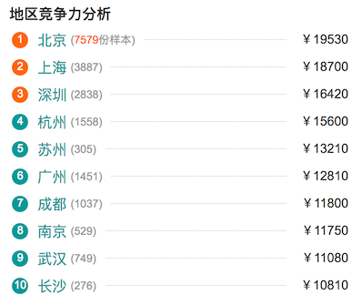
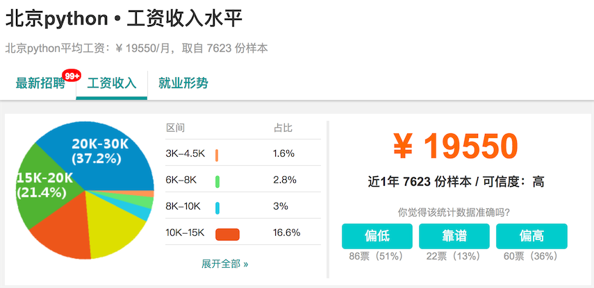
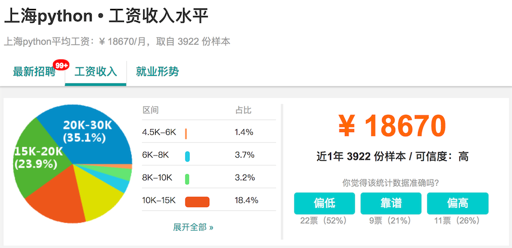
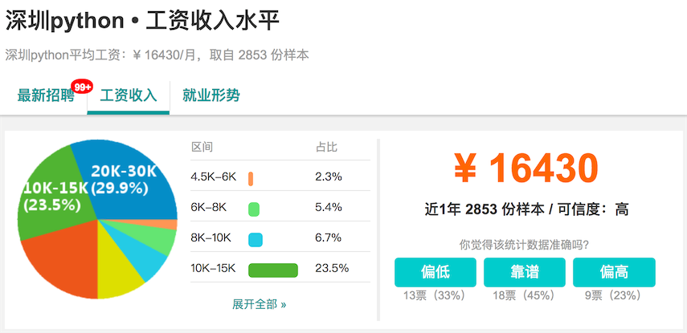
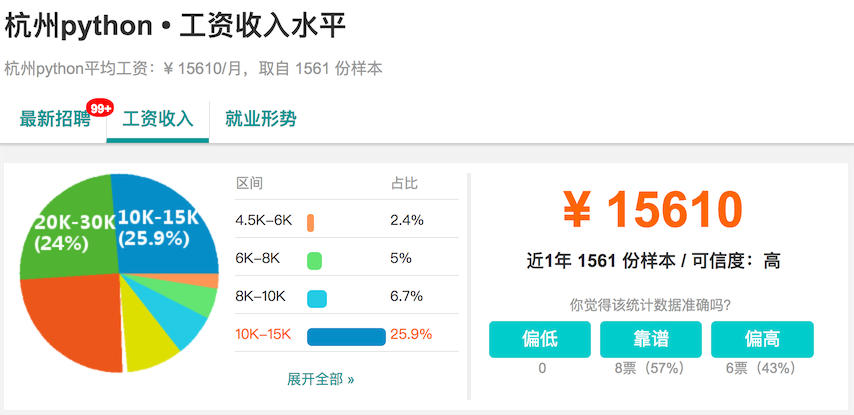
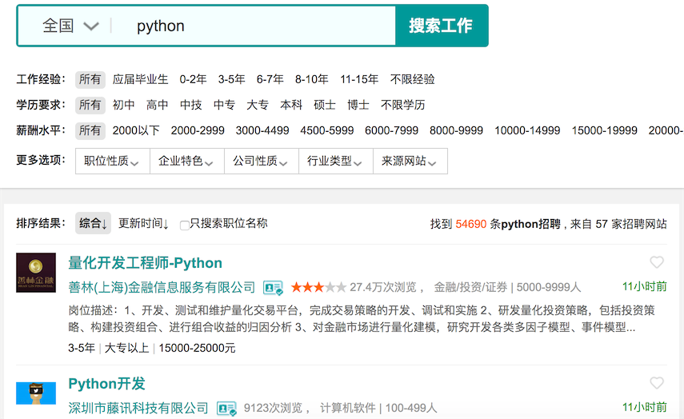

## Python教学大纲

### Python应用领域和就业形势分析

Python语言自身的优势：优雅、明确、简单。

 - 学习曲线低，尤其适合非专业人士
 - 开源软件，大量的三方库和强大的生态圈
 - 解释型语言，完美的平台可移植性
 - 支持两种主流的编程范式，面向对象和函数式编程
 - 可扩展性和可嵌入性，可以调用C/C++代码反之亦可以
 - 代码规范程度高，可读性强

目前几个比较流行的领域，Python都有用武之地。

 - 云基础设施 - Python / Java / Go
 - DevOps - Python / Shell / Ruby / Go
 - 网络爬虫 - Python / PHP / C++
 - 数据分析挖掘 - Python / R / Scala / Matlab
 - 机器学习 - Python / R / Java / Lisp

Python的就业市场分析：相同工作职位和要求，薪资普遍高3k-5k。

- Python服务器后台开发 / 游戏服务器开发 / 数据接口开发
- Python自动化运维
- Python数据分析 / 数据可视化 / 科学计算
- Python爬虫
- Python机器学习 / 聊天机器人 / 图像识别和处理

给初学者的几个建议：一个老司机的忠告。

- Make English as your working language.
- Practice makes perfect.
- All experience comes from mistakes.
- Don't be one of the leeches.
- Either stand out or kicked out.

### Python语言基础

#### Day01 - [初识Python](./Day01/初识Python.md)

- Python简介 - Python的历史 / Python的优缺点 / Python的应用领域
- 搭建编程环境 - Windows环境 / Linux环境 / MacOS环境
- 从终端运行Python程序 - DOS命令 / Hello, world / print函数 / 运行程序
- 使用IDLE - 交互式环境(REPL) / 编写多行代码 / 运行程序 / 退出IDLE
- 注释 - 注释的作用 / 单行注释 / 多行注释

#### Day02 - [语言元素](./Day02/语言元素.md)

- 程序和进制 - 指令和程序 / 冯诺依曼机 / 二进制和十进制 / 八进制和十六进制
- 变量和类型 - 变量的命名 / 变量的使用 / input函数 / 检查变量类型 / 类型转换
- 数字和字符串 - 整数 / 浮点数 / 复数 / 字符串 / 字符串基本操作 / 字符编码
- 运算符 - 数学运算符 / 赋值运算符 / 比较运算符 / 逻辑运算符 / 身份运算符 / 运算符的优先级
- 应用案例 - 华氏温度转换成摄氏温度 / 输入圆的半径计算周长和面积 / 输入年份判断是否是闰年

#### Day03 - [分支结构](./Day03/分支结构.md)

- 分支结构的应用场景 - 条件 / 缩进 / 代码块 / 流程图
- if语句 - 简单的if / if-else结构 / if-elif-else结构 / 嵌套的if
- 应用案例 - 用户身份验证 / 英制单位与公制单位互换 / 掷骰子决定做什么 / 百分制成绩转等级制 / 分段函数求值 / 输入三条边的长度如果能构成三角形就计算周长和面积

#### Day04 - [循环结构](./Day04/循环结构.md)

- 循环结构的应用场景 - 条件 / 缩进 / 代码块 / 流程图
- while循环 - 基本结构 / break语句 / continue语句
- for循环 - 基本结构 / range类型 / 在循环中使用分支结构 / 提前结束程序
- 应用案例 - 1~100求和 / 求阶乘 / 判断素数 / 求最大公约数和最小公倍数 / 打印三角形图案

#### Day05 - [总结和练习](./Day05/练习.md)

- 基础练习 - 水仙花数 / 完美数 / 打印1~100之间的素数 / 九九表 / Fibonacci数列 / 回文数 / 百钱百鸡
- 综合练习 - 猜数字游戏 / Craps赌博游戏

#### Day06 - [列表和元组](./Day06/列表和元组.md)

- 列表基本用法 - 定义列表 / 用下表访问元素 / 下标越界 / 添加元素 / 删除元素 / 修改元素 / 切片 / 循环遍历
- 列表常用操作 - 连接 / 复制(复制元素和复制数组) / 长度 / 排序 / 倒转 / 查找
- 生成列表 - 使用range创建数字列表 / 生成表达式 / 生成器
- 元组的使用 - 定义元组 / 使用元组中的值 / 修改元组变量 / 元组和列表转换
- 基础练习 - 列表找最大元素 / 统计考试成绩的平均分 / 跑马灯效果 / Fibonacci数列 / 杨辉三角 / 学生成绩统计表
- 综合练习 - 双色球随机选号

#### Day07 - [集合和字典](./Day07/集合和字典.md)

- 集合基本用法 - 集合和列表的区别 /  创建集合 / 添加元素 / 删除元素 /  清空
- 集合常用操作 - 交集 / 并集 / 差集 / 对称差 / 子集 / 超集
- 字典的基本用法 - 字典的特点 / 创建字典 / 添加元素 / 删除元素 / 取值 / 清空
- 字典常用操作 - keys()方法 / values()方法 / items()方法 / setdefault()方法
- 数据结构和算法 - 常用数据结构简介 / 数据结构和算法应用举例
- 综合练习 - 井字棋游戏

>**说明：**此处还没有接触到面向对象编程和函数的概念，在讲授该知识点时可以先对这两个概念稍作说明，也可以先让学生接受这种语法稍后再反过来推敲相关的概念，学生可能对什么时候该调用函数，什么时候应该使用方法产生疑问，这个需要进行强调。另外一种授课的顺序是先讲函数和面向对象的入门知识，再讲解如何使用列表、集合、字典、元组这些Python内置的类型。

#### Day08 - [函数基础](./Day08/函数基础.md)

- 函数的作用 - 代码的坏味道 / 用函数封装功能模块
- 定义函数 - def语句 / 函数名 / 参数列表 / return语句 / 调用自定义函数
- 调用函数 - Python内置函数 / 导入常用模块和常用函数
- 函数的参数 - 默认参数 / 可变参数 / 关键字参数 / 命名关键字参数
- 函数的返回值 - 没有返回值  / 返回单个值 / 返回多个值
- 作用域 - 局部作用域 / 全局作用域 / global语句

#### Day09 - [函数的应用和函数式编程](./Day09/函数的应用和函数式编程.md)

- 函数的递归调用 - 递归定义 / 递归公式 / 收敛条件 / 用递归解决实际问题
- 实现常用工具函数 - 生成指定长度的验证码 / 获取文件的后缀名 / 生成随机文件名
- 用模块管理函数 - 模块的概念 / 用自定义模块管理函数 / 导入模块和特定函数 / 第三方模块介绍
- 高阶函数 - 函数名也是变量 / 将函数传入函数 / 利用高阶函数实现代码的解耦合 / 匿名函数(Lambda函数) / 包装器(代理模式)
- 函数返回函数 - 用函数做返回值 / 闭包 
- 偏函数和柯里化 - 偏函数的意义 / 使用partial函数创建偏函数 / 柯里化的概念

>**说明：**函数式编程相关的内容属于比较尴尬的知识点，需要做一个简要的介绍，但是对学生来说暂时是用不上这些知识的，因此不要花太多的时间去纠结这些内容，让学生知道函数可以接受函数作为参数也可以返回函数即可，否则大多数学生一定是懵的。

#### Day10 - [面向对象基础](./Day10/面向对象基础.md)

- 类和对象 - 什么是类 / 什么是对象 / 面向对象其他相关概念
- 定义类 - 基本结构 / 属性和方法 / 构造器 / 析构器 / \_\_str\_\_方法
- 使用对象 - 创建对象 / 给对象发消息
- 面向对象的四大支柱 - 抽象 / 封装 / 继承 / 多态
- 综合案例 -  奥特曼打小怪兽 / 扑克游戏

#### Day11 - [面向对象高级](./Day11/面向对象高级.md)

- 属性 - 类属性 / 实例属性 / 属性访问器 / 属性修改器 / 属性删除器 / 使用\_\_slots\_\_

- 类中的方法 - 实例方法 / 类方法 / 静态方法
- 运算符重载 - \_\_add\_\_ / \_\_sub\_\_ / \_\_or\_\_ /\_\_getitem\_\_ / \_\_setitem\_\_ / \_\_len\_\_ / \_\_repr\_\_ / \_\_gt\_\_ / \_\_lt\_\_ / \_\_le\_\_ / \_\_ge\_\_ / \_\_eq\_\_ / \_\_ne\_\_ / \_\_contains\_\_ 
- 类(的对象)之间的关系 - 关联 / 继承 / 依赖
- 继承和多态 - 什么是继承 / 继承的语法 / 调用父类构造器 / 方法重写 / 类型判定 / 多重继承 / 菱形继承(钻石继承)和C3算法
- 综合案例 - 工资结算系统 / 图书自动折扣系统 / 自定义分数类

#### Day12 - [文件和异常](./Day12/文件和异常.md)

- 读文件 - 读取整个文件 / 逐行读取 / 文件路径
- 写文件 - 覆盖写入 / 追加写入 / 文本文件 / 二进制文件
- 异常处理 - 异常机制的重要性 / try-except代码块 / else代码块 / finally代码块 / 内置异常类型 / 异常栈 / raise语句
- 数据持久化 - CSV文件概述 / csv模块的应用 / JSON数据格式 / json模块的应用
- 综合案例 - 歌词解析

#### Day13 - [GUI和绘图](./Day13/图形用户界面和绘图.md)

- GUI编程简介 - 窗口和控件 / 事件驱动处理 / 布局管理器
- tkinter模块 - 导入tkinter模块 / 创建顶层窗口 / 使用Tk控件 / 主消息循环 / 处理事件
- 动画和游戏 - 屏幕坐标系和颜色 / 在窗口上绘图 / 加载图像 / 动画的原理 /  使用pygame

#### Day14 - [大战外星人游戏-1](./Day14/游戏开发-1.md)

#### Day15 - [大战外星人游戏-2](./Day15/游戏开发-2.md)

> 说明：可以根据班级情况安排其他简单且有趣的小游戏（五子棋、贪吃蛇等），主要目的是通过该项目综合运用三周所学的知识以及提升学员的兴趣和积极性。如果之前的课程中尚有很多知识点学员没有掌握或者非常生疏，也可以利用这两天时间进行查漏补缺和巩固加强。

#### Day16 - [字符串和正则表达式](./Day16/字符串和正则表达式.md)

- 字符串高级操作 - 转义字符 \ 原始字符串 \ 多行字符串 \ in和 not in运算符 \ is开头的方法 \ join和split方法 \ strip相关方法 \ pyperclip模块 \ 不变字符串和可变字符串 \ StringIO的使用
- 正则表达式入门 - 正则表达式的作用 \ 元字符 \ 转义 \ 量词 \ 分组 \ 零宽断言 \贪婪匹配与惰性匹配懒惰 \ 使用re模块实现正则表达式操作（匹配、搜索、替换、捕获）
- 使用正则表达式 - re模块 \ compile函数 \ group和groups方法 \ match方法 \ search方法 \ findall和finditer方法 \ sub和subn方法 \ split方法
- 应用案例 - 使用正则表达式验证输入的字符串

#### Day17 - [进程和线程入门](./Day17/进程和线程入门.md)

- 进程和线程的概念 - 什么是进程 / 什么是线程 / 多线程的应用场景
- 使用进程 - fork函数 / multiprocessing模块 / 进程池 / 进程间通信
- 使用线程 - thread模块 / threading模块 / Thread类 / Lock类

#### Day18 - [进程和线程高级](./Day18/进程和线程高级.md)

- 使用ThreadLocal - 资源竞争 / 死锁 / 将资源绑定到线程
- 并发编程模式 - 多进程和多线程的选择 / 生产者-消费者模式 / queue模块
- 协程 - 进程/线程切换的开销 / 单线程+异步I/O工作模式 / 使用协程（微线程）
- 其他相关内容 - concurrent.futures模块 / 其他相关模块

> **说明：**本章节的内容对学生来讲没有实际应用的场景可能会比较难于理解，因此可以根据教学的实际情况调整内容或者对之前的知识点进行巩固练习或进行作业评讲。

#### Day19 - [网络编程入门](./Day19/网络编程入门.md)

- 计算机网络基础 - 计算机网络发展史 / “TCP-IP”模型 / IP地址 / 端口 / 协议 / 其他相关概念
- 网络应用架构 - “客户端-服务器”架构 / “浏览器-服务器”架构
- Python网络编程 - 套接字的概念 / socket模块 /  socket函数 / 创建TCP服务器 / 创建TCP客户端 / 创建UDP服务器 / 创建UDP客户端 / SocketServer模块

> **说明：**一定要帮助学生尤其是没有计算机网络相关知识的学生对计算机网络尤其是端系统的工作方式有一个基本的了解，能够理解网络地址、协议、端口、域名服务、防火墙、套接字等概念以及它们存在的意义，当然如果能够对TCP协议和HTTP协议做更深入一些的讲解最好，这些都会让学生在面试的时候更具竞争力，掌握一门语言和框架其实很简单，真正理解系统底层的原理并不容易但却有很重要且长远的意义。

#### Day20 - [网络应用开发](./Day20/网络应用开发.md)

- 访问网络API - 网络API概述 / 访问URL / requests模块 / 解析JSON格式数据
- 文件传输 - FTP协议 / ftplib模块 / 交互式FTP应用
- 电子邮件 - SMTP协议 / POP3协议 / IMAP协议 / smtplib模块 / poplib模块 / imaplib模块
- 短信服务 - twilio模块 / 国内的短信服务

> **说明：**本章节的授课重点不是要面面俱到把每个知识点都讲一遍，而是让学生能够用Python语言和内置模块迅速开发出一些实用的网络应用程序，让学生感受到经过一个月的学习已经能够使用这门语言做很多以前很难想象的事情。

#### Day21 - [图像和办公文档处理](./Day21/图像和办公文档处理.md)

- 操作图像 - 图像基础知识 / 使用Pillow / 剪裁图片 / 旋转和缩放 / 在图像上绘画
- 处理Excel电子表格 - openpyxl模块 / 读取Excel文档 / 获取工作表 / 取得单元格 / 填充数据 / 设置单元格 / 公式计算 / 其他常用操作
- 处理Word文档 - 读取Word文档 / 创建带样式的Word文档 / 设置段落 / 添加图片
- 处理PDF文档 - 从PDF提取文本 / 创建PDF / 加密PDF / 操作页面 / 暴力PDF口令破解

#### Day22 - [关系型数据库入门](./Day22/关系型数据库入门.md)

- 关系型数据库概述 - 数据库发展史 / 关系型数据库相关概念 / 安装和使用MySQL
- SQL详解 - DDL / DML / DQL / DCL

#### Day23 - [数据库编程](./Day23/数据库编程.md)

- 使用PyMySQL模块 - 安装PyMySQL / 打开数据库连接 / 创建游标对象 / 执行DDL / 实现CRUD操作
- ORM - ORM的概念 / 安装SQLAlchemy模块 / 自动生成表 / 创建session对象 / 实现基本CRUD操作 / 关联映射 / 实现复杂查询操作

#### Day24 - [非关系型数据库入门](./Day24/非关系型数据库入门.md)

- NoSQL - 非关系型数据库的概念 / 非关系型数据库的分类 / 非关系型数据库的应用场景 
- MongoDB和Redis - 安装和使用MongoDB / MongoDB中的基本概念 / 安装和使用Redis / Redis中的数据类型 / 使用PyMongo操作MongoDB / 使用redis模块操作Redis

> **说明：**在时间不充足的情况下建议将NoSQL的知识转移到后面的Web项目优化中进行，尤其是涉及到缓存和非结构化数据的处理时候再引入NoSQL的东西学生可能更容易理解和接受，而且强烈建议让学生在阿里云的Linux服务器上安装redis和mongodb，这样在也可以让学生相互协作配置这些服务的主从模式和集群模式，从这一点上来考虑在一阶段讲解这些内容也会显得很苍白无力。

#### Day25 - [总结和考试](./Day25/考试.md)

> 说明：建议用半天时间对Python基础知识进行简单回顾，对遗漏的知识点进行查漏补缺，了解学生对知识点的掌握情况，如果时间充足的情况下最好用思维导图的方式进行梳理，如果时间不够也可以将考试推迟到星期六。

### Web开发部分

#### Day26 - [用标签承载内容](./Day26/用标签承载内容.md)

- HTML5入门 - HTML5概述 / HTML标签简介 / CSS简介 / JavaScript简介
- 常用标签 - 标题 / 水平线 / 折行 / 段落 / 列表 / 图像 / 链接 / 表格 / 表单 / 块 / 跨度 / 内联框架
- HTML5的标签 - 画布 / 音频 / 视频 / 导航 / 页眉 / 页脚 /  选项列表 / 嵌入 

#### Day27 - [用层叠样式表渲染页面-1](./Day27/用层叠样式表渲染页面-1.md)

- CSS入门 - CSS简介 / CSS语法 / 选择器 / 行内（内嵌）样式 / 内部样式 / 外部样式
- 常用CSS属性 - 文本 / 字体 / 尺寸 / 背景 / 列表 / 表格 / 链接 / 显示 / 定位 / 浮动 / 对齐
- 盒子模型 - 外边距 / 边框 / 内边距（填充）

#### Day28 - [用层叠样式表渲染页面-2]( ./Day28/用层叠样式表渲染页面-2.md)

- CSS其他知识 - 选择器的组合 / 伪类和伪元素 / 属性选择器 / 属性继承 / 计算优先级
- CSS3相关内容 - 文字效果 / 2D变换 / 3D变换 / 过渡和动画 / 弹性盒子 / 媒体查询
- CSS常用效果 - 导航栏 / 下拉菜单 / 滚动菜单 / 便签效果 / 提示信息 / 图文混排 / 分页效果 / 吸顶效果 / 开关效果 / 加载动画 / 覆盖效果

#### Day29 - [用JavaScript处理交互行为-1](./Day29/用JavaScript处理交互行为-1.md)

- JavaScript入门 - JavaScript的历史和现状 / 浏览器中的JavaScript
- JavaScript核心语法 - 核心语言元素 / 常用内置对象 / 面向对象编程 / 函数式编程 / ES规范
- 浏览器对象模型 -  window对象 / 模态对话框 / screen对象 / location对象 / history对象 / navigator对象 / 计时器 / Cookie操作

#### Day30 - [用JavaScript处理交互行为-2](./Day30/用JavaScript处理交互行为-2.md)

- 文档对象模型 - DOM简介 / 事件处理 / 操作标签 / 操作样式表
- JavaScript常用实例 - 表单验证 / 购物车 / 轮播广告 / 倒计时效果 / 保存用户偏好 / 

#### Day31 - [使用jQuery](./Day31/使用jQuery.md)

- jQuery入门 - jQuery简介 / 在页面中使用jQuery / jQuery对象 / 选择器
- 事件处理
- HTML元素操作
- 动画效果
- Ajax异步请求

#### Day32 - [使用Bootstrap](./Day32/使用Bootstrap.md)

- Bootstrap入门 - Bootstrap简介和原理 / 下载和使用Bootstrap
- Bootstrap实例
- 可视化定制

#### Day33 - [综合案例：房天下-1](./Day33/综合案例-1.md)

- 首页

#### Day34 - [综合案例：房天下-2](./Day34/综合案例-2.md)

- 登录页
- 注册页
- 用户自服务页

#### Day35 - [综合案例：房天下-3](./Day35/综合案例-3.md)

- 发布房源页
- 房源详情页

### Linux部分

#### Day36~Day39：Linux入门

#### Day40 - Django入门

### 后台开发部分

#### Day41 - Django中的模型

#### Day42 - Django中的视图

#### Day43 - Django中的模板

#### Day44 - 完整的案例-1

#### Day45 - 完整的案例-2

#### Day46 - Django专题知识-1

#### Day47 - Django专题知识-2

#### Day48 - Django专题知识-3

#### Day49 - Django专题知识-4

#### Day50 - 项目相关知识介绍

#### Day51 - 阶段项目-1

#### Day52 - 阶段项目-1

#### Day53 - 阶段项目-1

#### Day54 - 阶段项目-1

#### Day55 - 项目总结和考试

#### Day56~Day60 - Tornado相关

### Docker部分

#### Day61~Day70 - Docker的使用

### 爬虫开发

#### Day71~Day80- 分布式爬虫 / 搜索引擎

### 数据分析

#### Day81~Day95 - 数据分析 / 数据可视化 / 机器学习

### 项目实战

#### Day96~Day110 - 团队项目/ 项目答辩 / 简历指导 / 模拟面试

