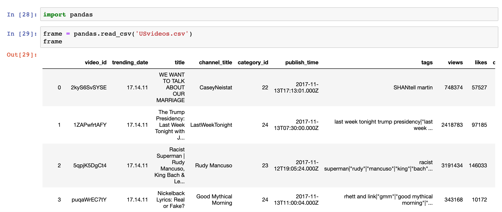

## 年薪50W+的Python程序员如何写代码

### 为什么要用Python写代码

#### 没有对比就没有伤害

> **很多互联网和移动互联网企业对开发效率的要求高于对执行效率的要求**。

##### 例子1：hello, world

C的版本：

```C
#include <stdio.h>

int main() {
    printf("hello, world\n");
    return 0;
}
```

Java的版本：

```Java
class Example01 {
    
    public static void main(String[] args) {
        System.out.println("hello, world");
    }
}
```

Python的版本：

```Python
print('hello, world')
```

#####  例子2：1-100求和

C的版本：

```C
#include <stdio.h>

int main() {
    int total = 0;
    for (int i = 1; i <= 100; ++i) {
        total += i;
    }
    printf("%d\n", total);
	return 0;
}
```

Python的版本：

```Java
print(sum(range(1, 101)))
```

##### 例子3：创建和初始化数组（列表）

Java的版本：

```Java
import java.util.Arrays;

public class Example03 {

    public static void main(String[] args) {
        boolean[] values = new boolean[10];
        Arrays.fill(values, true);
        System.out.println(Arrays.toString(values));

        int[] numbers = new int[10];
        for (int i = 0; i < numbers.length; ++i) {
            numbers[i] = i + 1;
        }
        System.out.println(Arrays.toString(numbers));
    }
}
```

Python的版本：

```Python
values = [True] * 10
print(values)
numbers = [x for x in range(1, 11)]
print(numbers)
```

##### 例子4：双色球随机选号

Java的版本：

```Java
import java.util.List;
import java.util.ArrayList;
import java.util.Collections;
import java.util.Scanner;

class Example03 {

    /**
     * 产生[min, max)范围的随机整数
     */
    public static int randomInt(int min, int max) {
        return (int) (Math.random() * (max - min) + min);
    }
    
    /**
     * 输出一组双色球号码
     */
    public static void display(List<Integer> balls) {
        for (int i = 0; i < balls.size(); ++i) {
            System.out.printf("%02d ", balls.get(i));
            if (i == balls.size() - 2) {
                System.out.print("| ");
            }
        }
        System.out.println();
    }

    /**
     * 生成一组随机号码
     */
    public static List<Integer> generate() {
        List<Integer> redBalls = new ArrayList<>();
        for (int i = 1; i <= 33; ++i) {
            redBalls.add(i);
        }
        List<Integer> selectedBalls = new ArrayList<>();
        for (int i = 0; i < 6; ++i) {
            selectedBalls.add(redBalls.remove(randomInt(0, redBalls.size())));
        }
        Collections.sort(selectedBalls);
        selectedBalls.add(randomInt(1, 17));
        return selectedBalls;
    }
    
    public static void main(String[] args) {
        try (Scanner sc = new Scanner(System.in)) {
            System.out.print("机选几注: ");
            int num = sc.nextInt();
            for (int i = 0; i < num; ++i) {
                display(generate());
            }
        }
    }
}
```

Python的版本：

```Python
from random import randint, sample


def generate():
    """生成一组随机号码"""
    red_balls = [x for x in range(1, 34)]
    selected_balls = sample(red_balls, 6)
    selected_balls.sort()
    selected_balls.append(randint(1, 16))
    return selected_balls


def display(balls):
    """输出一组双色球号码"""
    for index, ball in enumerate(balls):
        print(f'{ball:0>2d}', end=' ')
        if index == len(balls) - 2:
            print('|', end=' ')
    print()


num = int(input('机选几注: '))
for _ in range(num):
    display(generate())
```

> **温馨提示**：珍爱生命，远离任何形式的赌博。

##### 例子5：实现一个简单的HTTP服务器。

Java的版本：

> **说明**：JDK 1.6以前，需要通过套接字编程来实现，具体又可以分为多线程和NIO两种做法。JDK 1.6以后，可以使用`com.sun.net.httpserver`包提供的`HttpServer`类来实现。

```Java
import com.sun.net.httpserver.HttpExchange;
import com.sun.net.httpserver.HttpHandler;
import com.sun.net.httpserver.HttpServer;

import java.io.IOException;
import java.io.OutputStream;
import java.net.InetSocketAddress;

class Example05 {

    public static void main(String[] arg) throws Exception {
        HttpServer server = HttpServer.create(new InetSocketAddress(8000), 0);
        server.createContext("/", new RequestHandler());
        server.start();
    }

    static class RequestHandler implements HttpHandler {
        
        @Override
        public void handle(HttpExchange exchange) throws IOException {
            String response = "<h1>hello, world</h1>";
            exchange.sendResponseHeaders(200, 0);
            try (OutputStream os = exchange.getResponseBody()) {
                os.write(response.getBytes());
            }
        }
    }
}
```

Python的版本：

```Python
from http.server import HTTPServer, SimpleHTTPRequestHandler


class RequestHandler(SimpleHTTPRequestHandler):

    def do_GET(self):
        self.send_response(200)
        self.end_headers()
        self.wfile.write('<h1>hello, world</h1>'.encode())


server = HTTPServer(('', 8000), RequestHandler)
server.serve_forever()
```

或

```Python
python3 -m http.server 8000
```

#### 一行Python代码可以做什么

> **很多时候，你的问题只需一行Python代码就能解决**。

```Python
# 一行代码实现求阶乘函数
fac = lambda x: __import__('functools').reduce(int.__mul__, range(1, x + 1), 1)

# 一行代码实现求最大公约数函数
gcd = lambda x, y: y % x and gcd(y % x, x) or x

# 一行代码实现判断素数的函数
is_prime = lambda x: x > 1 and not [f for f in range(2, int(x ** 0.5) + 1) if x % f == 0]

# 一行代码实现快速排序
quick_sort = lambda items: len(items) and quick_sort([x for x in items[1:] if x < items[0]]) + [items[0]] + quick_sort([x for x in items[1:] if x > items[0]]) or items

# 生成FizzBuzz列表
['Fizz'[x % 3 * 4:] + 'Buzz'[x % 5 * 4:] or x for x in range(1, 101)]
```

#### 设计模式从未如此简单

> **Python是动态类型语言，大量的设计模式在Python中被简化或弱化**。

思考：如何优化下面的代码。

```Python
def fib(num):
    if num in (1, 2):
        return 1
    return fib(num - 1) + fib(num - 2)
```

代理模式在Python中可以通过内置的或自定义的装饰器来实现。

```Python
from functools import lru_cache


@lru_cache()
def fib(num):
    if num in (1, 2):
        return 1
    return fib(num - 1) + fib(num - 2)


for n in range(1, 121):
    print(f'{n}: {fib(n)}')
```

> **说明**：通过Python标准库`functools`模块的`lru_cache`装饰器为`fib`函数加上缓存代理，缓存函数执行的中间结果，优化代码的性能。

单例模式在Python中可以通过自定义的装饰器或元类来实现。

```Python
from functools import wraps
from threading import RLock


def singleton(cls):
    instances = {}
    lock = RLock()

    @wraps(cls)
    def wrapper(*args, **kwargs):
        if cls not in instances:
            with lock:
                if cls not in instances:
                    instances[cls] = cls(*args, **kwargs)
        return instances[cls]
```

> **说明**：需要实现单例模式的类只需要添加上面的装饰器即可。

原型模式在Python中可以通过元类来实现。

```Python
import copy


class PrototypeMeta(type):

    def __init__(cls, *args, **kwargs):
        super().__init__(*args, **kwargs)
        cls.clone = lambda self, is_deep=True: \
            copy.deepcopy(self) if is_deep else copy.copy(self)
```

> **说明**：通过元类给指定了`metaclass=PrototypeMeta`的类添加一个`clone`方法实现对象克隆，利用Python标准库`copy`模块的`copy`和`deepcopy`分别实现浅拷贝和深拷贝。

#### 数据采集和数据分析从未如此简单

> **网络数据采集是Python最擅长的领域之一。**

例子：获取豆瓣电影“Top250”。

```Python
import random
import time

import requests
from bs4 import BeautifulSoup

for page in range(10):
    resp = requests.get(
        url=f'https://movie.douban.com/top250?start={25 * page}',
        headers={'User-Agent': 'BaiduSpider'}
    )
    soup = BeautifulSoup(resp.text, "lxml")
    for elem in soup.select('a > span.title:nth-child(1)'):
        print(elem.text)
    time.sleep(random.random() * 5)
```

> **利用NumPy、Pandas、Matplotlib可以轻松实现数据分析和可视化**。



### 写出Python代码的正确姿势

> **用Python写代码就要写出Pythonic的代码**。

#### 姿势1：选择结构的正确姿势

跨界开发者的代码：

```Python
name = 'jackfrued'
fruits = ['apple', 'orange', 'grape']
owners = {'name': '骆昊', 'age': 40, 'gender': True}
if name != '' and len(fruits) > 0 and len(owners.keys()) > 0:
    print('Jackfrued love fruits.')
```

Pythonic的代码：

```Python
name = 'jackfrued'
fruits = ['apple', 'orange', 'grape']
owners = {'name': '骆昊', 'age': 40, 'gender': True}
if name and fruits and owners:
    print('Jackfrued love fruits.')
```

#### 姿势2：交换两个变量的正确姿势

跨界开发者的代码：

```Python
temp = a
a = b
b = temp
```

或

```Python
a = a ^ b
b = a ^ b
a = a ^ b
```

Pythonic的代码：

```Python
a, b = b, a
```


#### 姿势3：用序列组装字符串的正确姿势

跨界开发者的代码：

```Python
chars = ['j', 'a', 'c', 'k', 'f', 'r', 'u', 'e', 'd']
name = ''
for char in chars:
    name += char
```

Pythonic的代码：

```Python
chars = ['j', 'a', 'c', 'k', 'f', 'r', 'u', 'e', 'd']
name = ''.join(chars)
```


#### 姿势4：遍历列表的正确姿势

跨界开发者的代码：

```Python
fruits = ['orange', 'grape', 'pitaya', 'blueberry']
index = 0
for fruit in fruits:
    print(index, ':', fruit)
    index += 1
```

Pythonic的代码：

```Python
fruits = ['orange', 'grape', 'pitaya', 'blueberry']
for index, fruit in enumerate(fruits):
    print(index, ':', fruit)
```


#### 姿势5：创建列表的正确姿势

跨界开发者的代码：

```Python
data = [7, 20, 3, 15, 11]
result = []
for i in data:
    if i > 10:
        result.append(i * 3)
```

Pythonic的代码：

```Python
data = [7, 20, 3, 15, 11]
result = [num * 3 for num in data if num > 10]
```


#### 姿势6：确保代码健壮性的正确姿势

跨界开发者的代码：

```Python
data = {'x': '5'}
if 'x' in data and isinstance(data['x'], (str, int, float)) \
        and data['x'].isdigit():
    value = int(data['x'])
    print(value)
else:
    value = None
```

Pythonic的代码：

```Python
data = {'x': '5'}
try:
    value = int(data['x'])
    print(value)
except (KeyError, TypeError, ValueError):
    value = None
```


### 使用Lint工具检查你的代码规范

阅读下面的代码，看看你能看出哪些地方是有毛病的或者说不符合Python的编程规范的。

```Python
from enum import *

@unique
class Suite (Enum):
    SPADE, HEART, CLUB, DIAMOND = range(4)

class Card(object):
    def __init__(self,suite,face ):
        self.suite = suite
        self.face = face


    def __repr__(self):
        suites='♠♥♣♦'
        faces=['','A','2','3','4','5','6','7','8','9','10','J','Q','K']
        return f'{suites[self.suite.value]}{faces[self.face]}'

import random

class Poker(object):
    def __init__(self):
        self.cards =[Card(suite, face) for suite in Suite
            for face in range(1, 14)]
        self.current=0
    def shuffle (self):
        self.current=0
        random.shuffle(self.cards)
    def deal (self):
        card = self.cards[self.current]
        self.current+=1
        return card
    def has_next (self):
        if self.current<len(self.cards): return True
        return False

p = Poker()
p.shuffle()
print(p.cards)
```

#### PyLint的安装和使用

Pylint是Python代码分析工具，它分析Python代码中的错误，查找不符合代码风格标准（默认使用的代码风格是 PEP 8）和有潜在问题的代码。

```Bash
pip install pylint
pylint [options] module_or_package
```

Pylint输出格式如下所示。

> 模块名:行号:列号:    消息类型    消息

消息类型有以下几种：

1. C - 惯例：违反了Python编程惯例（PEP 8）的代码。
2. R - 重构：写得比较糟糕需要重构的代码。
3. W - 警告：代码中存在的不影响代码运行的问题。
4. E - 错误：代码中存在的影响代码运行的错误。
5. F - 致命错误：导致Pylint无法继续运行的错误。

Pylint命令的常用参数：

1. `--disable=<msg ids>`或`-d <msg ids>`：禁用指定类型的消息。
2. `--errors-only`或`-E`：只显示错误。
3. `--rcfile=<file>`：指定配置文件。
4. `--list-msgs`：列出Pylint的消息清单。
5. `--generate-rcfile`：生成配置文件的样例。
6. `--reports=<y_or_n>`或`-r <y_or_n>`：是否生成检查报告。

### 使用Profile工具剖析你的代码性能

#### cProfile模块

`example01.py`

```Python
import cProfile


def is_prime(num):
    for factor in range(2, int(num ** 0.5) + 1):
        if num % factor == 0:
            return False
    return True


class PrimeIter:

    def __init__(self, total):
        self.counter = 0
        self.current = 1
        self.total = total

    def __iter__(self):
        return self

    def __next__(self):
        if self.counter < self.total:
            self.current += 1
            while not is_prime(self.current):
                self.current += 1
            self.counter += 1
            return self.current
        raise StopIteration()

        
cProfile.run('list(PrimeIter(10000))')
```

执行结果：

```
   114734 function calls in 0.573 seconds

   Ordered by: standard name

   ncalls  tottime  percall  cumtime  percall filename:lineno(function)
        1    0.006    0.006    0.573    0.573 <string>:1(<module>)
        1    0.000    0.000    0.000    0.000 example.py:14(__init__)
        1    0.000    0.000    0.000    0.000 example.py:19(__iter__)
    10001    0.086    0.000    0.567    0.000 example.py:22(__next__)
   104728    0.481    0.000    0.481    0.000 example.py:5(is_prime)
        1    0.000    0.000    0.573    0.573 {built-in method builtins.exec}
        1    0.000    0.000    0.000    0.000 {method 'disable' of '_lsprof.Profiler' objects}
```

####line_profiler

给需要剖析时间性能的函数加上一个`profile`装饰器，这个函数每行代码的执行次数和时间都会被剖析。

`example02.py`

```Python
@profile
def is_prime(num):
    for factor in range(2, int(num ** 0.5) + 1):
        if num % factor == 0:
            return False
    return True


class PrimeIter:

    def __init__(self, total):
        self.counter = 0
        self.current = 1
        self.total = total

    def __iter__(self):
        return self

    def __next__(self):
        if self.counter < self.total:
            self.current += 1
            while not is_prime(self.current):
                self.current += 1
            self.counter += 1
            return self.current
        raise StopIteration()


list(PrimeIter(1000))
```

安装和使用`line_profiler`三方库。

```Bash
pip install line_profiler
kernprof -lv example.py

Wrote profile results to example02.py.lprof
Timer unit: 1e-06 s

Total time: 0.089513 s
File: example02.py
Function: is_prime at line 1

 #      Hits         Time  Per Hit   % Time  Line Contents
==============================================================
 1                                           @profile
 2                                           def is_prime(num):
 3     86624      43305.0      0.5     48.4      for factor in range(2, int(num ** 0.5) + 1):
 4     85624      42814.0      0.5     47.8          if num % factor == 0:
 5      6918       3008.0      0.4      3.4              return False
 6      1000        386.0      0.4      0.4      return True
```

####memory_profiler 

给需要剖析内存性能的函数加上一个`profile`装饰器，这个函数每行代码的内存使用情况都会被剖析。

`example03.py`

```Python
@profile
def eat_memory():
    items = []
    for _ in range(1000000):
        items.append(object())
    return items


eat_memory()
```

安装和使用`memory_profiler`三方库。

```Python
pip install memory_profiler
python3 -m memory_profiler example.py

Filename: example03.py

Line #    Mem usage    Increment   Line Contents
================================================
     1   38.672 MiB   38.672 MiB   @profile
     2                             def eat_memory():
     3   38.672 MiB    0.000 MiB       items = []
     4   68.727 MiB    0.000 MiB       for _ in range(1000000):
     5   68.727 MiB    1.797 MiB           items.append(object())
     6   68.727 MiB    0.000 MiB       return items
```

### 如何构建综合职业素养

#### 学习总结

1. 了解全局
2. 确定范围
3. 定义目标
4. 寻找资源
5. 创建学习计划
6. 筛选资源
7. 开始学习，浅尝辄止（YAGNI）
8. 动手操作，边学边玩
9. 全面掌握，学以致用
10. 乐为人师，融会贯通

#### 时间管理

1. 提升专注力

2. 充分利用碎片时间

3. 使用番茄工作法

4. 时间是怎么浪费掉的

5. 任何行动都比不采取行动好

   


#### 好书推荐

1. 职业规划：《软技能 - 代码之外的生存指南》
2. 吴军系列：《浪潮之巅》、《硅谷之谜》、《数学之美》、……
3. 时间管理：《成为一个更高效的人》、《番茄工作法图解》