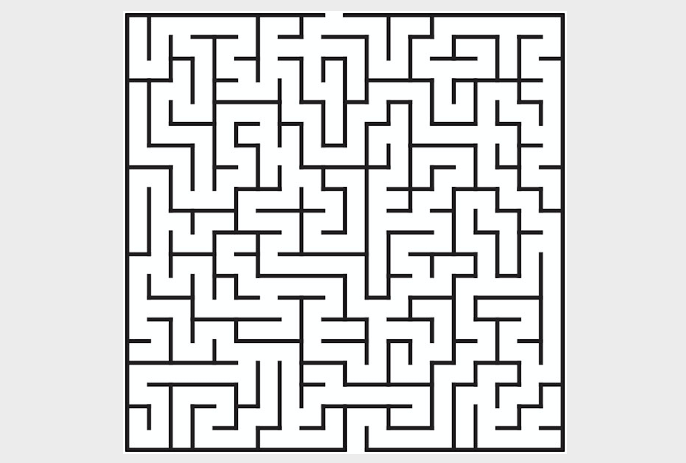
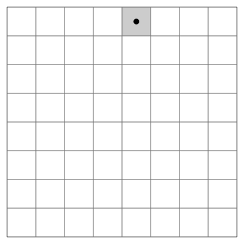
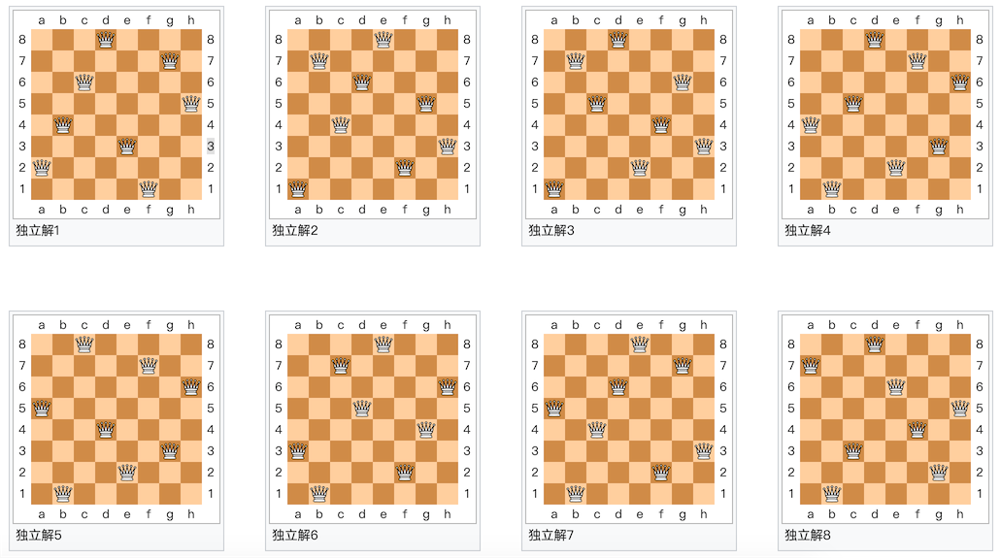

## 算法入门系列2 - 在水一方

在第一次的公开课中，我们讲到了穷举法。穷举法也被称为暴力搜索法，今天我们要讲的回溯法就是暴力搜索法的一种。接下来我们讲到的很多算法跟“递归”这个概念有或多或少的关系，所以我们先说说“递归”。

### 现实中的递归

从前有座山，山里有座庙，庙里有个老和尚，正在给小和尚讲故事呢！故事是什么呢？从前有座山，山里有座庙，庙里有个老和尚，正在给小和尚讲故事呢！故事是什么呢？从前有座山，山里有座庙，庙里有个老和尚，正在给小和尚讲故事呢！故事是什么呢？……

野比大雄在房间里，用时光电视看着未来的情况。电视画面中，野比大雄在房间里，用时光电视看着未来的情况。电视画面中，野比大雄在房间里，用时光电视看着未来的情况……

阶乘的递归定义：$$0! = 1$$，$$n!=n*(n-1)!$$ ，使用被定义对象的自身来为其下定义称为递归定义。

[德罗斯特效应](https://zh.wikipedia.org/wiki/%E5%BE%B7%E7%BD%97%E6%96%AF%E7%89%B9%E6%95%88%E5%BA%94)是递归的一种视觉形式。图中女性手持的物体中有一幅她本人手持同一物体的小图片，进而小图片中还有更小的一幅她手持同一物体的图片……


### 递归的应用

在程序中，一个函数如果直接或者间接的调用了自身，我们就称之为递归函数。

写递归函数有两个要点：

1. 收敛条件 - 什么时候结束递归。
2. 递归公式 - 每一项与前一项（前*N*项）的关系。

例子1：求阶乘。

```Python
def fac(num):
    if num == 0:
        return 1
    return num * fac(num - 1)
```

Python对递归的深度加以了限制（默认1000层函数调用），如果想突破这个限制，可以使用下面的方法。

```Python
import sys

sys.setrecursionlimit(10000)
```

例子2：爬楼梯 - 楼梯有*n*个台阶，一步可以走1阶、2阶或3阶，走完*n*个台阶共有多少种不同的走法。

```Python
def climb(num):
    if num == 0:
        return 1
    elif num < 0:
        return 0
    return climb(num - 1) + climb(num - 2) + climb(num - 3)
```

**注意**：上面的递归函数性能会非常的差，因为时间复杂度是几何级数级的。

优化后的代码。

```Python
from functools import lru_cache


@lru_cache()
def climb(num):
    if num == 0:
        return 1
    elif num < 0:
        return 0
    return climb(num - 1) + climb(num - 2) + climb(num - 3)
```

不使用的递归的代码。

```Python
def climb(num):
    a, b, c = 1, 2, 4
    for _ in range(num - 1):
        a, b, c = b, c, a + b + c
    return a
```

**重点**：有更好的办法的时候，请不要考虑递归。

### 回溯法

**回溯法**是[暴力搜索法](https://zh.wikipedia.org/wiki/%E6%9A%B4%E5%8A%9B%E6%90%9C%E5%B0%8B%E6%B3%95)中的一种。对于某些计算问题而言，回溯法是一种可以找出所有（或一部分）解的一般性算法，尤其适用于约束满足问题（在解决约束满足问题时，我们逐步构造更多的候选解，并且在确定某一部分候选解不可能补全成正确解之后放弃继续搜索这个部分候选解本身及其可以拓展出的子候选解，转而测试其他的部分候选解）。

### 经典案例

例子1：**迷宫寻路**。



```Python
"""
迷宫寻路
"""
import random
import sys

WALL = -1
ROAD = 0

ROWS = 10
COLS = 10


def find_way(maze, i=0, j=0, step=1):
    """走迷宫"""
    if 0 <= i < ROWS and 0 <= j < COLS and maze[i][j] == 0:
        maze[i][j] = step
        if i == ROWS - 1 and j == COLS - 1:
            print('=' * 20)
            display(maze)
            sys.exit(0)
        find_way(maze, i + 1, j, step + 1)
        find_way(maze, i, j + 1, step + 1)
        find_way(maze, i - 1, j, step + 1)
        find_way(maze, i, j - 1, step + 1)
        maze[i][j] = ROAD


def reset(maze):
    """重置迷宫"""
    for i in range(ROWS):
        for j in range(COLS):
            num = random.randint(1, 10)
            maze[i][j] = WALL if num > 7 else ROAD
    maze[0][0] = maze[ROWS - 1][COLS - 1] = ROAD


def display(maze):
    """显示迷宫"""
    for row in maze:
        for col in row:
            if col == -1:
                print('■', end=' ')
            elif col == 0:
                print('□', end=' ')
            else:
                print(f'{col}'.ljust(2), end='')
        print()


def main():
    """主函数"""
    maze = [[0] * COLS for _ in range(ROWS)]
    reset(maze)
    display(maze)
    find_way(maze)
    print('没有出路!!!')


if __name__ == '__main__':
    main()
```

**说明：**上面的代码用随机放置围墙的方式来生成迷宫，更好的生成迷宫的方式请参考[《简单的使用回溯法生成 Tile Based 迷宫》](<https://indienova.com/indie-game-development/generate-tile-based-maze-with-backtracking/>)一文。

例子2：**骑士巡逻** - 国际象棋中的骑士（马），按照骑士的移动规则走遍整个棋盘的每一个方格，而且每个方格只能够经过一次。



```Python
"""
骑士巡逻
"""
import sys

SIZE = 8


def display(board):
    """显示棋盘"""
    for row in board:
        for col in row:
            print(f'{col}'.rjust(2, '0'), end=' ')
        print()


def patrol(board, i=0, j=0, step=1):
    """巡逻"""
    if 0 <= i < SIZE and 0 <= j < SIZE and board[i][j] == 0:
        board[i][j] = step
        if step == SIZE * SIZE:
            display(board)
            sys.exit(0)
        patrol(board, i + 1, j + 2, step + 1)
        patrol(board, i + 2, j + 1, step + 1)
        patrol(board, i + 2, j - 1, step + 1)
        patrol(board, i + 1, j - 2, step + 1)
        patrol(board, i - 1, j - 2, step + 1)
        patrol(board, i - 2, j - 1, step + 1)
        patrol(board, i - 2, j + 1, step + 1)
        patrol(board, i - 1, j + 2, step + 1)
        board[i][j] = 0


def main():
    """主函数"""
    board = [[0] * SIZE for _ in range(SIZE)]
    patrol(board)


if __name__ == '__main__':
    main()
```

例子3：**八皇后** - 如何能够在8×8的国际象棋棋盘上放置八个皇后，使得任何一个皇后都无法直接吃掉其他的皇后？为了达到此目的，任两个皇后都不能处于同一条横行、纵行或斜线上。



**说明**：这个问题太经典了，网上有大把的答案，留给大家自己搞定。