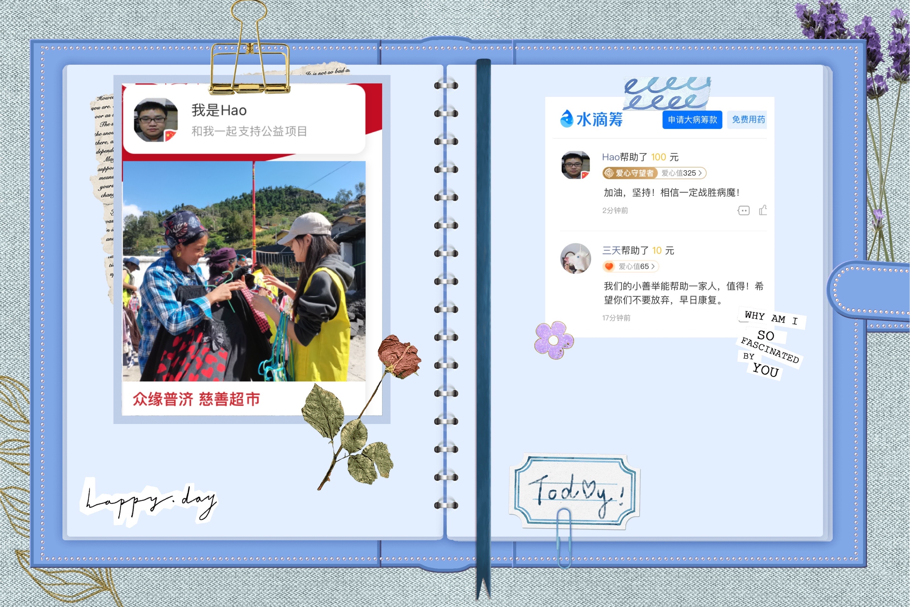
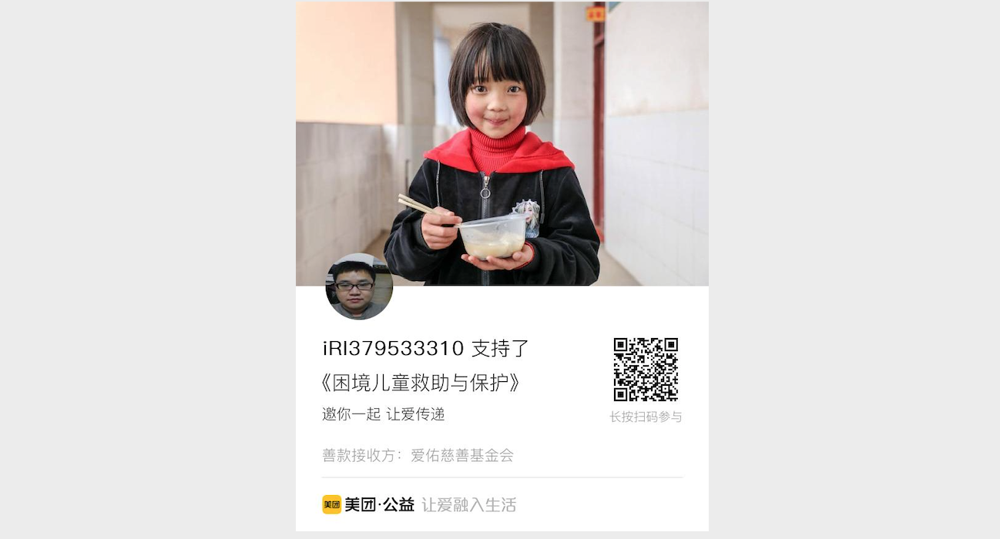
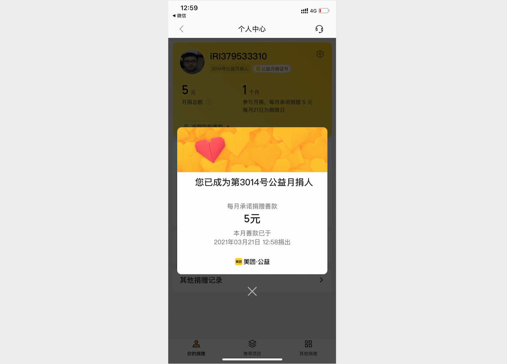
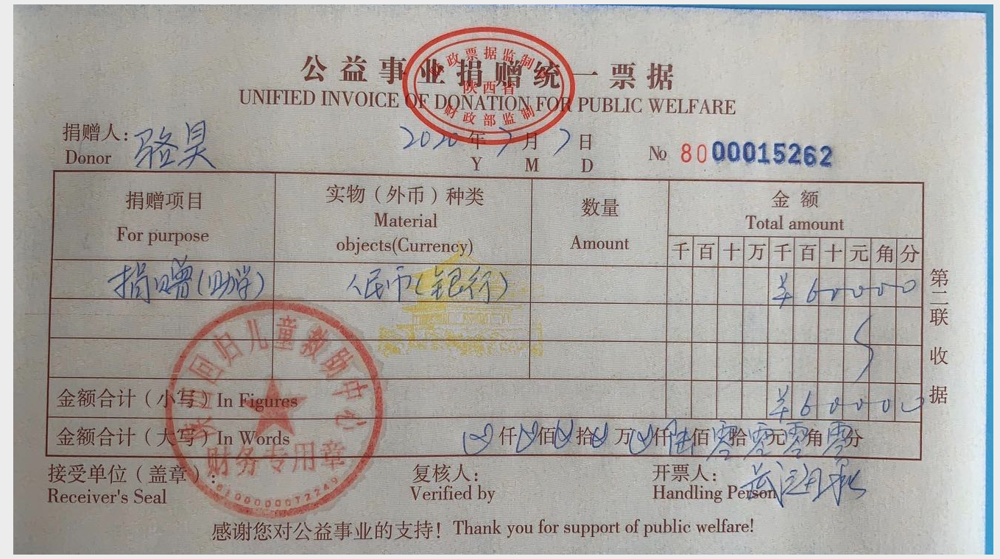
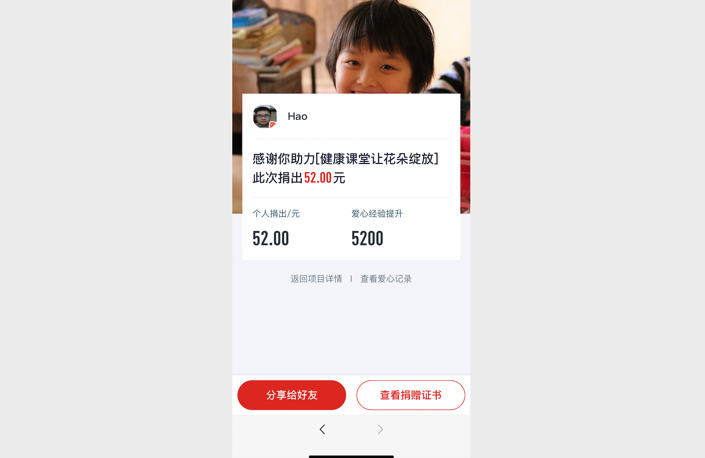
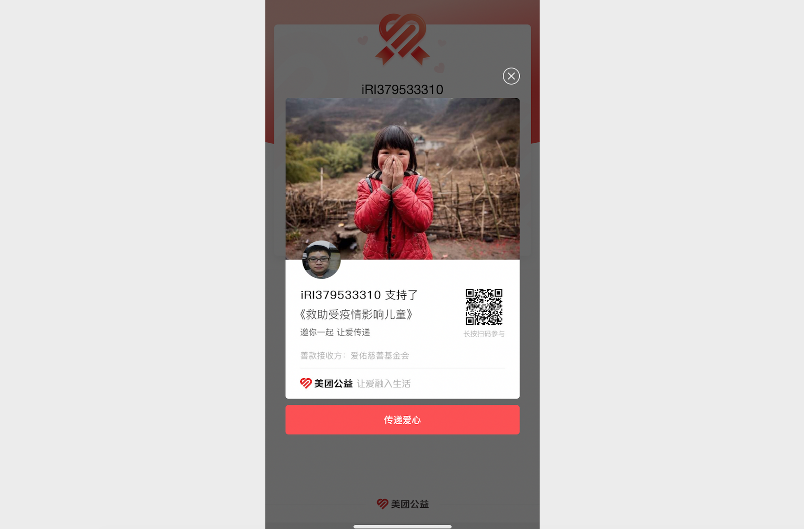
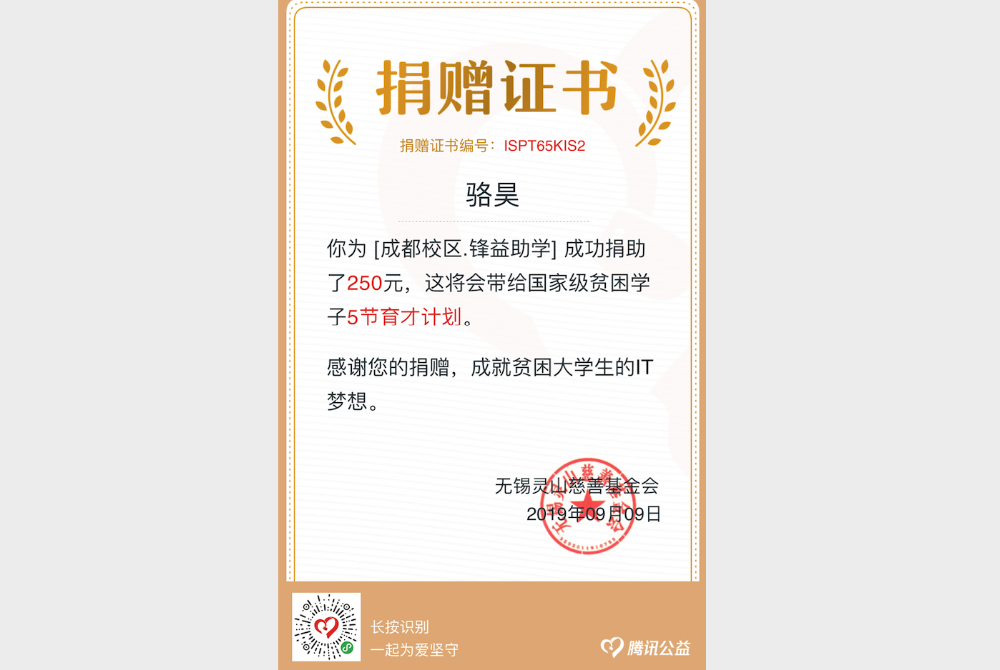
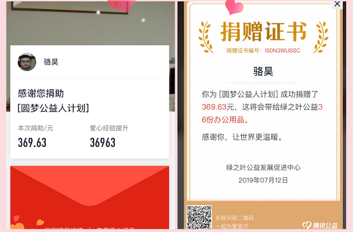

## 更新日志

### 2024年4月18日

1. 重新整理了项目结构，补充了一部分文档。
2. 准备开始撰写《机器学习和深度学习》部分的内容。

### 2022年1月11日

1. 将近期收到的打赏通过水滴筹和众缘普济公益慈善促进会捐赠给有需要的人。

    

### 2021年11月22日

1. 更新了数据库部分的文档和代码。
2. 修正了网友们指出的文档和代码中的bug。
3. 更新了README文件中的群信息。

### 2021年10月7日

1. 调整了项目目录结构。
2. 更新了数据分析部分的内容。

### 2021年3月28日

1. 最近把数据挖掘的东西梳理了一遍，准备开始写文档啦。

2. 近期收到的打赏通过美团公益捐赠给有需要的人。

    

    

    

###2020年10月3日

1. 调整项目目录结构。
2. 开始补全前面缺失内容和更新最后部分的工作。
3. 将近期收到的打赏通过水滴筹等平台捐助给需要帮助的人。

### 2020年7月12日

1. 修正了部分文档中的bug。

2. 更新了Django部分的文档。

3. 将近期收到的打赏捐赠给陕西回归儿童救助中心。

    

### 2020年4月8日

1. 将基础部分（第1天到第15天）内容重新创建了一个名为“Python-Core-50-Courses”的仓库，更新了部分内容。

2. 更新了README.md文件。

3. 将近期收到的打赏通过腾讯公益捐出，助力“儿童健康课堂”。

   

### 2020年3月8日

1. 更新了最后10天的部分文档。

2. 通过美团公益将近期打赏捐助给受疫情影响儿童。

   

### 2020年3月1日

1. 优化了项目中的部分图片资源。
2. 更新了部分文档。

### 2019年9月23日

1. 计划在国庆长假结束前，完成第91天到第100天内容的更新，包括最新的Python面试题集。
2. 修改了第7天《字符串和常用数据结构》一文的内容。

### 2019年9月15日

1. 将微信打赏所得收入通过腾讯公益捐赠给国家级贫困大学生。

   

2. 开始更新和调整第1天到第15天的内容。

3. 开始整理大家期待已久的《Python面试题大全及参考答案》。

### 2019年8月12日

1. 发布了《使用Hexo搭建自己的博客》一文。

### 2019年8月8日

1. 最近公司给安排了很多任务，所以好久都没有更新这个项目，今天终于把一直计划更新的《关系型数据库MySQL》更新完了。
2. 昨天微信收款提示我已经连续有48天收到了打赏，非常感谢大家持续的支持。
3. 最近一直在计划为这个项目录制一个配套的视频，当然这个工作量的巨大是可想而知的，但是我还是决定要在年底之前开始做这件事情，这样才能不辜负那么多希望通过这个项目学习和了解Python的人。

### 2019年7月11日

1. 今天终于结束了出差的日子，回来先把最近收到的打赏通过腾讯公益平台全部捐赠给了绿之叶，总共捐出了111笔打赏。

   

### 2019年7月9日

1. 最近出差，项目一直处于停更状态。交流群的很多初学者反馈从第8天开始内容就有一定难度，最近本来也打算把语言基础部分和爬虫的部门重新整理一次，这次争取将文字和案例做得更加通俗易懂，而且更具实用性，这个事情从今天已然开始了，最终的目标是要将这部分的内容整理成一本书，希望大家到时候能够一如既往的支持。
2. 最近1周多的时间一共收到60笔以上的打赏，最多的一天收到了14笔打赏，还是要再次谢谢大家为知识付费的行为，当然加交流群是不用付费的，您支付的费用会用于支持山区儿童教育。
3. 今天重新翻译了*Zen of Python*，这次的版本我自己都比较喜欢，所以也分享给大家。

### 2019年6月30日

1. 最近2天一共收到11笔打赏。
2. 终于将第48天《前后端分离开发》一文更新完，但是自己都感觉有点凑数的嫌疑，文字描述没怎么花心思去写，大家可以参考项目的代码来了解前后端分离开发。项目中使用了Vue.js，但是没有使用脚手架工具，也没有配置前端路由，仅仅使用了Vue.js来渲染页面，毕竟我自己也不是专业的前端。

### 2019年6月27日

1. 最近3天一共收到35笔打赏，感谢大家持续关注。
2. 近期事情较多，更新速度可能会放缓，请大家谅解。
3. 今晚公开课相关的资料已经更新到公开课目录中。

### 2019年6月23日

1. 最近几天一共收到25笔打赏，感谢大家的支持。
2. 更新了QQ交流群，重新创建了一个2000人群。

### 2019年6月18日

1. 在朋友的建议下，给首页加了一个打赏的二维码，看看有多少愿意为知识付费。今天一共收到了7位小伙伴的打赏，在此表示感谢，打赏获得的收入将通过腾讯公益平台全部捐出。
2. Django部分（第41天到第55天）更新到第47天，最新上线的部分包括报表、日志、ORM查询优化以及中间件相关的内容，并将投票应用的完成代码同步到github。

