## 玩转PyCharm

PyCharm是由JetBrains公司开发的提供给Python专业的开发者的一个集成开发环境，它最大的优点是能够大大提升Python开发者的工作效率，为开发者集成了很多用起来非常顺手的功能，包括代码调试、高亮语法、代码跳转、智能提示、自动补全、单元测试、版本控制等等。此外，PyCharm还提供了对一些高级功能的支持，包括支持基于Django框架的Web开发、。

### PyCharm的安装

可以在[JetBrains公司的官方网站]()找到PyCharm的[下载链接](https://www.jetbrains.com/pycharm/download/)，有两个可供下载的版本一个是社区版一个是专业版，社区版在[Apache许可证](https://zh.wikipedia.org/wiki/Apache%E8%AE%B8%E5%8F%AF%E8%AF%81)下发布，专业版在专用许可证下发布（需要购买授权下载后可试用30天），其拥有许多额外功能。安装PyCharm需要有JRE（Java运行时环境）的支持，如果没有可以在安装过程中选择在线下载安装。

> 说明：如果你是一名学生，希望购买PyCharm来使用，可以看看[教育优惠官方申请指南](https://sales.jetbrains.com/hc/zh-cn/articles/207154369)。

### 首次使用的设置

第一次使用PyCharm时，会有一个导入设置的向导，如果之前没有使用PyCharm或者没有保存过设置的就直接选择“Do not import settings”进入下一步即可。

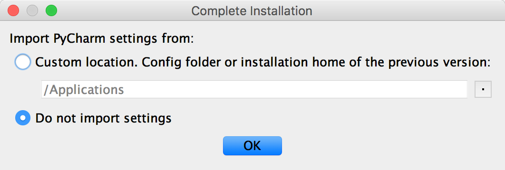

专业版的PyCharm是需要激活的，**强烈建议为优秀的软件支付费用**，如果不用做商业用途，我们可以暂时选择试用30天或者使用社区版的PyCharm。

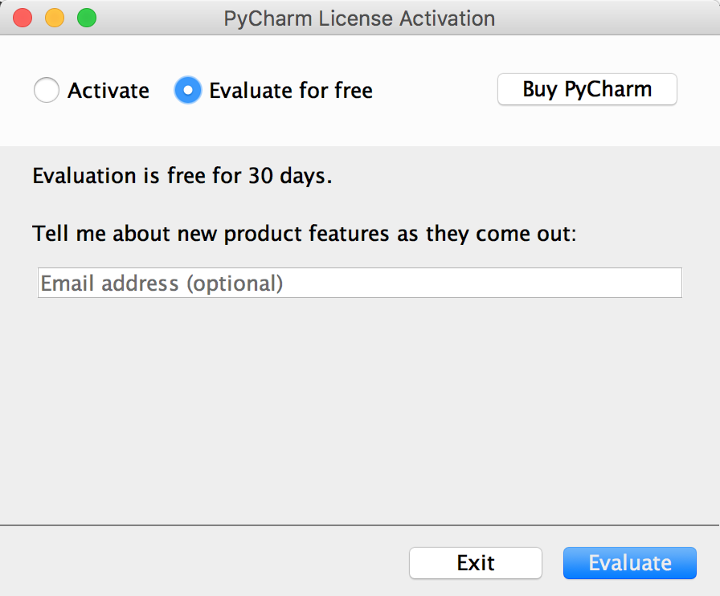

 接下来是选择UI主题，这个可以根据个人喜好进行选择。

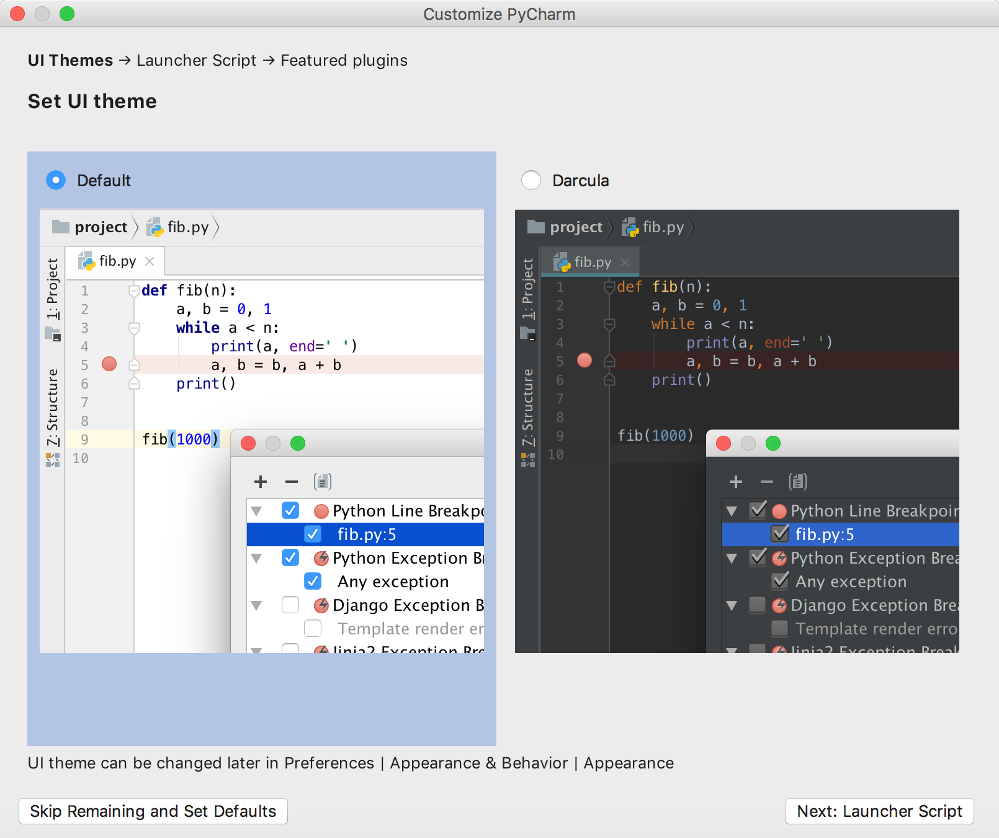

 再接下来是创建可以在终端（命令行）中使用PyCharm项目的启动脚本，当然也可以直接跳过这一步。

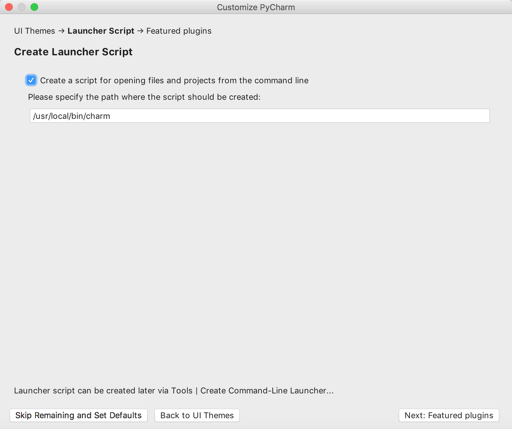

然后可以选择需要安装哪些插件，我们可以暂时什么都不安装等需要的时候再来决定。

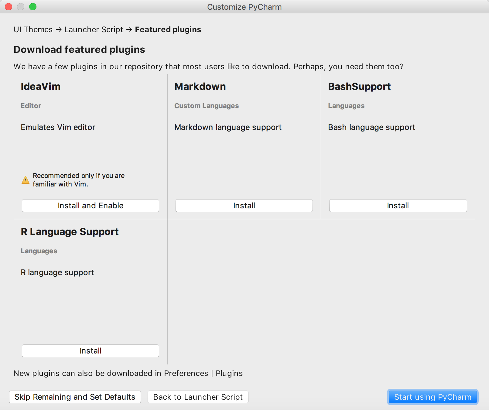

### 用PyCharm创建项目

点击上图中的“Start using PyCharm”按钮就可以开始使用PyCharm啦，首先来到的是一个欢迎页，在欢迎页上我们可以选择“创建新项目”、“打开已有项目”和“从版本控制系统中检出项目”。

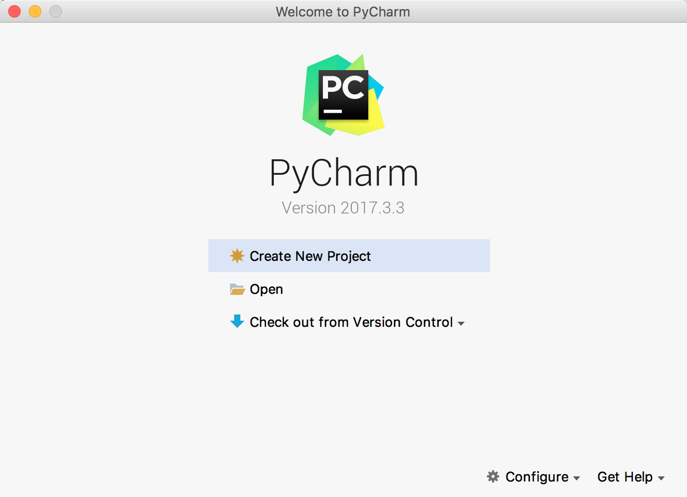

如果选择了“Create New Project”来创建新项目就会打一个创建项目的向导页。

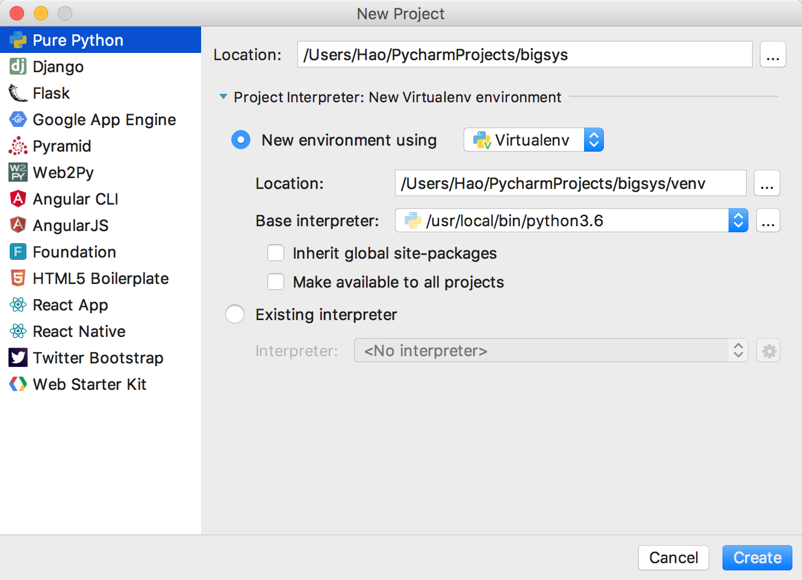

在如上图所示的界面中，我们可以选择创建项目的模板，包括了纯Python项目、基于各种不同框架的Web项目、Web前端项目、跨平台项目等各种不同的项目模板。如果选择Python的项目，那么有一个非常重要的设定是选择“New environment…”（创建新的虚拟环境）还是使用“Existing Interpreter”（已经存在的解释器）。前者肯定是更好的选择，因为新的虚拟环境不会对系统环境变量中配置的Python环境造成影响，简单举个例子就是你在虚拟环境下安装或者更新了任何三方库，它并不会对系统原有的Python解释器造成任何的影响，但代价是需要额外的存储空间来建立这个虚拟环境。

项目创建完成后就可以开始新建各种文件来书写Python代码了。

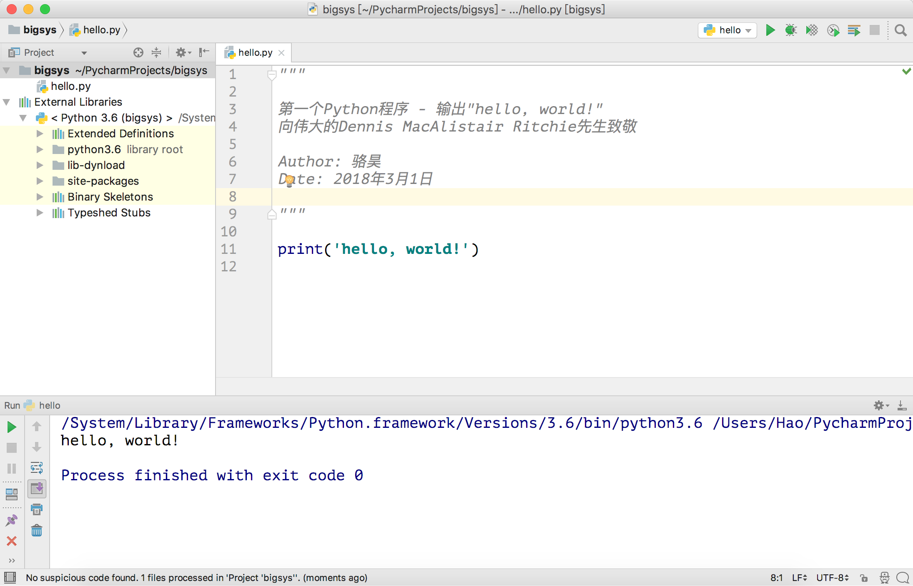

在工作窗口的右键菜单中可以找到“Run ...”和“Debug ...”菜单项，通过这两个菜单项我们就可以运行和调试我们的代码啦。建议关注一下菜单栏中的“Code”、“Refactor”和“Tools”菜单，这里面为编写Python代码提供了很多有用的帮助。

### 创建Django项目

#### 专业版

PyCharm专业版提供了对Django、Flask、Google App Engine、web2py等Python Web框架以及SQL、UML、前端语言和框架、远程调试、虚拟化部署等功能的支持，如果使用PyCharm专业版，在创建项目时可以直接选择创建Django项目并设置模板语言以及放置模板页的文件夹。

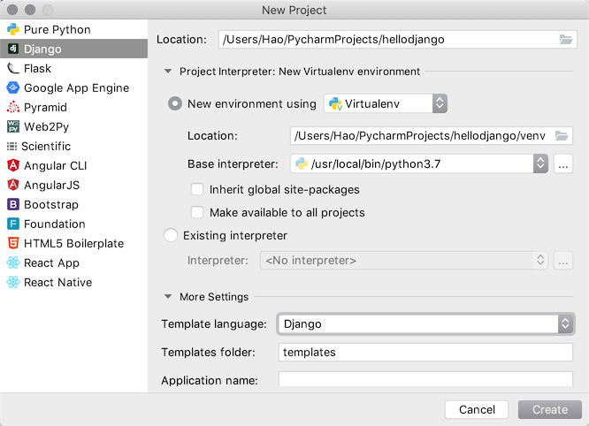

创建好项目之后，打开终端输入`pip list`命令，可以看到项目所需的依赖项已经安装好了，而且可以直接点击屏幕右上方的运行或调试按钮来直接运行Django项目。

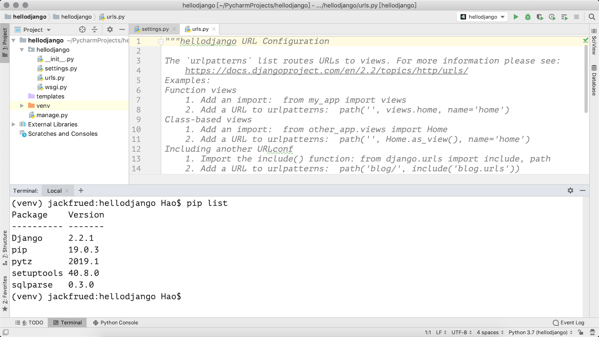

#### 社区版

PyCharm社区版只能创建Python项目，如果项目中需要Django的支持，可以自行安装依赖库并创建Django项目。

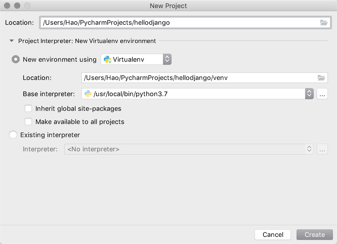

创建好Python项目之后，可以打开屏幕下方的终端（Terminal），并通过`pip install`安装Django项目的依赖项，可以通过`-i https://pypi.doubanio.com/simple`来指定下载依赖库的镜像仓库。

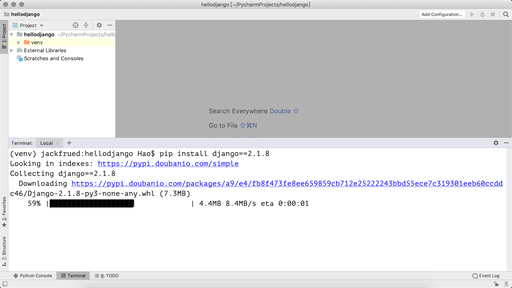

当然也可以在项目的设置菜单中找到解释器配置，并选择要添加的依赖项。

下面是搜索依赖项的界面，可以通过点击“Install Package”按钮来安装指定的依赖项；也可以通过点击“Manage Repositories”按钮来指定下载依赖项的仓库，国内用户推荐使用豆瓣镜像<http://pypi.doubanio.com/simple>。

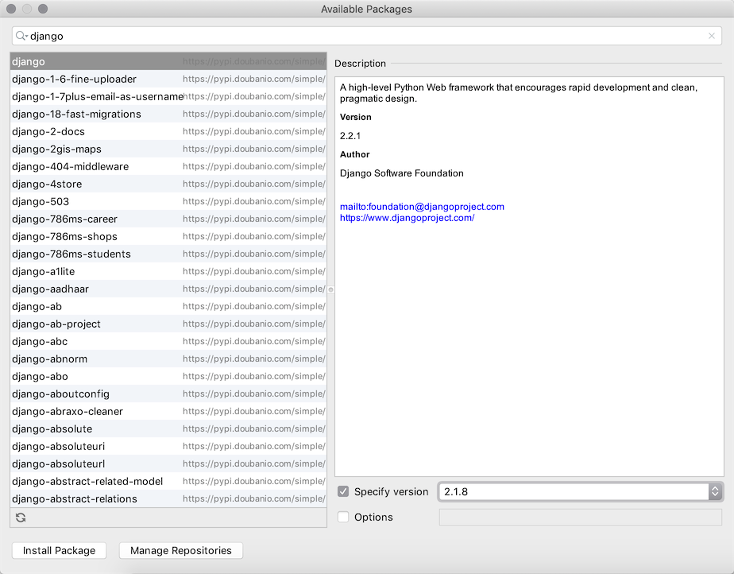

接下来可以在终端中输入`django-amdin startproject`指令来创建项目。

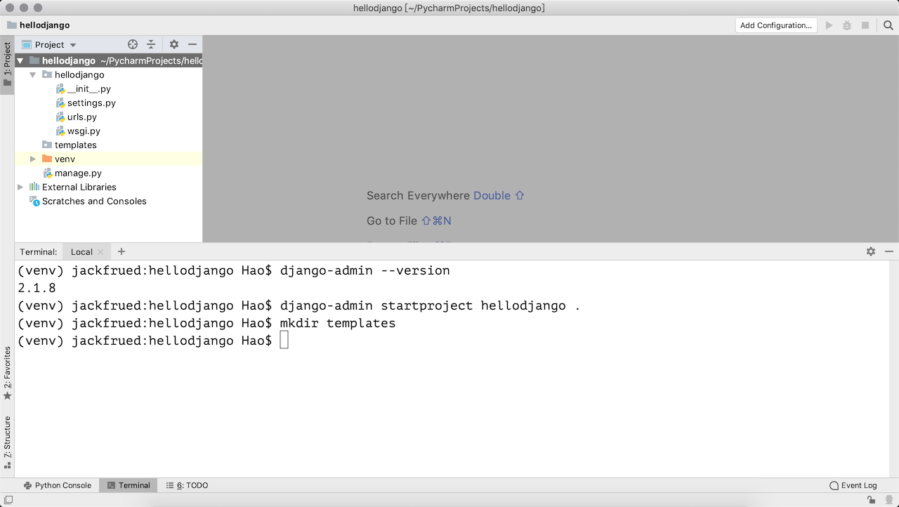

如果要运行项目，可以在终端中输入`python manage.py runserver`启动测试服务器。当然，也可以点击屏幕右上方的“Add Configuration”按钮，进入如下所示的配置界面，并点击窗口左上角的“+”来添加一个运行配置。

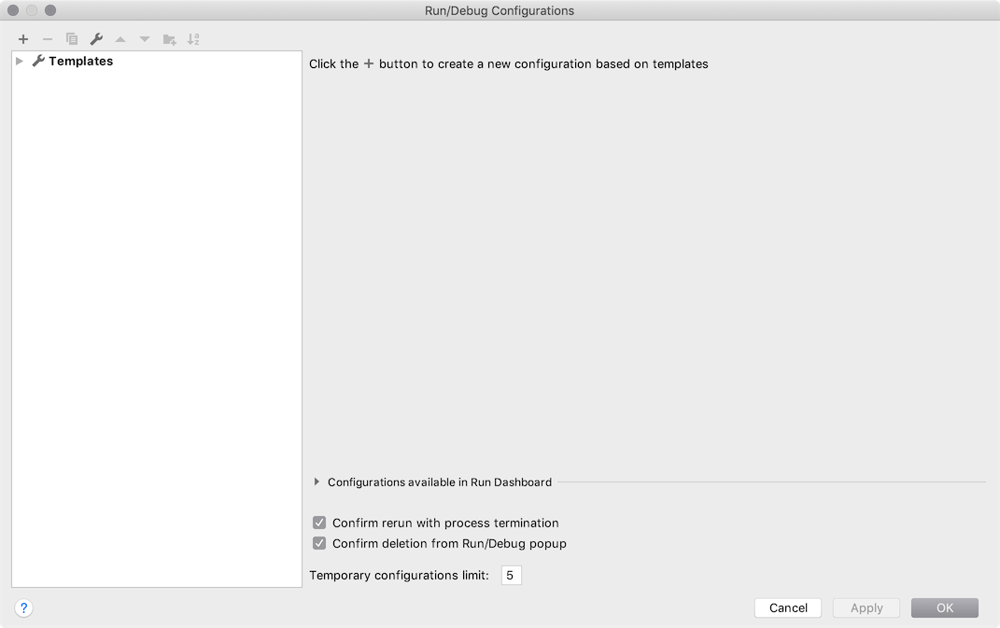

在配置窗口的右侧，指定要执行的脚本路径（Django项目的manage.py文件的位置）和运行参数（runserver），运行参数的后面还可以跟IP地址和端口。

注意到窗口的右上角了吗？现在可以点击运行或调试按钮来启动测试服务器运行项目了。

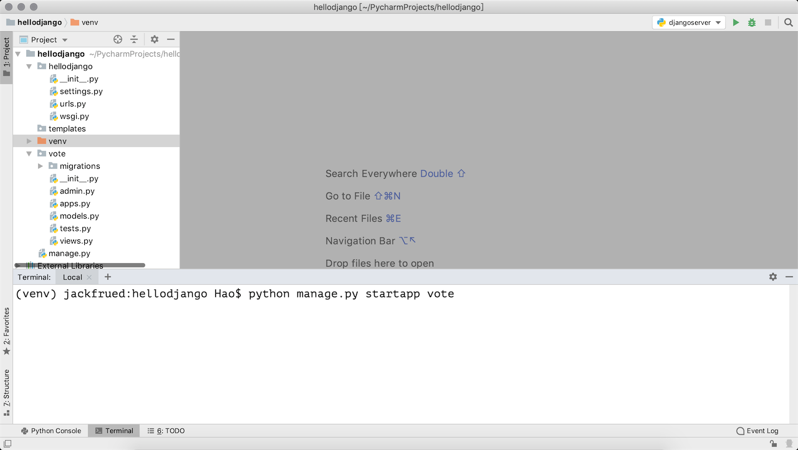