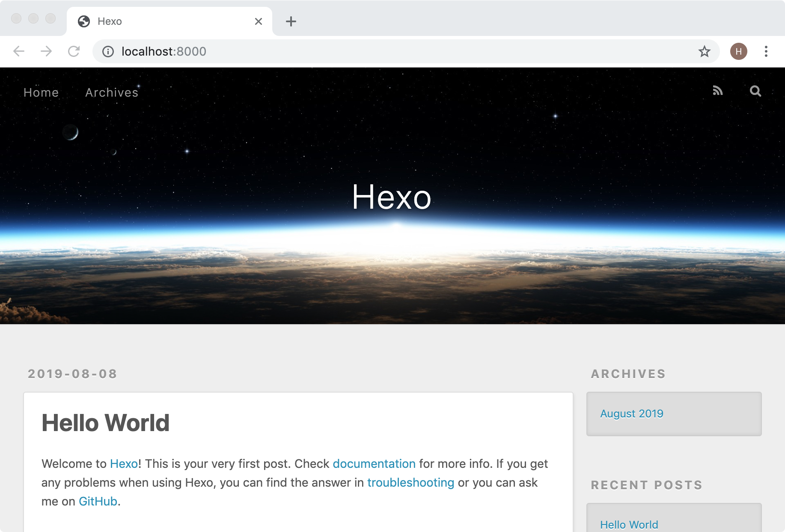
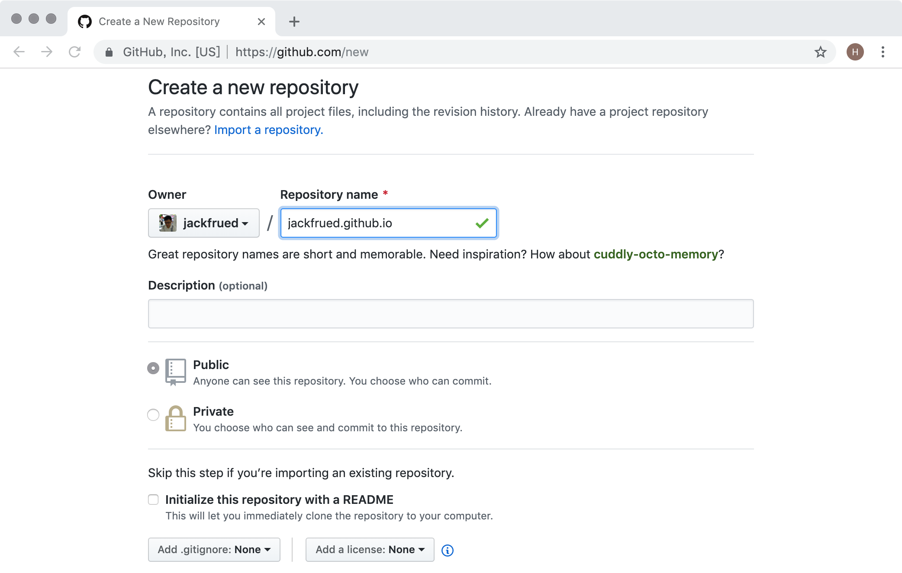
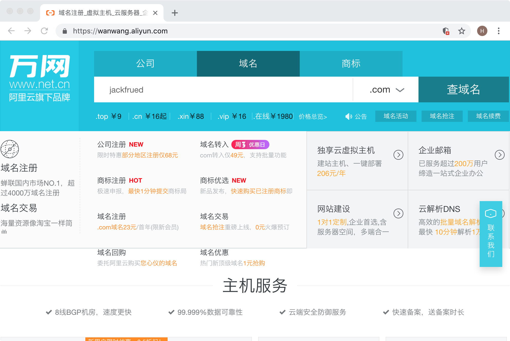
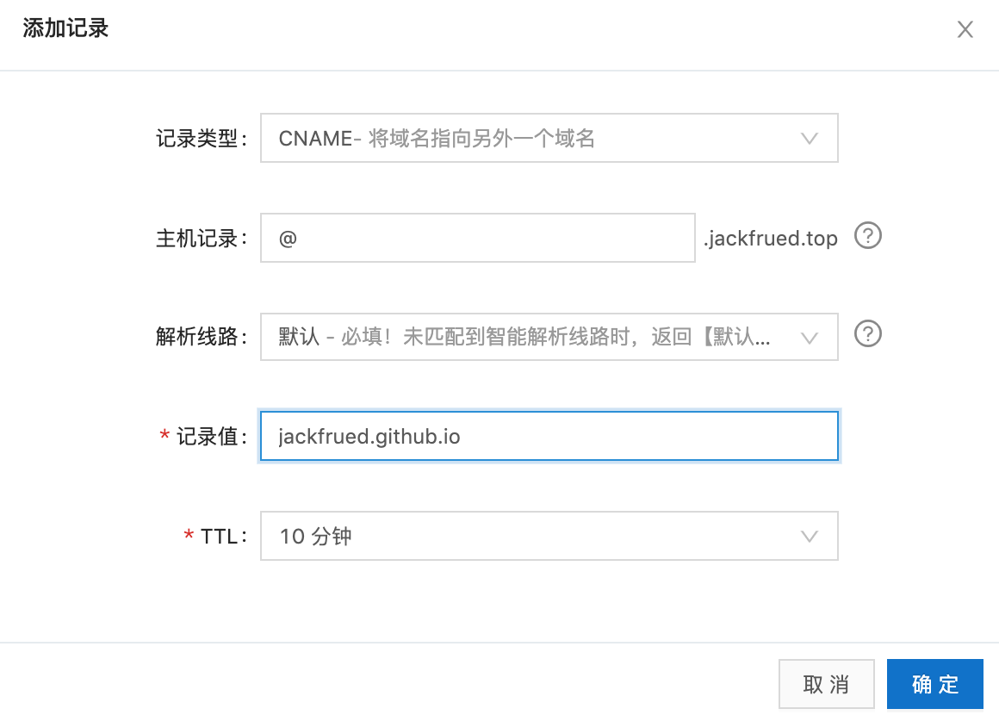

## 使用Hexo搭建自己的博客

对于一个程序员来说，搭建一个属于自己的博客平台是非常有意义的事情。首先，博客可以记录自己的成长历程，也是对自己一段时间学习和工作的总结和沉淀；其他，通过博客可以营销自己，增强自己在互联网或行业内的影响力，为将来更好的职业生涯打一个坚实的基础。前几年有一本名为《软技能 - 代码之外的生存指南》的畅销书，我记得书中有这么一段话：“流行乐队的音乐才华可能并不比夜店驻场乐队高多少，他们为什么就可以在全世界巡回演出，创造一个又一个白金记录？……你的营销做得越好，你的才华才能表现得淋漓尽致。”

这里顺便啰嗦两句，在互联网如此发达的今天，我们应该如何营销自己呢？自我营销首先要从打造个人品牌做起，对于程序员来说，最容易去做好的一件事情还是搭建自己的博客。博客相当于是你在互联网上的一个基地，尤其是当你拥有了属于自己的独立博客后，你可以做很多自己想做的事情，既可以传达自己的思想，又可以提升自己的影响力，当然如果你的博客经营得非常好，你可以从中获利。当然，除了博客，直播、视频网站、投稿、写书、技术活动都是可选的自我营销方式。当然，做自我营销也需要持之以恒，三天打鱼两天晒网是很难有什么收获的。

### Hexo概述

Hexo是一个快速、简洁且高效的博客框架，它能够将[Markdown格式](<https://zh.wikipedia.org/zh-hans/Markdown>)的文档渲染成漂亮的网页，这样我们就可以在很短的时间内迅速的创建出网站的静态内容，而Markdown格式对程序员来说相信并不陌生。要想使用Hexo来搭建自己的博客，我实在想不出有什么教程比[官方文档](<https://hexo.io/zh-cn/>)更好，强烈建议大家阅读官方文档来了解Hexo，下面我只做一个简要的使用说明。

> 说明：**Markdown**是一种轻量级标记语言，它允许人们使用易读易写的纯文本格式编写文档，同时也对图片、图表、数学公式提供了支持，可以用来书写电子书、软件文档等，同时也可以非常方便的转换为HTML页面或者是PDF文档。

要使用Hexo，首先得确保计算机上已经安装了[node.js](<https://nodejs.org/en/>)环境和[git](<https://git-scm.com/>)环境，前者是一个能够在服务器端运行JavaScript代码的环境，后者是版本控制工具。安装node.js主要是为了使用它的包管理工具npm，所以不需要先系统的学习node.js的知识；而安装git是为了利用版本控制系统克隆代码已经将博客项目托管到三方平台，如果想学习git，最好的资料是官方网站上的[*Git Pro*](<https://git-scm.com/book/zh/v2>)和[《Git权威指南》](<http://www.worldhello.net/gotgit/index.html>)。安装完成后，我们可以通过下面的命令来确认node.js环境以及它的包管理工具是否安装成功。

```Shell
node --version
npm --version
```

可以通过下面的命令来检查是否安装了git环境。

```Shell
git --version
```

我们可以使用npm来安装Hexo，npm是node.js的包管理工具，跟Python的pip工具作用一样，可以用它来安装依赖库和三方工具。在第一次使用npm的时候，我们可以先将npm的下载源更换为国内的淘宝镜像，这样下载的速度会有非常显著的提升。

```Shell
npm config set registry https://registry.npm.taobao.org
```

接下来我们就通过npm来安装Hexo，命令如下所示。

```Shell
npm install -g hexo-cli
```

安装成功后，就可以使用Hexo来创建属于自己的博客啦。

### 搭建博客

> 说明：以下内容基本上来自于Hexo的官方文档，推荐大家阅读官方文档。

我们先通过下面的命令来创建一个专门保存博客项目的文件夹，该命令会从github上克隆博客项目和默认的主题。

```Shell
hexo init blog
```

接下来我们进入这个文件夹并查看目录结构。

```Shell
cd blog
ls -lR
```

```
total 232
-rw-r--r--    1 Hao  staff    1768  8  8 01:15 _config.yml
drwxr-xr-x  274 Hao  staff    8768  8  8 01:19 node_modules
-rw-r--r--    1 Hao  staff  109972  8  8 01:19 package-lock.json
-rw-r--r--    1 Hao  staff     443  8  8 01:15 package.json
drwxr-xr-x    5 Hao  staff     160  8  8 01:15 scaffolds
drwxr-xr-x    3 Hao  staff      96  8  8 01:15 source
drwxr-xr-x    3 Hao  staff      96  8  8 01:15 themes
```

> 说明：Windows环境命令行提示符中可以使用dir命令查看目录结构。需要说明的是：`_config.yml`是博客项目的配置文件；`package.json`是项目的依赖项文件；`scaffolds`保存了Markdown文件的模板，也就是向新添加的Markdown文件中默认填充的内容；`source`目录下有一个名为`_post`的目录，我们稍后可以将编写好的Markdown文件放到该目录，这样就可以利用Hexo将Markdown文件处理成博客的静态页面，生成的静态页面将置于`public`目录下；`themes`文件夹保存了博客使用的主题。

然后我们通过下面的命令来安装项目所需的依赖项（`package.json`文件指明了这些依赖项）。

```Shell
npm install
```

做完上述的操作以后，我们已经可以直接通过下面的命令来生成博客。

```Shell
hexo generate
```

该命令也可以缩写为：

```Shell
hexo g
```

之前我们在安装依赖项的时候包括了一个名为`hexo-server`的依赖项，该依赖项可以帮助我们启动一个基于node.js的服务器来运行我们的博客项目，使用下面的命令即可启动服务器。

```Shell
hexo server
```

该命令也可以缩写为：

```Shell
hexo s
```

```
INFO  Start processing
INFO  Hexo is running at http://localhost:4000 . Press Ctrl+C to stop.
```

从运行命令的提示信息可以看到，服务器已经运转起并使用了4000端口，可以通过`Ctrl+C`来终止服务器的运行。如果要修改服务器使用的端口，可以在启动服务器的时候加上`-p`参数；如果希望服务器启动后，自动打开默认的浏览器访问服务器，可以使用`-o`参数，如下所示。

```Shell
hexo s -p 8000 -o
```

至此，我们已经可以看到Hexo在没有配置也没有加入自己的Markdown文件下生成的首页，如下图所示。



接下来我们修改博客的配置文件。

```Shell
vim _config.yml
```

```YAML
# Hexo Configuration
## Docs: https://hexo.io/docs/configuration.html
## Source: https://github.com/hexojs/hexo/

# Site
title: 骆昊的技术专栏
subtitle: 传道、授业、解惑，分享知识带来的快乐
description:
keywords:
author: 骆昊
language: zh
timezone:

# URL
## If your site is put in a subdirectory, set url as 'http://yoursite.com/child' and root as '/child/'
url: http://jackfrued.top
root: /
permalink: :year/:month/:day/:title/
permalink_defaults:

# Directory
source_dir: source
public_dir: public
tag_dir: tags
archive_dir: archives
category_dir: categories
code_dir: downloads/code
i18n_dir: :lang
skip_render:

# Writing
new_post_name: :title.md # File name of new posts
default_layout: post
titlecase: false # Transform title into titlecase
external_link: true # Open external links in new tab
filename_case: 0
render_drafts: false
post_asset_folder: false
relative_link: false
future: true
highlight:
  enable: true
  line_number: true
  auto_detect: false
  tab_replace:
  
# Home page setting
# path: Root path for your blogs index page. (default = '')
# per_page: Posts displayed per page. (0 = disable pagination)
# order_by: Posts order. (Order by date descending by default)
index_generator:
  path: ''
  per_page: 10
  order_by: -date
  
# Category & Tag
default_category: uncategorized
category_map:
tag_map:

# Date / Time format
## Hexo uses Moment.js to parse and display date
## You can customize the date format as defined in
## http://momentjs.com/docs/#/displaying/format/
date_format: YYYY-MM-DD
time_format: HH:mm:ss

# Pagination
## Set per_page to 0 to disable pagination
per_page: 10
pagination_dir: page

# Extensions
## Plugins: https://hexo.io/plugins/
## Themes: https://hexo.io/themes/
theme: landscape

# Deployment
## Docs: https://hexo.io/docs/deployment.html
deploy:
  type:
```

下面是YAML文件中相关选项的说明。

| 参数               | 描述                                                         |
| ------------------ | ------------------------------------------------------------ |
| `title`            | 网站的标题                                                   |
| `subtitle`         | 网站的副标题                                                 |
| `description`      | 网站的描述                                                   |
| `keywords`         | 网站的关键词，可以用逗号分隔多个关键词                       |
| `author`           | 自己的名字                                                   |
| `language`         | 网站使用的语言                                               |
| `timezone`         | 网站使用时区，默认使用电脑上设置的时区                       |
| `url`              | 网址                                                         |
| `root`             | 网站根目录                                                   |
| `source_dir`       | 资源文件夹，这个文件夹用来存放内容，默认source目录           |
| `public_dir`       | 公共文件夹，这个文件夹用于存放生成的站点文件，默认public目录 |
| `tag_dir`          | 标签文件夹，默认tags目录                                     |
| `archive_dir`      | 归档文件夹，默认archives目录                                 |
| `category_dir`     | 分类文件夹，默认categories目录                               |
| `auto_spacing`     | 在中文和英文之间加入空格，默认false                          |
| `titlecase`        | 把标题转换为首字母大写，默认false                            |
| `external_link`    | 在新标签中打开链接，默认true                                 |
| `relative_link`    | 把链接改为与根目录的相对位址，默认false                      |
| `default_category` | 默认分类                                                     |
| `date_format`      | 日期格式，默认YYYY-MM-DD                                     |
| `time_format`      | 时间格式，默认HH:mm:ss                                       |
| `per_page`         | 每页显示的文章数量 ，默认值10，0表示不使用分页               |
| `pagination_dir`   | 分页目录，默认为page目录                                     |
| `theme`            | 当前主题名称                                                 |
| `deploy`           | 部署部分的设置                                               |

我们将编写好的Markdown文件可以拷贝到`source/_posts`目录，我们可以在每个Markdown文件的上方添加Front-matter来对文件的布局、标题、分类、标签、发布日期等信息加以说明。所谓Front-matter，就是每个Markdown文件最上方以`---`分隔的区域，可以在Front-matter中设置以下内容。

| 参数         | 描述                 | 默认值       |
| ------------ | -------------------- | ------------ |
| `layout`     | 布局                 |              |
| `title`      | 标题                 |              |
| `date`       | 建立日期             | 文件建立日期 |
| `updated`    | 更新日期             | 文件更新日期 |
| `comments`   | 开启文章的评论功能   | true         |
| `tags`       | 标签（不适用于分页） |              |
| `categories` | 分类（不适用于分页） |              |
| `permalink`  | 覆盖文章网址         |              |

例如：

```Markdown
---
title: Python编程惯例
categories: 
- Python基础
tags:
- Python
- PEP8
date: 2019-8-1
---
## Python惯例

“惯例”这个词指的是“习惯的做法，常规的办法，一贯的做法”，与这个词对应的英文单词叫“idiom”。由于Python跟其他很多编程语言在语法和使用上还是有比较显著的差别，因此作为一个Python开发者如果不能掌握这些惯例，就无法写出“Pythonic”的代码。下面我们总结了一些在Python开发中的惯用的代码。

1. 让代码既可以被导入又可以被执行。
   if __name__ == '__main__':

2. 用下面的方式判断逻辑“真”或“假”。
   if x:
   if not x:
```


在完成上述工作后，我们可以通过下面的命令先清理之前生成的内容。

```Shell
hexo clean
```

接下来我们就可以用之前讲过的命令重新生成并运行博客项目。

```Shell
hexo generate
hexo server -p 8000 -o
```

### 将博客托管到GitHub

我们可以利用GitHub网站提供的[Pages服务](<https://pages.github.com/>)来托管我们的博客。在GitHub Pages的首页上就有一个教程指导我们如何托管自己的网站，当然第一步得在GitHub上注册一个属于自己的账号，登录成功之后才能进行后续的操作。

1. 根据自己的用户名创建一个仓库，仓库**一定**要取名为“用户名.github.io”。例如：我在GitHub上的用户名是jackfrued，那么我的托管博客项目的仓库一定要命名为jackfrued.github.io。

   

2. 修改博客项目的配置文件`_config.yml`，配置使用GitHub来部署该博客项目。

   ```Shell
   vim _config.yml
   ```

   ```YAML
   # 省略上面的内容
   # Deployment
   ## Docs: https://hexo.io/docs/deployment.html
   deploy:
     type: git
     repo: https://github.com/jackfrued/jackfrued.github.io.git
     branch: master
   ```

   上面的配置中，type指定了使用git进行项目部署，repo指定了部署项目的git仓库的URL，我们这里使用的是HTTPS的地址，如果之前配置过密钥对也可以使用SSH的地址，branch指定了将代码同步到仓库中的哪一个分支，通常master分支就是发布项目最终工作成果的分支，也称为项目的主分支。

3. 安装名为`hexo-deployer-git`的部署器插件，通过该插件就能实现一键部署。

   ```Shell
   npm install hexo-deployer-git --save
   ```

4. 可以使用下面的命令来实现一键部署到GitHub。

   ```Shell
   hexo deploy -g
   ```

   或者

   ```Shell
   hexo generate -d
   ```

5. 接下来在浏览器中输入[jackfrued.github.io](https://jackfrued.github.io)就能够看到自己的博客，现在全世界的人都可以通过这个URL来访问你的博客。大家是否注意到，访问你博客的这个URL就是刚才我们给仓库起的名字，因为你在GitHub上注册的用户名是独一无二的，所以这个域名也是全世界独一无二的。

### 将博客绑定到自己的域名

虽然我们已经通过GitHub提供的域名访问到了自己的博客，但是如果我们不愿意“寄人篱下”，我们在利用GitHub Pages提供的托管服务同时，也可以将博客绑定到自己专属的域名。如果暂时还没有购买域名，我们可以在提供域名购买服务的网站（如：[万网](<https://www.hichina.com/>)、[GoDaddy](<https://www.godaddy.com/>)）上进行购买。



> 说明：目前国内对域名的管理日趋严格，在购买域名时需要填写一大堆的个人信息，进行实名认证后才能获得域名，这一点相信大家能够理解。

比如说，我现在已经购买了一个名为“jackfrued.top”的域名，如何让它跟“jackfrued.github.io”这个域名做一个绑定呢，我们可以利用[阿里云控制台](<https://dns.console.aliyun.com/>)或者[DNSPod](<https://www.dnspod.cn/>)来做一个域名解析服务。在域名解析平台登录成功后，可以添加或选择自己的域名来配置域名解析。点击“添加记录”按钮，创建一个类型为CNAME的域名解析，CNAME类型的解析代表将一个域名解析到另一个域名，如下图所示。



完成这一步后，还不能马上通过自己的域名访问到博客项目，最后需要在博客项目的`source`目录下添加一个名为CNAME的文件（请注意这个文件的名字是全大写字母的）。

```Shell
vim CNAME
```

编辑该文件的内容，如下所示。

```
jackfrued.top
```

可以清理一下之前生成的内容，然后将项目重新生成并发布到GitHub就大功告成了！现在我们已经拥有了独立域名的博客，希望大家可以利用它做些有意义的事情（记录自己的成长历程、分享自己的工作经验、提升个人的影响力）。加油吧，程序员！