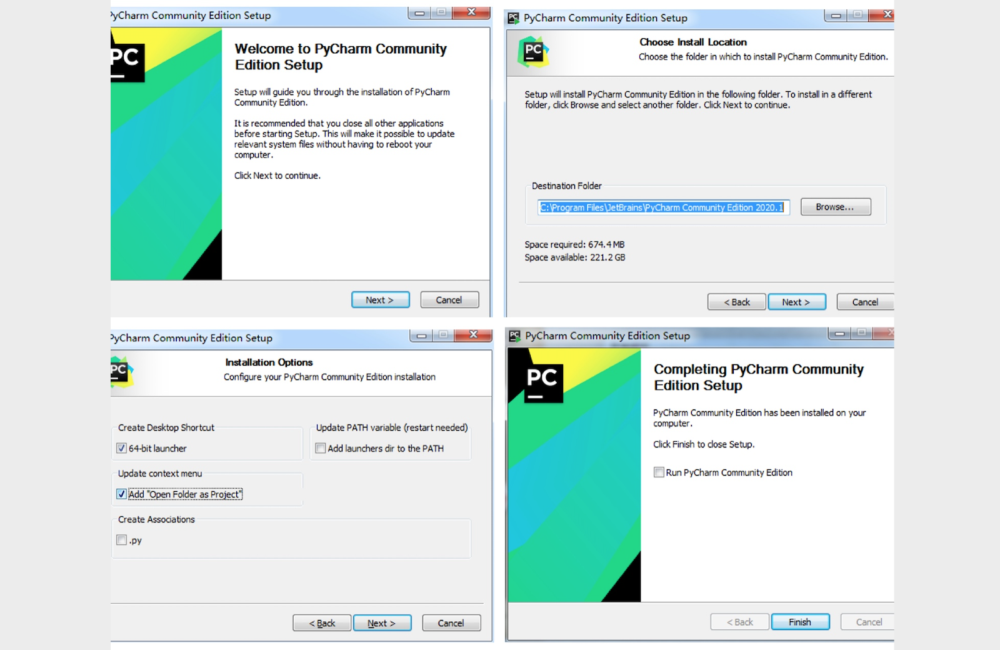
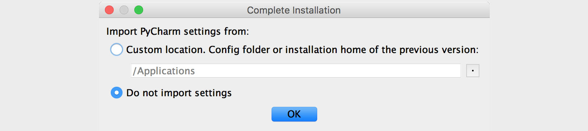
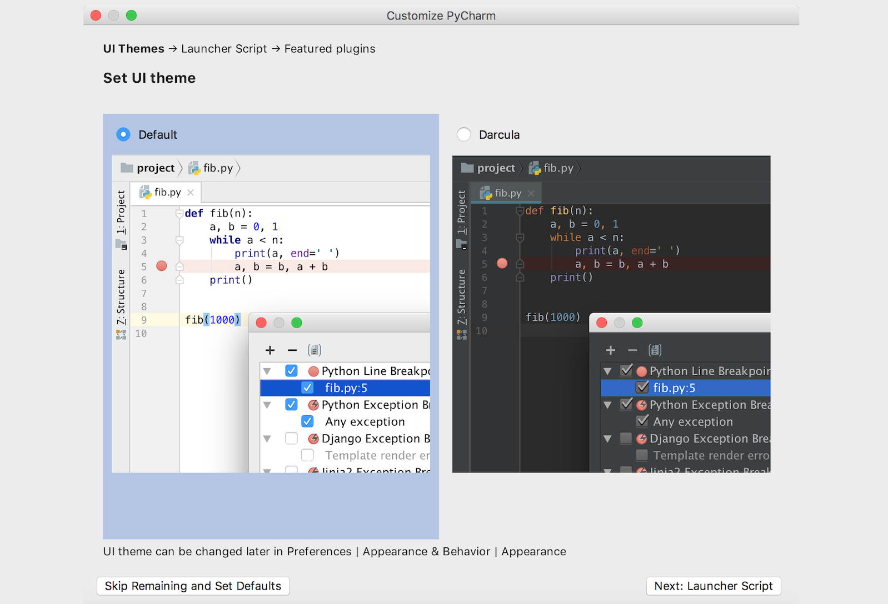
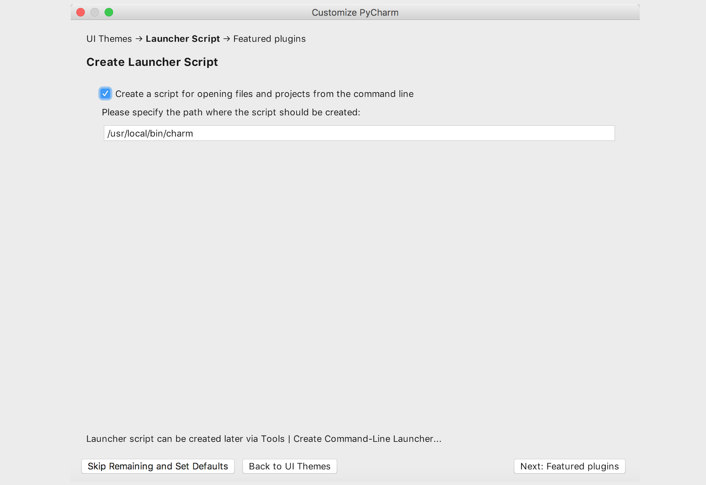
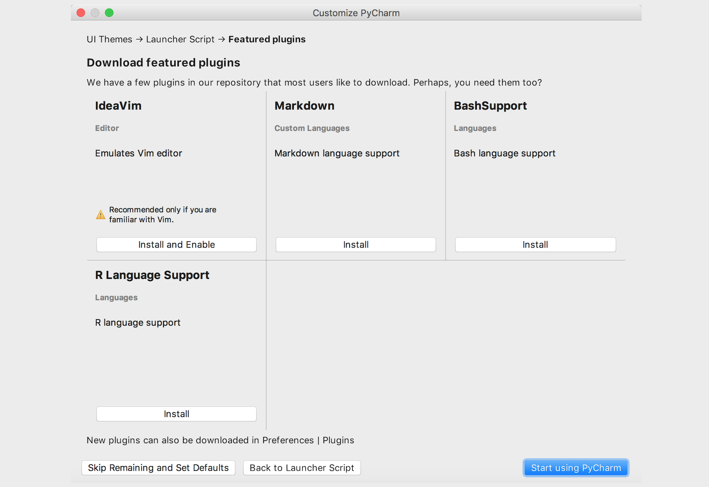
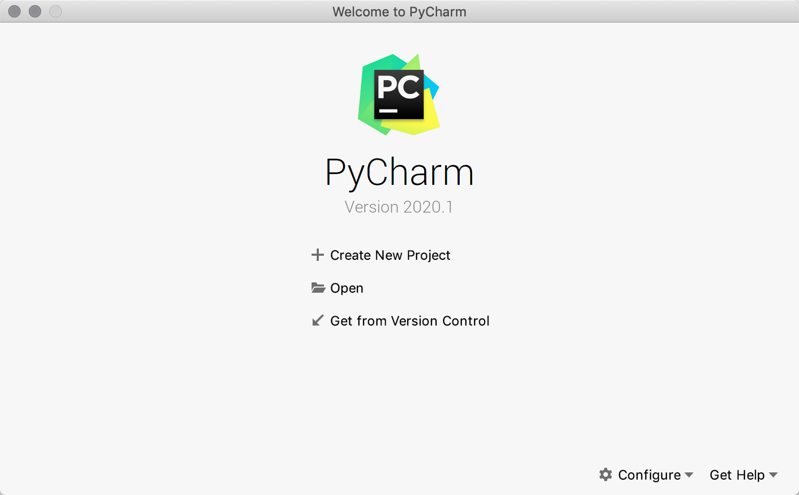
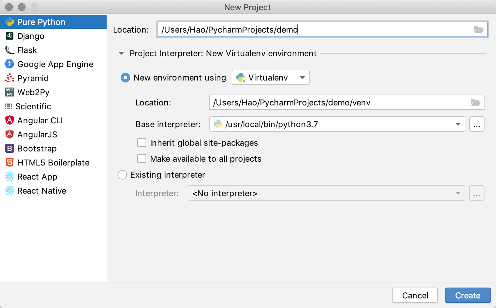
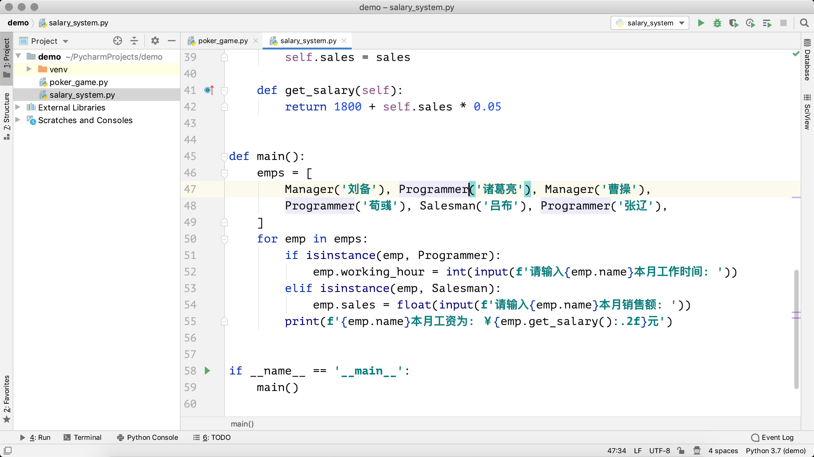

## 玩转PyCharm

PyCharm是由JetBrains公司开发的提供给Python专业的开发者的一个集成开发环境，它最大的优点是能够大大提升Python开发者的工作效率，为开发者集成了很多用起来非常顺手的功能，包括代码调试、高亮语法、代码跳转、智能提示、自动补全、单元测试、版本控制等等。此外，PyCharm还提供了对一些高级功能的支持，包括支持基于Django框架的Web开发。

### PyCharm的下载和安装

可以在[JetBrains公司的官方网站](<https://www.jetbrains.com/>)找到PyCharm的[下载链接](https://www.jetbrains.com/pycharm/download/)，有两个可供下载的版本，一个是社区版（PyCharm CE），一个是专业版（PyCharm Professional）。社区版在Apache许可证下发布，可以免费使用；专业版在专用许可证下发布，需要购买授权后才能使用，但新用户可以试用30天。很显然，专业版提供了更为强大的功能和对企业级开发的各种支持，但是对于初学者来说，社区版已经足够强大和好用了。安装PyCharm只需要直接运行下载的安装程序，然后持续的点击“Next”（下一步）按钮就可以啦。下面是我在Windows系统下安装PyCharm的截图，安装完成后点击“Finish”（结束）按钮关闭安装向导，然后可以通过双击桌面的快捷方式来运行PyCharm。

### 首次使用的设置

第一次使用PyCharm时，会有一个导入设置的向导，如果之前没有使用PyCharm或者没有保存过设置的就直接选择“Do not import settings”进入下一步即可，下面是我在macOS系统下第一次使用PyCharm时的截图。

专业版的PyCharm是需要激活的，**强烈建议大家在条件允许的情况下支付费用来支持优秀的产品**，如果不用做商业用途或者不需要使用PyCharm的高级功能，我们可以暂时选择试用30天或者使用社区版的PyCharm。如果你是一名学生，希望购买PyCharm来使用，可以看看[教育优惠官方申请指南](https://sales.jetbrains.com/hc/zh-cn/articles/207154369)。如下图所示，我们需要点击“Evaluate”按钮来试用专业版PyCharm。

接下来是选择UI主题，可以根据个人喜好进行选择，深色的主题比较护眼而浅色的主题对比度更好。

再接下来是创建可以在“终端”或“命令行提示符”中运行PyCharm的启动脚本，当然也可以不做任何勾选，直接点击“Next: Featured plugins”按钮进入下一环节。

然后可以选择需要安装哪些插件，我们可以暂时什么都不安装，等需要的时候再来决定。

最后点击上图右下角的“Start using PyCharm”（开始使用PyCharm）就可以开启你的PyCharm之旅了。

### 用PyCharm创建项目

启动PyCharm之后会来到一个欢迎页，在欢迎页上我们可以选择“创建新项目”（Create New Project）、“打开已有项目”（Open）和“从版本控制系统中检出项目”（Get from Version Control）。

如果选择了“Create New Project”来创建新项目就会打一个创建项目的向导页。下图所示是PyCharm专业版创建新项目的向导页，可以看出专业版支持的项目类型非常的多，而社区版只能创建纯Python项目（Pure Python），没有这一系列的选项。

接下来，我们要为项目创建专属的虚拟环境，每个Python项目最好都在自己专属的虚拟环境中运行，因为每个项目对Python解释器和三方库的需求并不相同，虚拟环境对不同的项目进行了隔离。在上图所示的界面在，我们可以选择新建虚拟环境（New environment using Virtualenv），这里的“Virtualenv”是PyCharm默认选择的创建虚拟环境的工具，我们就保留这个默认的选项就可以了。

项目创建完成后就可以开始新建各种文件来书写Python代码了，如下图所示。左侧是项目浏览器，可以看到刚才创建的项目文件夹以及虚拟环境文件夹。我们可以在项目上点击鼠标右键，选择“New”，在选择“Python File”来创建Python代码文件，下图中我们创建了两个Python文件，分别是`poker_game.py`和`salary_system.py`。当然，如果愿意，也可以使用复制粘贴的方式把其他地方的Python代码文件复制到项目文件夹下。

在工作窗口点击鼠标右键可以在上下文菜单中找到“Run”选项，例如要运行`salary_system.py`文件，右键菜单会显示“Run 'salary_system'”选项，点击这个选项我们就可以运行Python代码啦，运行结果在屏幕下方的窗口可以看到，如下图所示。

### 常用操作和快捷键

PyCharm为写Python代码提供了自动补全和高亮语法功能，这也是PyCharm作为集成开发环境（IDE）的基本功能。PyCharm的“File”菜单有一个“Settings”菜单项（macOS上是在“PyCharm”菜单的“Preferences…”菜单项），这个菜单项会打开设置窗口，可以在此处对PyCharm进行设置，如下图所示。

PyCharm的菜单项中有一个非常有用的“Code”菜单，菜单中提供了自动生成代码、自动补全代码、格式化代码、移动代码等选项，这些功能对开发者来说是非常有用的，大家可以尝试使用这些菜单项或者记住它们对应的快捷键，例如在macOS上，格式化代码这个菜单项对应的快捷键是`alt+command+L`。除此之外，“Refactor”菜单也非常有用，它提供了一些重构代码的选项。所谓重构是在不改变代码执行结果的前提下调整代码的结构，这也是资深程序员的一项重要技能。还有一个值得一提的菜单是“VCS”，VCS是“Version Control System”（版本控制系统）的缩写，这个菜单提供了对代码版本管理的支持。版本控制的知识会在其他的课程中为大家讲解。

下表列出了一些PyCharm中特别常用的快捷键，当然如果愿意，也可以通过设置窗口中“Keymap”菜单项自定义快捷键，PyCharm本身也针对不同的操作系统和使用习惯对快捷键进行了分组。

| 快捷键                                        | 作用                                   |
| --------------------------------------------- | -------------------------------------- |
| `command + j`                                 | 显示可用的代码模板                     |
| `command + b`                                 | 查看函数、类、方法的定义               |
| `ctrl + space`                                | 万能代码提示快捷键，一下不行按两下     |
| `command + alt + l`                           | 格式化代码                             |
| `alt + enter`                                 | 万能代码修复快捷键                     |
| `ctrl + /`                                    | 注释/反注释代码                        |
| `shift + shift`                               | 万能搜索快捷键                         |
| `command + d` / `command + y`                 | 复制/删除一行代码                      |
| `command + shift + -` / `command + shift + +` | 折叠/展开所有代码                      |
| `F2`                                          | 快速定位到错误代码                     |
| `command+ alt + F7`                           | 查看哪些地方用到了指定的函数、类、方法 |

> **说明**：Windows系统下如果使用PyCharm的默认设置，可以将上面的`command`键换成`ctrl`键即可，唯一的例外是`ctrl + space`那个快捷键，因为它跟Windows系统切换输入法的快捷键是冲突的，所以在Windows系统下默认没有与之对应的快捷键。